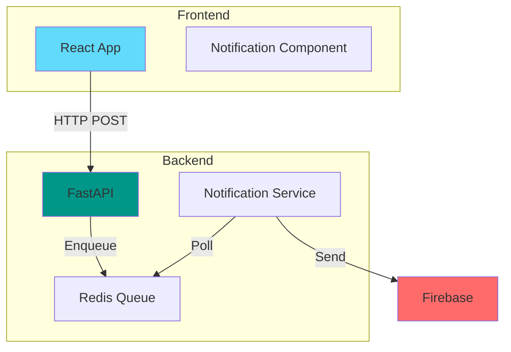

# Context2Task - Análise Cross-Validation e Detalhamento

**Data**: 2025-10-19  
**Status**: Análise Pós-Planning  
**Objetivo**: Identificar gaps, inconsistências e oportunidades de detalhamento antes do `/tasks`

---

## 📊 Visão Geral da Análise

### Documentos Analisados
- ✅ `spec.md` - Especificação completa
- ✅ `plan.md` - Plano técnico de implementação
- ✅ `system-flow-diagram.md` - 11 diagramas Mermaid
- ✅ `user-flows.md` - Fluxos de usuário detalhados
- ✅ `priority-features-detail.md` - 9 features prioritárias
- ✅ `multi-spec-feature.md` - Feature multi-repo
- ✅ `interface-final-v2.md` - Interface redesenhada
- ✅ `company-task-template.md` - Template da empresa
- ✅ `openrouter-integration-notes.md` - Integração OpenRouter
- ✅ `mcp-integration-notes.md` - Integração MCP

---

## 🔍 PARTE 1: Inconsistências Identificadas

### ✅ Status: TODAS RESOLVIDAS

Todas as inconsistências foram corrigidas:
- ✅ GitHub Projects vs GitHub Issues → Corrigido em todos documentos
- ✅ Tech Debt: grep vs IA → Corrigido para análise inteligente
- ✅ Markdown Preview: side-by-side vs final → Esclarecido (só no final)

---

## 🎯 PARTE 2: Gaps de Informação Críticos

### 1. 🔐 Estratégia de Sanitização de Dados Sensíveis

**Gap**: `spec.md` menciona "dados sensíveis", mas não há detalhamento de QUAIS dados e COMO sanitizar.

**Recomendação: Criar documento detalhado**

```yaml
# sanitization-rules.yml

sensitive_patterns:
  pii:
    - type: "cpf"
      regex: '\b\d{3}\.\d{3}\.\d{3}-\d{2}\b'
      replacement: "[CPF_REDACTED]"
      severity: "critical"
    
    - type: "email"
      regex: '\b[A-Za-z0-9._%+-]+@[A-Za-z0-9.-]+\.[A-Z|a-z]{2,}\b'
      replacement: "[EMAIL_REDACTED]"
      severity: "medium"
    
    - type: "phone"
      regex: '\b\(\d{2}\)\s?\d{4,5}-\d{4}\b'
      replacement: "[PHONE_REDACTED]"
      severity: "medium"
  
  credentials:
    - type: "password"
      regex: '(?i)(senha|password|pwd)\s*[:=]\s*\S+'
      replacement: "[PASSWORD_REDACTED]"
      severity: "critical"
    
    - type: "api_key"
      regex: '(?i)(api[_-]?key|token|secret)\s*[:=]\s*["\']?([a-zA-Z0-9_-]{20,})["\']?'
      replacement: "[API_KEY_REDACTED]"
      severity: "critical"
    
    - type: "jwt"
      regex: 'eyJ[a-zA-Z0-9_-]*\.eyJ[a-zA-Z0-9_-]*\.[a-zA-Z0-9_-]*'
      replacement: "[JWT_REDACTED]"
      severity: "critical"
  
  healthcare:
    - type: "medical_diagnosis"
      regex: '(?i)(diagnóstico|cid-10|doença)\s*:\s*[^\\n]+'
      replacement: "[DIAGNOSIS_REDACTED]"
      severity: "critical"
    
    - type: "medication"
      regex: '(?i)(medicamento|remédio|prescrição)\s*:\s*[^\\n]+'
      replacement: "[MEDICATION_REDACTED]"
      severity: "high"

sanitization_strategy:
  before_mcp_search: true
  before_llm_prompt: true
  in_logs: true
  in_exports: false  # User wants full context in exports
  
  redaction_modes:
    development: "partial"  # Show first 3 chars
    production: "full"      # Complete redaction
  
  audit:
    log_sanitizations: true
    log_location: "logs/sanitization-audit.log"
    alert_on_critical: true
```

**Implementação no Backend**:
```python
# backend/utils/sanitization.py

from typing import List, Dict
import re
import yaml

class SanitizationEngine:
    def __init__(self, rules_path: str = ".context2task/sanitization-rules.yml"):
        with open(rules_path, 'r') as f:
            self.rules = yaml.safe_load(f)
        self.patterns = self._compile_patterns()
    
    def _compile_patterns(self) -> List[Dict]:
        """Compile regex patterns from rules"""
        compiled = []
        for category in self.rules['sensitive_patterns'].values():
            for rule in category:
                compiled.append({
                    'type': rule['type'],
                    'pattern': re.compile(rule['regex']),
                    'replacement': rule['replacement'],
                    'severity': rule['severity']
                })
        return compiled
    
    def sanitize_text(self, text: str, context: str = "general") -> tuple[str, List[Dict]]:
        """
        Sanitize text and return cleaned text + audit log
        
        Args:
            text: Text to sanitize
            context: Context of sanitization (mcp_search, llm_prompt, logs, etc.)
        
        Returns:
            (sanitized_text, audit_entries)
        """
        audit_entries = []
        result = text
        
        for pattern_info in self.patterns:
            matches = pattern_info['pattern'].findall(result)
            if matches:
                result = pattern_info['pattern'].sub(
                    pattern_info['replacement'], 
                    result
                )
                
                audit_entries.append({
                    'type': pattern_info['type'],
                    'count': len(matches),
                    'severity': pattern_info['severity'],
                    'context': context
                })
        
        return result, audit_entries
    
    def sanitize_context_batch(self, contexts: List[Dict]) -> List[Dict]:
        """Sanitize batch of MCP search results"""
        sanitized = []
        total_audit = []
        
        for ctx in contexts:
            clean_content, audit = self.sanitize_text(
                ctx['content'], 
                context='mcp_search'
            )
            
            sanitized.append({
                **ctx,
                'content': clean_content,
                'sanitized': len(audit) > 0
            })
            
            total_audit.extend(audit)
        
        # Log critical sanitizations
        critical = [a for a in total_audit if a['severity'] == 'critical']
        if critical:
            logger.warning(
                "critical_data_sanitized",
                count=len(critical),
                types=[a['type'] for a in critical]
            )
        
        return sanitized

# Usage example
sanitizer = SanitizationEngine()

# Before sending to MCP
contexts = await mcp_client.search_code(repo, query, limit=20)
clean_contexts = sanitizer.sanitize_context_batch(contexts)

# Before sending to LLM
prompt_text, audit = sanitizer.sanitize_text(
    build_prompt(clean_contexts),
    context='llm_prompt'
)
```

---

### 2. 📝 Prompts Especializados para IA

**Gap**: Documentos mencionam "prompts especializados" mas não detalham a estrutura exata.

**Recomendação: Criar biblioteca de prompts**

```python
# backend/prompts/templates.py

from typing import Dict, List
from enum import Enum

class UserProfile(Enum):
    TECHNICAL = "technical"
    NON_TECHNICAL = "non_technical"

class PromptLibrary:
    """Centralized prompt templates for all AI interactions"""
    
    @staticmethod
    def system_prompt(profile: UserProfile) -> str:
        """Base system prompt based on user profile"""
        
        base = """Você é um assistente especializado em criar especificações técnicas de features.
Você tem acesso ao código-fonte do projeto através de contexto fornecido.

REGRAS FUNDAMENTAIS:
1. Sempre baseie suas respostas no contexto de código fornecido
2. Cite arquivos e linhas específicas quando relevante
3. Apresente múltiplas opções (tradeoffs) quando apropriado
4. Seja específico e acionável
5. Mantenha consistência com a arquitetura existente
"""
        
        if profile == UserProfile.NON_TECHNICAL:
            return base + """
PERFIL DO USUÁRIO: NÃO-TÉCNICO (Product Owner)

ADAPTAÇÕES:
- Use linguagem simples, evite jargões técnicos
- Explique conceitos técnicos com analogias
- Foque em benefícios de negócio, não implementação
- Estimativas em dias/semanas, não story points
- Esconda detalhes técnicos (mas ofereça "Mostrar detalhes")
- Use emojis para facilitar compreensão 💡
- Sempre explique siglas na primeira menção

EXEMPLO BOM:
"Vou usar Firebase (um serviço do Google) para enviar notificações.
Vantagem: Rápido de implementar (2 dias)
Custo: ~$50/mês"

EXEMPLO RUIM:
"Implementar FCM SDK com async workers e exponential backoff"
"""
        else:  # TECHNICAL
            return base + """
PERFIL DO USUÁRIO: TÉCNICO (Developer/Tech Lead)

ADAPTAÇÕES:
- Use terminologia técnica precisa
- Detalhe arquitetura e padrões de design
- Apresente métricas de performance
- Analise complexidade e tradeoffs técnicos
- Mostre trechos de código relevantes
- Sugira otimizações e refatorações
- Cite RFCs, docs e best practices

EXEMPLO BOM:
"Implementar FCM via firebase-admin SDK (Python):
- Async/await com asyncio.gather() para batch sends
- Retry com exponential backoff (2^n segundos)
- Rate limiting: 500 req/s (quota do FCM)
- Latência esperada: 200-500ms P95"

EXEMPLO RUIM:
"Vamos usar o Firebase para notificações"
"""
    
    @staticmethod
    def initial_analysis_prompt(
        feature_description: str,
        code_context: List[Dict],
        profile: UserProfile
    ) -> str:
        """Prompt for initial feature analysis"""
        
        context_str = "\n\n".join([
            f"Arquivo: {ctx['file']} (linhas {ctx['start_line']}-{ctx['end_line']})\n"
            f"Relevância: {ctx['score']:.0%}\n"
            f"Código:\n{ctx['content']}"
            for ctx in code_context[:5]  # Top 5 most relevant
        ])
        
        return f"""Analise a seguinte feature solicitada pelo usuário:

FEATURE SOLICITADA:
{feature_description}

CONTEXTO DO CÓDIGO ATUAL:
{context_str}

TAREFAS:
1. Identifique arquivos e módulos que serão impactados
2. Liste funcionalidades existentes que podem ser reutilizadas
3. {"Apresente 2-3 opções de implementação com tradeoffs" if profile == UserProfile.TECHNICAL else "Sugira a melhor forma de implementar (linguagem simples)"}
4. Identifique possíveis desafios técnicos
5. {"Estime complexidade (pontos de story)" if profile == UserProfile.TECHNICAL else "Estime tempo de implementação em dias"}

FORMATO DA RESPOSTA:
Use markdown estruturado, com seções claras e emojis.
"""
    
    @staticmethod
    def tech_debt_analysis_prompt(
        feature_title: str,
        code_context: List[Dict],
        tech_stack: Dict[str, str]
    ) -> str:
        """Specialized prompt for tech debt detection"""
        
        context_str = "\n\n".join([
            f"=== {ctx['file']} ===\n{ctx['content']}"
            for ctx in code_context[:15]  # More context for analysis
        ])
        
        return f"""Você é um arquiteto de software sênior especializado em análise de qualidade de código.

CONTEXTO:
Estamos implementando a feature: "{feature_title}"

STACK TECNOLÓGICA:
{yaml.dump(tech_stack, default_flow_style=False)}

CÓDIGO RELACIONADO À FEATURE:
{context_str}

TAREFA: Análise profunda de Tech Debt

Analise o código acima e identifique problemas nas seguintes categorias:

1. **Code Smells**:
   - Métodos muito longos (> 20 linhas)
   - Classes com muitas responsabilidades (> 300 LOC)
   - Complexidade ciclomática alta (> 10)
   - Parâmetros demais em funções (> 5)

2. **Duplicação de Código**:
   - Blocos de código similares (> 80% de similaridade)
   - Lógica repetida que poderia ser abstraída

3. **Anti-Patterns**:
   - Singleton com estado mutável
   - Magic numbers/strings sem constantes
   - God objects
   - Tight coupling entre módulos

4. **Performance Issues**:
   - N+1 queries
   - Loops desnecessários
   - Alocações de memória excessivas
   - I/O bloqueante em código async

5. **Acoplamento**:
   - Dependências circulares
   - Acoplamento tight entre camadas
   - Falta de inversão de dependências

6. **Testabilidade**:
   - Código não testável (hard dependencies)
   - Falta de interfaces/abstrações
   - Lógica complexa sem separação

7. **Violações de Best Practices** (específico para {tech_stack}):
   - Naming conventions
   - Estrutura de pastas
   - Padrões do framework/linguagem

FORMATO DE RESPOSTA (JSON ESTRUTURADO):

```json
{{
  "tech_debt": [
    {{
      "severity": "critical|medium|low",
      "category": "code_smell|duplication|anti_pattern|performance|coupling|testability|best_practice",
      "file": "path/to/file.py",
      "line": 123,
      "issue": "Descrição clara e específica do problema",
      "suggestion": "Sugestão concreta de refatoração com exemplo",
      "effort_hours": 2.0,
      "priority_reason": "Por que isso é crítico/médio/baixo"
    }}
  ],
  "summary": {{
    "total_issues": 8,
    "critical": 3,
    "medium": 3,
    "low": 2,
    "total_effort_hours": 12.5,
    "recommendation": "Texto resumindo se deve refatorar antes da feature"
  }}
}}
```

IMPORTANTE:
- Seja específico (cite linhas exatas)
- Dê exemplos de código na sugestão
- Estime esforço realisticamente
- Priorize por impacto na feature atual
"""
    
    @staticmethod
    def security_analysis_prompt(
        feature_description: str,
        code_context: List[Dict],
        company_rules: Dict
    ) -> str:
        """Specialized prompt for security analysis"""
        
        return f"""Você é um especialista em segurança de aplicações e compliance.

FEATURE A ANALISAR:
{feature_description}

CÓDIGO ENVOLVIDO:
{yaml.dump([c['file'] for c in code_context], default_flow_style=False)}

REGRAS DE COMPLIANCE DA EMPRESA:
{yaml.dump(company_rules, default_flow_style=False)}

TAREFA: Análise de Segurança

Analise a feature sob as seguintes perspectivas:

1. **LGPD & Dados Pessoais**:
   - A feature manipula dados pessoais (CPF, email, telefone)?
   - Há dados sensíveis (saúde, raça, religião)?
   - Consentimento explícito é necessário?
   - Prazo de retenção está definido?
   - Pseudonimização/anonimização necessária?

2. **OWASP Top 10**:
   - A01: Broken Access Control
   - A02: Cryptographic Failures
   - A03: Injection (SQL, XSS, etc.)
   - A04: Insecure Design
   - A05: Security Misconfiguration
   - A07: Auth Failures
   - A08: Software and Data Integrity Failures

3. **API Security** (se aplicável):
   - Rate limiting necessário?
   - Autenticação JWT correta?
   - Validação de inputs?
   - CORS configurado?
   - HTTPS enforced?

4. **Critérios Específicos da Empresa**:
   Verifique conformidade com regras fornecidas acima

FORMATO DE RESPOSTA (JSON):

```json
{{
  "security_checks": [
    {{
      "category": "lgpd|owasp|api|company_specific",
      "check_name": "Nome do check",
      "status": "pass|fail|warning|not_applicable",
      "severity": "critical|high|medium|low",
      "finding": "Descrição do problema encontrado (se fail/warning)",
      "recommendation": "Ação necessária para corrigir",
      "compliance_impact": "Impacto no compliance (legal, reputacional, etc.)"
    }}
  ],
  "summary": {{
    "total_checks": 15,
    "passed": 10,
    "failed": 3,
    "warnings": 2,
    "critical_issues": 1,
    "overall_status": "pass|fail|warning"
  }},
  "recommendations": [
    "Lista de ações prioritárias para resolver problemas críticos"
  ]
}}
```
"""
    
    @staticmethod
    def multi_spec_detection_prompt(
        feature_description: str,
        repositories: List[str],
        impact_analysis: Dict[str, float]
    ) -> str:
        """Prompt to detect if feature needs multi-spec split"""
        
        return f"""Analise se a feature abaixo deve ser dividida em múltiplas especificações.

FEATURE:
{feature_description}

REPOSITÓRIOS ANALISADOS:
{yaml.dump(impact_analysis, default_flow_style=False)}

CRITÉRIOS PARA SPLIT:

1. **Impacto em Múltiplos Repos** (threshold: 70%):
   - Se 2+ repos têm score > 0.7, considerar split

2. **Natureza das Mudanças**:
   - Mudanças independentes? → Split
   - Mudanças fortemente acopladas? → Spec única

3. **Times Diferentes**:
   - Backend team ≠ Frontend team → Split
   - Mesmo time → Spec única pode ser OK

4. **Paralelização**:
   - Trabalho pode ser feito em paralelo? → Split
   - Precisa sequencial? → Avaliar caso a caso

RESPONDA EM JSON:

```json
{{
  "should_split": true/false,
  "confidence": 0.95,
  "reasoning": "Explicação da decisão",
  "recommended_split": {{
    "backend-api": {{
      "focus": "Lista do que vai neste spec",
      "estimated_effort": "3-5 dias",
      "priority": "P0 - deve ser feito primeiro",
      "dependencies": []
    }},
    "frontend-web": {{
      "focus": "Lista do que vai neste spec",
      "estimated_effort": "2-3 dias",
      "priority": "P1 - depende do backend",
      "dependencies": ["backend-api"]
    }}
  }},
  "linking_strategy": "Como as specs devem ser linkadas"
}}
```
"""
    
    @staticmethod
    def diagram_generation_prompt(
        feature_description: str,
        architecture_context: Dict,
        diagram_type: str
    ) -> str:
        """Prompt to generate Mermaid diagrams"""
        
        diagrams = {
            "architecture": "Diagrama de arquitetura mostrando componentes, APIs, databases",
            "flow": "Diagrama de fluxo de dados mostrando como dados se movem",
            "sequence": "Diagrama de sequência mostrando interações temporais",
            "er": "Diagrama entidade-relacionamento mostrando models e relações"
        }
        
        return f"""Gere um diagrama Mermaid para documentar a feature.

FEATURE:
{feature_description}

TIPO DE DIAGRAMA: {diagram_type}
Objetivo: {diagrams.get(diagram_type, 'Diagrama genérico')}

CONTEXTO DE ARQUITETURA:
{yaml.dump(architecture_context, default_flow_style=False)}

INSTRUÇÕES:

1. Crie diagrama Mermaid válido (sintaxe correta)
2. Use cores e estilos para clareza
3. Adicione labels descritivos
4. Mantenha simplicidade (não complexo demais)
5. Foque nos componentes relacionados à feature

FORMATO DE RESPOSTA:

```json
{{
  "mermaid_code": "graph TB\\n  A[Component]...",
  "explanation": "Explicação do diagrama em português",
  "key_components": [
    "Lista dos componentes principais mostrados"
  ],
  "data_flows": [
    "Descrição dos fluxos de dados importantes"
  ]
}}
```

EXEMPLO (para referência de estilo):


"""
```

---

### 3. 🧪 Casos de Borda e Edge Cases

**Gap**: Poucos casos de borda documentados de forma estruturada.

**Recomendação: Criar catálogo de edge cases**

```yaml
# edge-cases-catalog.yml

session_management:
  - case: "Usuário fecha navegador durante conversa"
    expected_behavior: "Sessão expira após 30min. Dados perdidos (V1 in-memory)"
    mitigation: "Auto-save a cada mensagem (localStorage como backup)"
    priority: "high"
  
  - case: "Múltiplas abas abertas com mesma sessão"
    expected_behavior: "Cada aba mantém sessão independente"
    mitigation: "Session ID no localStorage compartilhado"
    priority: "medium"
  
  - case: "Sessão expira durante análise de tech debt"
    expected_behavior: "Análise é perdida"
    mitigation: "Background tasks com timeout + retry"
    priority: "high"

mcp_integration:
  - case: "MCP server está offline"
    expected_behavior: "Erro gracioso: 'Repositório não disponível'"
    fallback: "Modo degradado: continua sem contexto de código"
    priority: "critical"
  
  - case: "Repositório muito grande (> 10GB)"
    expected_behavior: "Indexação parcial ou timeout"
    mitigation: "Indexar por partes + mostrar progresso + permitir cancelar"
    priority: "high"
  
  - case: "Busca retorna 0 resultados"
    expected_behavior: "IA avisa: 'Não encontrei código relacionado'"
    fallback: "Sugerir termos alternativos ou continuar sem contexto"
    priority: "medium"
  
  - case: "Token limit exceeded no contexto"
    expected_behavior: "Selecionar top N resultados mais relevantes"
    mitigation: "Implementar ranking + truncação inteligente"
    priority: "high"

llm_integration:
  - case: "OpenRouter rate limit"
    expected_behavior: "Erro 429 → retry com backoff exponencial"
    mitigation: "Queue de requisições + mostrar 'Aguardando...'"
    priority: "critical"
  
  - case: "LLM responde em formato inválido"
    expected_behavior: "Parser falha → retry com prompt ajustado"
    mitigation: "Validação + fallback para resposta parcial"
    priority: "high"
  
  - case: "LLM timeout (> 30s)"
    expected_behavior: "Cancela requisição → tenta modelo fallback"
    mitigation: "Streaming + timeout configurável"
    priority: "high"
  
  - case: "Resposta do LLM contém código malicioso"
    expected_behavior: "Sanitização antes de mostrar ao usuário"
    mitigation: "Code injection detection + sandboxing"
    priority: "critical"

user_input:
  - case: "Feature description muito vaga ('melhore o sistema')"
    expected_behavior: "IA faz 3-5 perguntas de esclarecimento"
    mitigation: "Template de perguntas obrigatórias"
    priority: "medium"
  
  - case: "Usuário envia 10k caracteres de texto"
    expected_behavior: "Trunca para 10k + avisa"
    mitigation: "Validação no frontend + backend"
    priority: "low"
  
  - case: "Input contém SQL injection attempt"
    expected_behavior: "Sanitização automática + log"
    mitigation: "Input validation + WAF-like rules"
    priority: "critical"
  
  - case: "Voice input com ruído excessivo"
    expected_behavior: "Transcrição ruim → avisar usuário"
    mitigation: "Audio quality check antes de enviar"
    priority: "medium"

multi_spec:
  - case: "Split automático sugere 5+ repositórios"
    expected_behavior: "Avisar: 'Muitos repos, revise a seleção'"
    mitigation: "Limite máximo de 4 specs + avisar sobre complexidade"
    priority: "medium"
  
  - case: "Usuário não-técnico deseja editar split sugerido"
    expected_behavior: "Permitir selecionar manualmente quais repos incluir"
    mitigation: "UI simples de checkbox"
    priority: "low"
  
  - case: "Dependências circulares entre specs"
    expected_behavior: "Detectar e avisar: 'Ordem de implementação indefinida'"
    mitigation: "Análise de grafo de dependências"
    priority: "medium"

export:
  - case: "Documento gerado está incompleto (< 50% seções)"
    expected_behavior: "Avisar antes de exportar: 'Spec incompleta'"
    mitigation: "Checklist de validação + opção de continuar"
    priority: "medium"
  
  - case: "GitHub API está offline"
    expected_behavior: "Erro gracioso + oferecer download local"
    mitigation: "Retry + fallback para download"
    priority: "high"
  
  - case: "Export de 3 specs leva > 30s"
    expected_behavior: "Mostrar progresso (1/3, 2/3, 3/3)"
    mitigation: "Background task + WebSocket updates"
    priority: "low"

security:
  - case: "Sanitização falha (regex bug)"
    expected_behavior: "Log erro + bloqueia envio ao LLM"
    mitigation: "Fallback: redação completa se sanitização falhar"
    priority: "critical"
  
  - case: "Usuário tenta acessar sessão de outro"
    expected_behavior: "401 Unauthorized"
    mitigation: "Session validation em toda requisição"
    priority: "critical"

performance:
  - case: "Análise de tech debt leva > 60s"
    expected_behavior: "Timeout + resultado parcial"
    mitigation: "Streaming de resultados + cancelamento"
    priority: "medium"
  
  - case: "100 usuários simultâneos"
    expected_behavior: "Rate limiting por IP/session"
    mitigation: "Load balancer + sessões distribuídas (V2 com Redis)"
    priority: "low (V1 expectativa: < 10 usuários simultâneos)"
```

---

## 🎯 PARTE 3: Detalhamentos Adicionais Recomendados

### 1. 📊 Métricas e KPIs Detalhados

**Recomendação: Dashboard de observabilidade**

```python
# backend/monitoring/metrics.py

from dataclasses import dataclass
from typing import Dict, List
from datetime import datetime
import structlog

logger = structlog.get_logger()

@dataclass
class SessionMetrics:
    """Métricas por sessão"""
    session_id: str
    user_profile: str
    started_at: datetime
    ended_at: datetime
    
    # Engagement
    messages_sent: int
    ai_responses: int
    conversation_duration_seconds: int
    
    # Context
    mcp_searches_count: int
    mcp_results_found: int
    mcp_average_relevance: float
    repositories_used: List[str]
    
    # Output
    spec_generated: bool
    spec_completeness_percent: int
    export_format: str
    multi_spec: bool
    
    # Features Used
    voice_input_used: bool
    tech_debt_analysis: bool
    security_check: bool
    diagram_generated: bool
    review_mode: bool
    
    # Performance
    total_llm_tokens: int
    llm_cost_usd: float
    mcp_latency_avg_ms: float
    llm_latency_avg_ms: float

@dataclass
class SystemMetrics:
    """Métricas do sistema"""
    timestamp: datetime
    
    # Usage
    active_sessions: int
    total_sessions_today: int
    specs_generated_today: int
    
    # Performance
    avg_response_time_ms: float
    p95_response_time_ms: float
    p99_response_time_ms: float
    
    # External Services
    mcp_uptime_percent: float
    openrouter_uptime_percent: float
    mcp_error_rate: float
    llm_error_rate: float
    
    # Resources
    memory_usage_mb: float
    cpu_usage_percent: float
    active_mcp_connections: int
    
    # Costs
    total_llm_cost_today_usd: float
    cost_per_spec_avg_usd: float

class MetricsCollector:
    """Coletor centralizado de métricas"""
    
    def __init__(self):
        self.session_metrics: Dict[str, SessionMetrics] = {}
    
    def track_session_start(self, session_id: str, profile: str):
        """Rastreia início de sessão"""
        self.session_metrics[session_id] = SessionMetrics(
            session_id=session_id,
            user_profile=profile,
            started_at=datetime.now(),
            ended_at=None,
            messages_sent=0,
            # ... inicializar todos campos
        )
        
        logger.info(
            "session_started",
            session_id=session_id,
            profile=profile
        )
    
    def track_message(self, session_id: str, is_user: bool):
        """Rastreia mensagem enviada"""
        if session_id in self.session_metrics:
            if is_user:
                self.session_metrics[session_id].messages_sent += 1
            else:
                self.session_metrics[session_id].ai_responses += 1
    
    def track_mcp_search(
        self, 
        session_id: str, 
        results_count: int, 
        avg_relevance: float,
        latency_ms: float
    ):
        """Rastreia busca no MCP"""
        if session_id in self.session_metrics:
            metrics = self.session_metrics[session_id]
            metrics.mcp_searches_count += 1
            metrics.mcp_results_found += results_count
            # Update rolling average
            metrics.mcp_average_relevance = (
                (metrics.mcp_average_relevance * (metrics.mcp_searches_count - 1) +
                 avg_relevance) / metrics.mcp_searches_count
            )
        
        logger.info(
            "mcp_search_completed",
            session_id=session_id,
            results_count=results_count,
            latency_ms=latency_ms
        )
    
    def track_llm_call(
        self,
        session_id: str,
        tokens_used: int,
        cost_usd: float,
        latency_ms: float
    ):
        """Rastreia chamada ao LLM"""
        if session_id in self.session_metrics:
            metrics = self.session_metrics[session_id]
            metrics.total_llm_tokens += tokens_used
            metrics.llm_cost_usd += cost_usd
        
        logger.info(
            "llm_call_completed",
            session_id=session_id,
            tokens=tokens_used,
            cost_usd=cost_usd,
            latency_ms=latency_ms
        )
    
    def get_kpis(self) -> Dict:
        """Calcula KPIs agregados"""
        completed_sessions = [
            s for s in self.session_metrics.values()
            if s.spec_generated
        ]
        
        if not completed_sessions:
            return {}
        
        return {
            "success_rate": len(completed_sessions) / len(self.session_metrics),
            "avg_conversation_duration_min": sum(
                s.conversation_duration_seconds for s in completed_sessions
            ) / len(completed_sessions) / 60,
            "avg_messages_per_session": sum(
                s.messages_sent for s in completed_sessions
            ) / len(completed_sessions),
            "avg_spec_completeness": sum(
                s.spec_completeness_percent for s in completed_sessions
            ) / len(completed_sessions),
            "voice_adoption_rate": sum(
                1 for s in completed_sessions if s.voice_input_used
            ) / len(completed_sessions),
            "tech_debt_usage_rate": sum(
                1 for s in completed_sessions if s.tech_debt_analysis
            ) / len(completed_sessions),
            "multi_spec_rate": sum(
                1 for s in completed_sessions if s.multi_spec
            ) / len(completed_sessions),
            "avg_cost_per_spec_usd": sum(
                s.llm_cost_usd for s in completed_sessions
            ) / len(completed_sessions),
            "avg_mcp_latency_ms": sum(
                s.mcp_latency_avg_ms for s in completed_sessions
            ) / len(completed_sessions),
        }

# Usage
metrics = MetricsCollector()

# Em cada endpoint
metrics.track_session_start(session_id, profile)
metrics.track_message(session_id, is_user=True)
# ...

# Dashboard endpoint
@app.get("/api/admin/metrics/kpis")
async def get_kpis():
    return metrics.get_kpis()
```

---

### 2. 🔄 Máquina de Estados para Sessão

**Recomendação: Formalizar estados da sessão**

```python
# backend/models/session_state.py

from enum import Enum
from typing import Optional
from datetime import datetime

class SessionState(Enum):
    """Estados possíveis de uma sessão"""
    INITIALIZING = "initializing"
    REPO_SELECTION = "repo_selection"
    PROFILE_SELECTION = "profile_selection"
    INITIAL_INPUT = "initial_input"
    MCP_SEARCHING = "mcp_searching"
    CONVERSATION = "conversation"
    MULTI_SPEC_DETECTED = "multi_spec_detected"
    MULTI_SPEC_CONVERSATION = "multi_spec_conversation"
    SPEC_GENERATION = "spec_generation"
    OPTIONAL_ANALYSIS = "optional_analysis"
    TECH_DEBT_ANALYZING = "tech_debt_analyzing"
    SECURITY_ANALYZING = "security_analyzing"
    DIAGRAM_GENERATING = "diagram_generating"
    READY_FOR_EXPORT = "ready_for_export"
    EXPORTING = "exporting"
    REVIEW_MODE = "review_mode"
    COMPLETED = "completed"
    ERROR = "error"
    EXPIRED = "expired"

class StateTransition:
    """Regras de transição entre estados"""
    
    ALLOWED_TRANSITIONS = {
        SessionState.INITIALIZING: [
            SessionState.REPO_SELECTION,
            SessionState.ERROR
        ],
        SessionState.REPO_SELECTION: [
            SessionState.PROFILE_SELECTION,
            SessionState.ERROR
        ],
        SessionState.PROFILE_SELECTION: [
            SessionState.INITIAL_INPUT,
            SessionState.ERROR
        ],
        SessionState.INITIAL_INPUT: [
            SessionState.MCP_SEARCHING,
            SessionState.ERROR
        ],
        SessionState.MCP_SEARCHING: [
            SessionState.CONVERSATION,
            SessionState.MULTI_SPEC_DETECTED,
            SessionState.ERROR
        ],
        SessionState.CONVERSATION: [
            SessionState.CONVERSATION,  # Loop
            SessionState.MCP_SEARCHING,  # Nova busca
            SessionState.SPEC_GENERATION,
            SessionState.ERROR
        ],
        SessionState.MULTI_SPEC_DETECTED: [
            SessionState.MULTI_SPEC_CONVERSATION,
            SessionState.CONVERSATION,  # Se usuário rejeitar split
            SessionState.ERROR
        ],
        SessionState.MULTI_SPEC_CONVERSATION: [
            SessionState.MULTI_SPEC_CONVERSATION,  # Loop
            SessionState.SPEC_GENERATION,
            SessionState.ERROR
        ],
        SessionState.SPEC_GENERATION: [
            SessionState.OPTIONAL_ANALYSIS,
            SessionState.READY_FOR_EXPORT,
            SessionState.ERROR
        ],
        SessionState.OPTIONAL_ANALYSIS: [
            SessionState.TECH_DEBT_ANALYZING,
            SessionState.SECURITY_ANALYZING,
            SessionState.DIAGRAM_GENERATING,
            SessionState.READY_FOR_EXPORT,  # Pular análises
            SessionState.ERROR
        ],
        SessionState.TECH_DEBT_ANALYZING: [
            SessionState.OPTIONAL_ANALYSIS,  # Voltar para escolher outras
            SessionState.READY_FOR_EXPORT,
            SessionState.ERROR
        ],
        SessionState.SECURITY_ANALYZING: [
            SessionState.OPTIONAL_ANALYSIS,
            SessionState.READY_FOR_EXPORT,
            SessionState.ERROR
        ],
        SessionState.DIAGRAM_GENERATING: [
            SessionState.OPTIONAL_ANALYSIS,
            SessionState.READY_FOR_EXPORT,
            SessionState.ERROR
        ],
        SessionState.READY_FOR_EXPORT: [
            SessionState.EXPORTING,
            SessionState.REVIEW_MODE,
            SessionState.CONVERSATION,  # Voltar para editar
            SessionState.ERROR
        ],
        SessionState.EXPORTING: [
            SessionState.COMPLETED,
            SessionState.ERROR
        ],
        SessionState.REVIEW_MODE: [
            SessionState.REVIEW_MODE,  # Loop de reviews
            SessionState.READY_FOR_EXPORT,  # Aprovado
            SessionState.CONVERSATION,  # Rejeitado, volta para edição
            SessionState.ERROR
        ],
        SessionState.COMPLETED: [],  # Estado final
        SessionState.ERROR: [
            # Pode tentar recuperar para alguns estados
            SessionState.INITIAL_INPUT,
            SessionState.CONVERSATION
        ],
        SessionState.EXPIRED: []  # Estado final
    }
    
    @classmethod
    def can_transition(
        cls, 
        from_state: SessionState, 
        to_state: SessionState
    ) -> bool:
        """Valida se transição é permitida"""
        return to_state in cls.ALLOWED_TRANSITIONS.get(from_state, [])
    
    @classmethod
    def validate_transition(
        cls,
        from_state: SessionState,
        to_state: SessionState
    ) -> None:
        """Valida transição ou levanta exceção"""
        if not cls.can_transition(from_state, to_state):
            raise InvalidStateTransitionError(
                f"Cannot transition from {from_state.value} "
                f"to {to_state.value}"
            )

class SessionStateMachine:
    """Gerencia estado da sessão"""
    
    def __init__(self, session_id: str):
        self.session_id = session_id
        self.current_state = SessionState.INITIALIZING
        self.state_history: List[tuple[SessionState, datetime]] = [
            (SessionState.INITIALIZING, datetime.now())
        ]
    
    def transition_to(self, new_state: SessionState) -> None:
        """Transiciona para novo estado"""
        StateTransition.validate_transition(self.current_state, new_state)
        
        self.current_state = new_state
        self.state_history.append((new_state, datetime.now()))
        
        logger.info(
            "state_transition",
            session_id=self.session_id,
            from_state=self.current_state.value,
            to_state=new_state.value
        )
    
    def is_in_state(self, *states: SessionState) -> bool:
        """Verifica se está em algum dos estados"""
        return self.current_state in states
    
    def can_export(self) -> bool:
        """Verifica se pode exportar"""
        return self.is_in_state(
            SessionState.READY_FOR_EXPORT,
            SessionState.REVIEW_MODE
        )
    
    def get_available_actions(self) -> List[str]:
        """Retorna ações disponíveis no estado atual"""
        actions_map = {
            SessionState.INITIAL_INPUT: ["send_message", "use_voice", "select_template"],
            SessionState.CONVERSATION: ["send_message", "finish_spec", "search_more"],
            SessionState.READY_FOR_EXPORT: ["export", "analyze_tech_debt", "security_check", "generate_diagram"],
            # ... mapear todos estados
        }
        return actions_map.get(self.current_state, [])
```

---

### 3. 🧪 Suite de Testes Automatizados

**Recomendação: Estratégia de testes completa**

```python
# tests/integration/test_full_flow.py

import pytest
from fastapi.testclient import TestClient
from backend.main import app

class TestFullSpecCreationFlow:
    """Testes end-to-end do fluxo completo"""
    
    @pytest.fixture
    def client(self):
        return TestClient(app)
    
    @pytest.fixture
    def mock_mcp(self, mocker):
        """Mock do MCP client"""
        return mocker.patch('backend.services.mcp.MCPClient')
    
    @pytest.fixture
    def mock_llm(self, mocker):
        """Mock do OpenRouter"""
        return mocker.patch('backend.services.llm.LLMService')
    
    def test_technical_user_single_repo_spec(self, client, mock_mcp, mock_llm):
        """
        Cenário: Usuário técnico cria spec para 1 repositório
        Validar: Todo o fluxo até export de markdown
        """
        
        # 1. Criar sessão
        response = client.post("/api/sessions", json={
            "user_profile": "technical",
            "selected_repositories": ["/test/backend-api"]
        })
        assert response.status_code == 201
        session_id = response.json()["session_id"]
        
        # 2. Enviar mensagem inicial
        mock_mcp.return_value.search_code.return_value = [
            {
                "file": "backend/cache.py",
                "start_line": 10,
                "end_line": 30,
                "content": "def get_cached()...",
                "score": 0.95
            }
        ]
        
        mock_llm.return_value.chat.return_value = {
            "content": "Entendi! Você quer implementar Redis cache...",
            "spec_updates": {
                "description": "Implementar cache Redis..."
            }
        }
        
        response = client.post("/api/conversations/message", json={
            "session_id": session_id,
            "message": "Adicionar Redis cache no SIGTAP"
        })
        
        assert response.status_code == 200
        assert "Redis" in response.json()["assistant_reply"]
        
        # 3. Continuar conversa (2-3 mensagens)
        # ... simular conversa completa
        
        # 4. Gerar spec final
        response = client.post("/api/spec/generate", json={
            "session_id": session_id
        })
        assert response.status_code == 200
        
        # 5. Analisar tech debt
        mock_llm.return_value.analyze_tech_debt.return_value = {
            "total_issues": 5,
            "critical": [
                {
                    "file": "backend/cache.py",
                    "issue": "Long method"
                }
            ]
        }
        
        response = client.post("/api/analysis/tech-debt", json={
            "session_id": session_id
        })
        assert response.status_code == 200
        assert response.json()["total_items"] == 5
        
        # 6. Exportar markdown
        response = client.post("/api/export", json={
            "session_id": session_id,
            "format": "markdown"
        })
        
        assert response.status_code == 200
        markdown = response.json()["specs"]["backend-api"]
        
        # Validar estrutura do markdown
        assert "## 📌 Descrição" in markdown
        assert "## 👤 User Story" in markdown
        assert "## ⚙️ Detalhes Técnicos" in markdown
        assert "Redis" in markdown
    
    def test_non_technical_user_multi_repo_auto_split(
        self, 
        client, 
        mock_mcp, 
        mock_llm
    ):
        """
        Cenário: Usuário não-técnico descreve feature que impacta múltiplos repos
        Validar: Sistema detecta automaticamente e cria múltiplas specs
        """
        
        # 1. Criar sessão (não-técnico + 3 repos)
        response = client.post("/api/sessions", json={
            "user_profile": "non_technical",
            "selected_repositories": [
                "/test/backend-api",
                "/test/frontend-web",
                "/test/mobile-app"
            ]
        })
        session_id = response.json()["session_id"]
        
        # 2. Enviar mensagem que impacta múltiplos repos
        mock_mcp.return_value.search_code.side_effect = [
            # Backend results
            [{"file": "backend/notifications.py", "score": 0.9}],
            # Frontend results
            [{"file": "frontend/NotificationBell.tsx", "score": 0.85}],
            # Mobile results
            [{"file": "mobile/PushHandler.dart", "score": 0.8}]
        ]
        
        mock_llm.return_value.detect_multi_spec.return_value = {
            "should_split": True,
            "confidence": 0.95,
            "recommended_split": {
                "backend-api": {...},
                "frontend-web": {...},
                "mobile-app": {...}
            }
        }
        
        response = client.post("/api/conversations/message", json={
            "session_id": session_id,
            "message": "Quero notificações push quando médico enviar mensagem"
        })
        
        assert response.status_code == 200
        assert response.json()["multi_spec_detected"] == True
        assert len(response.json()["affected_repositories"]) == 3
        
        # 3. Sistema automaticamente cria 3 conversas
        # ... simular preenchimento das 3 specs
        
        # 4. Exportar (deve gerar 3 arquivos linkados)
        response = client.post("/api/export", json={
            "session_id": session_id,
            "format": "markdown"
        })
        
        specs = response.json()["specs"]
        assert len(specs) == 3
        assert "backend-api" in specs
        assert "frontend-web" in specs
        assert "mobile-app" in specs
        
        # Validar linking entre specs
        backend_md = specs["backend-api"]
        assert "frontend-web" in backend_md
        assert "mobile-app" in backend_md
        assert "Tasks Relacionadas" in backend_md
```

---

## 🚀 PARTE 4: Próximas Ações Recomendadas

### Prioridade CRÍTICA (Antes de `/tasks`)

1. ✅ **Definir Estratégia de Sanitização** (CRÍTICO)
   - Criar `sanitization-rules.yml`
   - Implementar `SanitizationEngine`
   - Testar com dados reais da empresa

2. ✅ **Formalizar Prompts** (CRÍTICO)
   - Criar `PromptLibrary` com templates
   - Validar prompts com LLM (testes)
   - Documentar expected outputs

3. ✅ **Catálogo de Edge Cases** (ALTO)
   - Criar `edge-cases-catalog.yml`
   - Implementar tratamento para top 10
   - Testes de edge cases

### Prioridade ALTA (Durante `/tasks`)

4. ✅ **Métricas e Observabilidade**
   - Implementar `MetricsCollector`
   - Dashboard de métricas (/admin/metrics)
   - Alertas para problemas críticos

5. ✅ **Máquina de Estados**
   - Implementar `SessionStateMachine`
   - Validar transições
   - Logging de estados

6. ✅ **Suite de Testes**
   - Testes E2E dos fluxos principais
   - Testes de integração (MCP + LLM)
   - Coverage > 80%

### Prioridade MÉDIA (Durante Implementação)

7. **Otimizações de Performance**
   - Caching de contexto MCP
   - Prompt caching no OpenRouter
   - Rate limiting inteligente

8. **UI Polish**
   - Animações de loading
   - Error states
   - Empty states

9. **Documentação de Usuário**
   - Tutorial interativo
   - FAQ
   - Troubleshooting guide

---

## 📋 Checklist de Validação Pré-`/tasks`

Antes de executar `/tasks`, validar:

- [x] Especificação completa e aprovada
- [x] Plano técnico detalhado
- [x] Diagramas de arquitetura atualizados
- [x] Fluxos de usuário documentados
- [ ] **Estratégia de sanitização definida** ← BLOCKER
- [ ] **Prompts especializados documentados** ← BLOCKER
- [ ] **Edge cases catalogados** ← RECOMENDADO
- [x] Stack tecnológica confirmada
- [x] Integrações externas documentadas
- [x] Template de task da empresa disponível
- [ ] **Métricas de sucesso definidas** ← RECOMENDADO

---

## 🎯 Resumo Executivo

### O que está BOM ✅
- Especificação abrangente e detalhada
- Plano técnico com arquitetura clara
- Diagramas visuais completos
- Features prioritárias bem definidas
- Integrações documentadas

### O que precisa ATENÇÃO ⚠️
- **Sanitização de dados sensíveis** - Precisa detalhamento URGENTE
- **Prompts especializados** - Documentar estrutura exata
- **Edge cases** - Catalogar e implementar tratamento
- **Métricas** - Definir KPIs específicos e coletores

### O que pode ser MELHORADO 💡
- Testes automatizados (expandir cobertura)
- Máquina de estados (formalizar transições)
- Performance (adicionar benchmarks)
- Documentação de usuário (tutoriais)

---

**Próximo Passo Recomendado**: 
1. Definir estratégia de sanitização (BLOCKER)
2. Documentar prompts especializados (BLOCKER)
3. Executar `/tasks` para quebrar implementação

---

**Criado**: 2025-10-19  
**Status**: Análise Completa  
**Versão**: 1.0  
**Reviewers**: TBD

