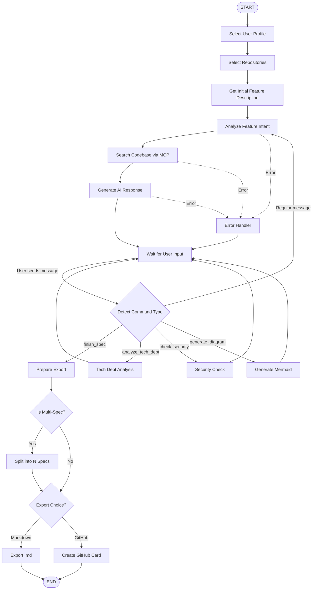

# Context2Task - Arquitetura LangGraph

**Data**: 2025-10-19  
**Versão**: 1.0  
**Framework**: LangGraph (Python)

---

## 🎯 Visão Geral

Sistema híbrido onde o **estado do grafo** é controlado por:
1. **Decisões da IA** (transições automáticas baseadas em análise)
2. **Ações do usuário** (comandos explícitos que alteram o fluxo)

---

## 📊 Arquitetura do Grafo

### Design Modular com Subgrafos

```
Context2TaskGraph
├── InitializationSubgraph (setup inicial)
├── ConversationSubgraph (loop principal)
├── OptionalAnalysisSubgraph (tech debt, security, etc.)
└── ExportSubgraph (finalização)
```

### Princípios de Design

1. **Modularidade**: Cada funcionalidade é um subgrafo independente
2. **Extensibilidade**: Adicionar novos nós sem quebrar o fluxo
3. **Interruptibilidade**: Usuário pode intervir a qualquer momento
4. **Observabilidade**: Cada transição é logada
5. **Recuperação**: Estados de erro podem voltar para estados seguros

---

## 🔄 Máquina de Estados Completa

### Estados Principais

```python
from enum import Enum

class NodeType(str, Enum):
    """Tipos de nós no grafo"""
    # === Initialization ===
    START = "start"
    SELECT_PROFILE = "select_profile"
    SELECT_REPOS = "select_repos"
    
    # === Main Conversation Loop ===
    INITIAL_INPUT = "initial_input"
    ANALYZE_FEATURE = "analyze_feature"
    SEARCH_CODEBASE = "search_codebase"
    LLM_RESPONSE = "llm_response"
    WAIT_USER_INPUT = "wait_user_input"
    DETECT_MULTI_SPEC = "detect_multi_spec"
    
    # === Optional Analysis (User-Triggered) ===
    TECH_DEBT_ANALYSIS = "tech_debt_analysis"
    SECURITY_CHECK = "security_check"
    GENERATE_DIAGRAM = "generate_diagram"
    
    # === Export ===
    PREPARE_EXPORT = "prepare_export"
    EXPORT_MARKDOWN = "export_markdown"
    EXPORT_GITHUB = "export_github"
    
    # === Special ===
    END = "end"
    ERROR_HANDLER = "error_handler"

class UserCommand(str, Enum):
    """Comandos que o usuário pode enviar para alterar o grafo"""
    # Navegação
    CONTINUE = "continue"
    FINISH_SPEC = "finish_spec"
    START_OVER = "start_over"
    
    # Análises opcionais (mudam o fluxo do grafo)
    ANALYZE_TECH_DEBT = "analyze_tech_debt"
    CHECK_SECURITY = "check_security"
    GENERATE_DIAGRAM = "generate_diagram"
    
    # Export
    PREVIEW_SPEC = "preview_spec"
    EXPORT_MD = "export_md"
    EXPORT_GITHUB = "export_github"
    
    # Modificações
    EDIT_SECTION = "edit_section"
    SEARCH_MORE = "search_more"
```

---

## 🏗️ Estrutura do Estado do Grafo

```python
from typing import TypedDict, Annotated, Optional, Literal
from langgraph.graph import add_messages
from datetime import datetime

class AgentState(TypedDict):
    """Estado global do grafo - modificado por IA e usuário"""
    
    # === Session Info ===
    session_id: str
    created_at: datetime
    last_updated: datetime
    
    # === User Context ===
    user_profile: Literal["technical", "non_technical"]
    selected_repositories: list[str]  # ["backend-api", "frontend-web"]
    
    # === Conversation ===
    messages: Annotated[list[dict], add_messages]  # LangGraph message history
    current_user_input: str | None  # Último input do usuário
    
    # === AI Analysis ===
    feature_summary: str | None
    detected_complexity: Literal["simple", "medium", "complex"] | None
    suggested_approach: str | None
    codebase_context: list[dict]  # Resultados do MCP
    
    # === Multi-Spec Detection ===
    is_multi_spec: bool
    affected_repositories: list[str]  # Se multi-spec: ["backend", "frontend"]
    
    # === Spec Building (Dynamic) ===
    spec_sections: dict[str, str]  # {"description": "...", "user_story": "..."}
    completion_percentage: int  # 0-100
    
    # === Optional Analysis (User-Triggered) ===
    tech_debt_report: dict | None
    security_report: dict | None
    mermaid_diagram: str | None
    
    # === Control Flow ===
    current_node: str  # NodeType atual
    next_action: str | None  # Decisão da IA sobre próximo passo
    user_command: str | None  # Comando explícito do usuário
    
    # === Export ===
    ready_for_export: bool
    export_format: Literal["markdown", "github"] | None
    github_project_board: Literal["backlog", "sprint", "roadmap"] | None
    
    # === Error Handling ===
    errors: list[str]
    retry_count: int
```

---

## 🎨 Diagrama do Grafo Completo



---

## 💻 Implementação Detalhada

### 1. Setup do Grafo Principal

```python
# backend/agent/graph.py

from langgraph.graph import StateGraph, END
from langgraph.checkpoint.memory import MemorySaver
from langgraph.prebuilt import ToolNode
from typing import Literal

from .state import AgentState, NodeType, UserCommand
from .nodes import (
    select_profile_node,
    select_repos_node,
    initial_input_node,
    analyze_feature_node,
    search_codebase_node,
    llm_response_node,
    wait_user_input_node,
    detect_multi_spec_node,
    tech_debt_analysis_node,
    security_check_node,
    generate_diagram_node,
    prepare_export_node,
    export_markdown_node,
    export_github_node,
    error_handler_node,
)
from .edges import (
    route_user_command,
    should_continue_conversation,
    should_search_codebase,
    route_export_choice,
)

def create_context2task_graph() -> StateGraph:
    """
    Cria o grafo principal do Context2Task
    
    Design Principles:
    1. Modular: Cada nó é uma função independente
    2. User-Controllable: Usuário pode alterar fluxo via comandos
    3. AI-Driven: IA decide próximos passos automaticamente
    4. Interruptible: Pode pausar e retomar
    """
    
    # Inicializar grafo com estado tipado
    workflow = StateGraph(AgentState)
    
    # === INITIALIZATION SUBGRAPH ===
    workflow.add_node(NodeType.SELECT_PROFILE, select_profile_node)
    workflow.add_node(NodeType.SELECT_REPOS, select_repos_node)
    workflow.add_node(NodeType.INITIAL_INPUT, initial_input_node)
    
    # === MAIN CONVERSATION LOOP ===
    workflow.add_node(NodeType.ANALYZE_FEATURE, analyze_feature_node)
    workflow.add_node(NodeType.SEARCH_CODEBASE, search_codebase_node)
    workflow.add_node(NodeType.LLM_RESPONSE, llm_response_node)
    workflow.add_node(NodeType.WAIT_USER_INPUT, wait_user_input_node)
    workflow.add_node(NodeType.DETECT_MULTI_SPEC, detect_multi_spec_node)
    
    # === OPTIONAL ANALYSIS (USER-TRIGGERED) ===
    workflow.add_node(NodeType.TECH_DEBT_ANALYSIS, tech_debt_analysis_node)
    workflow.add_node(NodeType.SECURITY_CHECK, security_check_node)
    workflow.add_node(NodeType.GENERATE_DIAGRAM, generate_diagram_node)
    
    # === EXPORT ===
    workflow.add_node(NodeType.PREPARE_EXPORT, prepare_export_node)
    workflow.add_node(NodeType.EXPORT_MARKDOWN, export_markdown_node)
    workflow.add_node(NodeType.EXPORT_GITHUB, export_github_node)
    
    # === ERROR HANDLING ===
    workflow.add_node(NodeType.ERROR_HANDLER, error_handler_node)
    
    # === EDGES ===
    
    # Entry point
    workflow.set_entry_point(NodeType.SELECT_PROFILE)
    
    # Linear initialization
    workflow.add_edge(NodeType.SELECT_PROFILE, NodeType.SELECT_REPOS)
    workflow.add_edge(NodeType.SELECT_REPOS, NodeType.INITIAL_INPUT)
    workflow.add_edge(NodeType.INITIAL_INPUT, NodeType.ANALYZE_FEATURE)
    
    # Main conversation loop (AI-driven)
    workflow.add_conditional_edges(
        NodeType.ANALYZE_FEATURE,
        should_search_codebase,
        {
            "search": NodeType.SEARCH_CODEBASE,
            "respond": NodeType.LLM_RESPONSE,
        }
    )
    
    workflow.add_edge(NodeType.SEARCH_CODEBASE, NodeType.LLM_RESPONSE)
    workflow.add_edge(NodeType.LLM_RESPONSE, NodeType.WAIT_USER_INPUT)
    
    # User input routing (USER-CONTROLLED)
    workflow.add_conditional_edges(
        NodeType.WAIT_USER_INPUT,
        route_user_command,
        {
            # Regular conversation
            "continue": NodeType.ANALYZE_FEATURE,
            
            # Optional analysis (changes graph flow)
            "tech_debt": NodeType.TECH_DEBT_ANALYSIS,
            "security": NodeType.SECURITY_CHECK,
            "diagram": NodeType.GENERATE_DIAGRAM,
            
            # Finish and export
            "export": NodeType.PREPARE_EXPORT,
        }
    )
    
    # Optional analysis loops back to waiting
    workflow.add_edge(NodeType.TECH_DEBT_ANALYSIS, NodeType.WAIT_USER_INPUT)
    workflow.add_edge(NodeType.SECURITY_CHECK, NodeType.WAIT_USER_INPUT)
    workflow.add_edge(NodeType.GENERATE_DIAGRAM, NodeType.WAIT_USER_INPUT)
    
    # Export flow
    workflow.add_edge(NodeType.PREPARE_EXPORT, NodeType.DETECT_MULTI_SPEC)
    
    workflow.add_conditional_edges(
        NodeType.DETECT_MULTI_SPEC,
        route_export_choice,
        {
            "markdown": NodeType.EXPORT_MARKDOWN,
            "github": NodeType.EXPORT_GITHUB,
        }
    )
    
    workflow.add_edge(NodeType.EXPORT_MARKDOWN, END)
    workflow.add_edge(NodeType.EXPORT_GITHUB, END)
    
    # Error handling (can recover to waiting)
    workflow.add_edge(NodeType.ERROR_HANDLER, NodeType.WAIT_USER_INPUT)
    
    return workflow

def compile_graph():
    """Compila o grafo com checkpointing"""
    workflow = create_context2task_graph()
    
    # MemorySaver para V1 (in-memory)
    # TODO V2: Trocar para PostgresSaver ou RedisSaver
    memory = MemorySaver()
    
    app = workflow.compile(
        checkpointer=memory,
        interrupt_before=[
            NodeType.WAIT_USER_INPUT,  # Sempre pausa aqui
            NodeType.PREPARE_EXPORT,   # Pausa antes de exportar
        ]
    )
    
    return app
```

---

### 2. Implementação dos Nós (Modular)

```python
# backend/agent/nodes/conversation.py

from typing import Any
from ..state import AgentState, NodeType
from ..services.llm_service import LLMService
from ..services.mcp_service import MCPService
from ..prompts import get_prompt_for_profile

async def analyze_feature_node(state: AgentState) -> dict[str, Any]:
    """
    Analisa a feature descrita pelo usuário
    
    Decisões da IA:
    - Complexidade da feature (simple, medium, complex)
    - Precisa buscar mais contexto no codebase?
    - Qual abordagem sugerir?
    """
    
    llm_service = LLMService()
    
    # Pegar último input do usuário
    user_message = state["current_user_input"]
    user_profile = state["user_profile"]
    
    # Prompt adaptado ao perfil
    system_prompt = get_prompt_for_profile(
        profile=user_profile,
        task="analyze_feature"
    )
    
    # Chamar LLM
    response = await llm_service.chat_completion(
        messages=[
            {"role": "system", "content": system_prompt},
            {"role": "user", "content": user_message}
        ],
        model="google/gemini-2.0-flash-exp:free",
    )
    
    # Extrair análise
    analysis = response["choices"][0]["message"]["content"]
    
    # IA decide: precisa buscar no codebase?
    needs_search = llm_service.extract_boolean(
        analysis, 
        "needs_codebase_search"
    )
    
    return {
        "feature_summary": analysis,
        "next_action": "search" if needs_search else "respond",
        "current_node": NodeType.ANALYZE_FEATURE,
    }


async def search_codebase_node(state: AgentState) -> dict[str, Any]:
    """
    Busca contexto relevante nos repositórios via MCP
    """
    
    mcp_service = MCPService()
    
    # Extrair query de busca baseado no contexto
    search_query = extract_search_query(state["feature_summary"])
    
    results = []
    for repo_path in state["selected_repositories"]:
        try:
            search_result = await mcp_service.search_code(
                path=repo_path,
                query=search_query,
                limit=10
            )
            results.extend(search_result)
        except Exception as e:
            # Log error mas não falha
            print(f"MCP search failed for {repo_path}: {e}")
    
    return {
        "codebase_context": results,
        "current_node": NodeType.SEARCH_CODEBASE,
    }


async def llm_response_node(state: AgentState) -> dict[str, Any]:
    """
    Gera resposta da IA baseado no contexto acumulado
    """
    
    llm_service = LLMService()
    
    # Construir contexto completo
    context_parts = []
    
    # 1. Histórico de conversa
    context_parts.append("## Conversation History")
    for msg in state["messages"][-5:]:  # Últimas 5 mensagens
        context_parts.append(f"{msg['role']}: {msg['content']}")
    
    # 2. Contexto do codebase
    if state.get("codebase_context"):
        context_parts.append("\n## Relevant Code")
        for ctx in state["codebase_context"][:3]:  # Top 3
            context_parts.append(f"File: {ctx['file']}\n{ctx['content']}")
    
    # 3. Análise atual
    if state.get("feature_summary"):
        context_parts.append(f"\n## Feature Analysis\n{state['feature_summary']}")
    
    full_context = "\n\n".join(context_parts)
    
    # Prompt adaptado
    system_prompt = get_prompt_for_profile(
        profile=state["user_profile"],
        task="conversation_response"
    )
    
    response = await llm_service.chat_completion(
        messages=[
            {"role": "system", "content": system_prompt},
            {"role": "user", "content": full_context}
        ],
        model="google/gemini-2.0-flash-exp:free",
    )
    
    ai_message = response["choices"][0]["message"]["content"]
    
    # Atualizar spec sections se a IA preencheu algo
    updated_sections = extract_spec_sections(ai_message)
    
    # Calcular % de completude
    completion = calculate_completion(state["spec_sections"])
    
    return {
        "messages": [{"role": "assistant", "content": ai_message}],
        "spec_sections": {**state["spec_sections"], **updated_sections},
        "completion_percentage": completion,
        "current_node": NodeType.LLM_RESPONSE,
    }


async def wait_user_input_node(state: AgentState) -> dict[str, Any]:
    """
    Nó que PAUSA a execução e espera input do usuário
    
    Este é um interrupt point - o grafo para aqui até o usuário enviar algo
    """
    
    return {
        "current_node": NodeType.WAIT_USER_INPUT,
        "next_action": None,  # Será definido pela edge condicional
    }
```

---

### 3. Nós de Análise Opcional (User-Triggered)

```python
# backend/agent/nodes/optional_analysis.py

from typing import Any
from ..state import AgentState, NodeType
from ..services.llm_service import LLMService
from ..services.mcp_service import MCPService
from ..prompts.tech_debt_prompt import TECH_DEBT_ANALYSIS_PROMPT
from ..prompts.security_prompt import SECURITY_CHECK_PROMPT

async def tech_debt_analysis_node(state: AgentState) -> dict[str, Any]:
    """
    Análise de débito técnico (AI-powered via MCP + LLM)
    
    Disparado quando usuário clica "Analisar Tech Debt"
    """
    
    mcp_service = MCPService()
    llm_service = LLMService()
    
    all_issues = []
    
    for repo_path in state["selected_repositories"]:
        # Buscar código potencialmente problemático
        context_searches = [
            "code with complex nested logic",
            "duplicated code patterns",
            "large functions or classes",
            "tight coupling between modules",
        ]
        
        code_samples = []
        for query in context_searches:
            results = await mcp_service.search_code(
                path=repo_path,
                query=query,
                limit=5
            )
            code_samples.extend(results)
        
        # Enviar para LLM analisar
        analysis_response = await llm_service.chat_completion(
            messages=[
                {"role": "system", "content": TECH_DEBT_ANALYSIS_PROMPT},
                {"role": "user", "content": format_code_for_analysis(code_samples)}
            ],
            model="google/gemini-2.0-flash-exp:free",
            response_format={"type": "json_object"}
        )
        
        issues = parse_tech_debt_response(analysis_response)
        all_issues.extend(issues)
    
    # Agrupar por severidade
    report = {
        "critical": [i for i in all_issues if i["severity"] == "critical"],
        "medium": [i for i in all_issues if i["severity"] == "medium"],
        "low": [i for i in all_issues if i["severity"] == "low"],
        "total_estimated_hours": sum(i["effort_hours"] for i in all_issues),
    }
    
    return {
        "tech_debt_report": report,
        "current_node": NodeType.TECH_DEBT_ANALYSIS,
        "messages": [{
            "role": "assistant",
            "content": format_tech_debt_message(report)
        }]
    }


async def security_check_node(state: AgentState) -> dict[str, Any]:
    """
    Checklist de segurança baseado nos critérios da empresa
    
    Disparado quando usuário clica "Verificar Segurança"
    """
    
    mcp_service = MCPService()
    llm_service = LLMService()
    
    # Buscar padrões de segurança no código
    security_queries = [
        "authentication and authorization code",
        "data validation and sanitization",
        "sensitive data handling",
        "API endpoints and input handling",
    ]
    
    code_samples = []
    for repo_path in state["selected_repositories"]:
        for query in security_queries:
            results = await mcp_service.search_code(
                path=repo_path,
                query=query,
                limit=3
            )
            code_samples.extend(results)
    
    # Análise via LLM
    analysis = await llm_service.chat_completion(
        messages=[
            {"role": "system", "content": SECURITY_CHECK_PROMPT},
            {"role": "user", "content": format_code_for_security(code_samples)}
        ],
        model="google/gemini-2.0-flash-exp:free",
        response_format={"type": "json_object"}
    )
    
    security_report = parse_security_response(analysis)
    
    return {
        "security_report": security_report,
        "current_node": NodeType.SECURITY_CHECK,
        "messages": [{
            "role": "assistant",
            "content": format_security_message(security_report)
        }]
    }


async def generate_diagram_node(state: AgentState) -> dict[str, Any]:
    """
    Gera diagrama Mermaid da arquitetura
    
    Disparado quando usuário clica "Gerar Diagrama"
    """
    
    llm_service = LLMService()
    
    # Construir contexto para gerar diagrama
    context = {
        "feature": state["feature_summary"],
        "repositories": state["selected_repositories"],
        "affected_components": state.get("affected_repositories", []),
        "codebase_context": state.get("codebase_context", [])[:5],
    }
    
    # LLM gera o Mermaid
    diagram_response = await llm_service.chat_completion(
        messages=[
            {"role": "system", "content": MERMAID_GENERATION_PROMPT},
            {"role": "user", "content": json.dumps(context, indent=2)}
        ],
        model="google/gemini-2.0-flash-exp:free",
    )
    
    mermaid_code = extract_mermaid_code(diagram_response)
    
    return {
        "mermaid_diagram": mermaid_code,
        "current_node": NodeType.GENERATE_DIAGRAM,
        "messages": [{
            "role": "assistant",
            "content": f"Aqui está o diagrama da arquitetura:\n\n```mermaid\n{mermaid_code}\n```"
        }]
    }
```

---

### 4. Edges Condicionais (Roteamento Inteligente)

```python
# backend/agent/edges.py

from typing import Literal
from .state import AgentState, UserCommand

def route_user_command(state: AgentState) -> Literal[
    "continue", "tech_debt", "security", "diagram", "export"
]:
    """
    Roteamento baseado no comando do usuário
    
    CRÍTICO: Aqui o usuário CONTROLA o fluxo do grafo
    """
    
    user_command = state.get("user_command")
    current_input = state.get("current_user_input", "").lower()
    
    # Comando explícito tem prioridade
    if user_command == UserCommand.ANALYZE_TECH_DEBT:
        return "tech_debt"
    
    if user_command == UserCommand.CHECK_SECURITY:
        return "security"
    
    if user_command == UserCommand.GENERATE_DIAGRAM:
        return "diagram"
    
    if user_command == UserCommand.FINISH_SPEC:
        return "export"
    
    # Detectar intenção no texto (fallback)
    if any(keyword in current_input for keyword in [
        "tech debt", "débito", "código ruim", "problemas no código"
    ]):
        return "tech_debt"
    
    if any(keyword in current_input for keyword in [
        "segurança", "security", "vulnerabilidade"
    ]):
        return "security"
    
    if any(keyword in current_input for keyword in [
        "diagrama", "diagram", "arquitetura", "fluxo"
    ]):
        return "diagram"
    
    if any(keyword in current_input for keyword in [
        "finalizar", "exportar", "pronto", "finish"
    ]):
        return "export"
    
    # Default: continuar conversação normal
    return "continue"


def should_search_codebase(state: AgentState) -> Literal["search", "respond"]:
    """
    IA decide se precisa buscar mais contexto no codebase
    """
    
    # Se já tem contexto suficiente, responde direto
    if len(state.get("codebase_context", [])) >= 5:
        return "respond"
    
    # Se a IA marcou que precisa buscar
    if state.get("next_action") == "search":
        return "search"
    
    # Default: responder com o que tem
    return "respond"


def route_export_choice(state: AgentState) -> Literal["markdown", "github"]:
    """
    Roteia para o tipo de export escolhido
    """
    
    export_format = state.get("export_format", "markdown")
    
    if export_format == "github":
        return "github"
    
    return "markdown"
```

---

### 5. Integração com FastAPI (Backend)

```python
# backend/api/session.py

from fastapi import APIRouter, HTTPException, WebSocket
from pydantic import BaseModel
from typing import Literal
import uuid

from ..agent.graph import compile_graph
from ..agent.state import AgentState, UserCommand

router = APIRouter(prefix="/api/session", tags=["session"])

# Grafo compilado (singleton)
app = compile_graph()

class CreateSessionRequest(BaseModel):
    user_profile: Literal["technical", "non_technical"]
    repositories: list[str]

class SendMessageRequest(BaseModel):
    session_id: str
    message: str
    command: UserCommand | None = None  # Comando explícito opcional

class SendMessageResponse(BaseModel):
    ai_response: str
    spec_sections: dict[str, str]
    completion_percentage: int
    current_node: str

@router.post("/create")
async def create_session(req: CreateSessionRequest):
    """Cria nova sessão e inicializa o grafo"""
    
    session_id = str(uuid.uuid4())
    
    # Estado inicial
    initial_state: AgentState = {
        "session_id": session_id,
        "user_profile": req.user_profile,
        "selected_repositories": req.repositories,
        "messages": [],
        "spec_sections": {},
        "completion_percentage": 0,
        "ready_for_export": False,
        "is_multi_spec": False,
        "affected_repositories": [],
        "errors": [],
        "retry_count": 0,
    }
    
    # Invocar até o primeiro interrupt (WAIT_USER_INPUT)
    config = {"configurable": {"thread_id": session_id}}
    result = await app.ainvoke(initial_state, config)
    
    return {
        "session_id": session_id,
        "status": "created",
        "current_node": result["current_node"],
    }


@router.post("/message")
async def send_message(req: SendMessageRequest) -> SendMessageResponse:
    """
    Envia mensagem e/ou comando do usuário
    
    Exemplos:
    1. Mensagem normal: {"message": "Quero adicionar autenticação"}
    2. Com comando: {"message": "...", "command": "analyze_tech_debt"}
    3. Só comando: {"message": "", "command": "finish_spec"}
    """
    
    config = {"configurable": {"thread_id": req.session_id}}
    
    # Pegar estado atual
    state = await app.aget_state(config)
    
    if not state:
        raise HTTPException(404, "Session not found")
    
    # Atualizar estado com novo input
    updates = {
        "current_user_input": req.message,
        "user_command": req.command,
        "messages": [{"role": "user", "content": req.message}] if req.message else [],
    }
    
    # Continuar execução
    result = await app.ainvoke(updates, config)
    
    # Extrair última resposta da IA
    ai_messages = [m for m in result["messages"] if m["role"] == "assistant"]
    last_ai_response = ai_messages[-1]["content"] if ai_messages else ""
    
    return SendMessageResponse(
        ai_response=last_ai_response,
        spec_sections=result["spec_sections"],
        completion_percentage=result["completion_percentage"],
        current_node=result["current_node"],
    )


@router.get("/state/{session_id}")
async def get_session_state(session_id: str):
    """Recupera estado completo da sessão"""
    
    config = {"configurable": {"thread_id": session_id}}
    state = await app.aget_state(config)
    
    if not state:
        raise HTTPException(404, "Session not found")
    
    return state.values


@router.post("/export/{session_id}")
async def export_spec(
    session_id: str,
    format: Literal["markdown", "github"],
    github_board: Literal["backlog", "sprint", "roadmap"] | None = None
):
    """Exporta a spec finalizada"""
    
    config = {"configurable": {"thread_id": session_id}}
    
    # Atualizar estado para export
    updates = {
        "export_format": format,
        "github_project_board": github_board,
        "user_command": UserCommand.EXPORT_MD if format == "markdown" else UserCommand.EXPORT_GITHUB,
    }
    
    result = await app.ainvoke(updates, config)
    
    if format == "markdown":
        return {
            "type": "markdown",
            "content": result.get("exported_markdown"),
        }
    else:
        return {
            "type": "github",
            "cards": result.get("github_cards"),
        }
```

---

## 🎮 Exemplos de Uso

### Cenário 1: Conversa Normal (IA decide)

```python
# 1. Criar sessão
response = await client.post("/api/session/create", json={
    "user_profile": "technical",
    "repositories": ["/home/user/backend-api"]
})
session_id = response.json()["session_id"]

# 2. Enviar mensagem (sem comando)
response = await client.post("/api/session/message", json={
    "session_id": session_id,
    "message": "Quero adicionar autenticação OAuth2",
    "command": None  # IA decide o próximo passo
})

# Resultado: IA analisa → busca no MCP → responde
```

### Cenário 2: Usuário Dispara Tech Debt (Muda o Grafo)

```python
# Durante a conversa, usuário decide analisar tech debt
response = await client.post("/api/session/message", json={
    "session_id": session_id,
    "message": "",  # Pode ser vazio
    "command": "analyze_tech_debt"  # COMANDO EXPLÍCITO
})

# Resultado: Grafo desvia para tech_debt_analysis_node
# Depois volta para wait_user_input
```

### Cenário 3: Finalizar e Exportar

```python
# Usuário terminou de refinar a spec
response = await client.post("/api/session/message", json={
    "session_id": session_id,
    "message": "Está pronto, pode finalizar",
    "command": "finish_spec"
})

# Exportar para GitHub Projects
response = await client.post(f"/api/session/export/{session_id}", params={
    "format": "github",
    "github_board": "backlog"
})
```

---

## 🔧 Modularidade e Extensibilidade

### Adicionar Novo Nó Opcional

```python
# 1. Adicionar ao enum
class NodeType(str, Enum):
    ESTIMATE_EFFORT = "estimate_effort"  # NOVO

# 2. Criar o nó
async def estimate_effort_node(state: AgentState) -> dict[str, Any]:
    """Estima esforço da feature (story points, horas)"""
    # ... implementação ...
    return {"effort_estimate": {...}}

# 3. Adicionar ao grafo
workflow.add_node(NodeType.ESTIMATE_EFFORT, estimate_effort_node)
workflow.add_edge(NodeType.ESTIMATE_EFFORT, NodeType.WAIT_USER_INPUT)

# 4. Adicionar roteamento
def route_user_command(state: AgentState):
    if state.get("user_command") == "estimate_effort":
        return "estimate"
    # ...

workflow.add_conditional_edges(
    NodeType.WAIT_USER_INPUT,
    route_user_command,
    {
        # ...
        "estimate": NodeType.ESTIMATE_EFFORT,
    }
)
```

### Adicionar Subgrafo Completo

```python
# Para features complexas, criar subgrafo isolado
from langgraph.graph import StateGraph

def create_review_subgraph() -> StateGraph:
    """Subgrafo para Review Mode"""
    review_graph = StateGraph(ReviewState)
    
    review_graph.add_node("submit_review", submit_review_node)
    review_graph.add_node("assign_reviewer", assign_reviewer_node)
    review_graph.add_node("approve", approve_node)
    
    # ... edges ...
    
    return review_graph.compile()

# Adicionar ao grafo principal
workflow.add_node("review_mode", create_review_subgraph())
```

---

## 📊 Observabilidade

```python
# backend/agent/observability.py

from langgraph.pregel import RetryPolicy
import logging

logger = logging.getLogger("context2task.graph")

def log_node_execution(node_name: str, state: AgentState):
    """Log cada execução de nó"""
    logger.info(f"[{state['session_id']}] Executing {node_name}")
    logger.debug(f"State: {state}")

def log_state_transition(from_node: str, to_node: str, session_id: str):
    """Log transições de estado"""
    logger.info(f"[{session_id}] Transition: {from_node} -> {to_node}")

# Adicionar ao compile
app = workflow.compile(
    checkpointer=memory,
    interrupt_before=[NodeType.WAIT_USER_INPUT],
    retry_policy=RetryPolicy(max_attempts=3),
    debug=True,  # Ativa logs detalhados
)
```

---

## 🎯 Próximos Passos

1. ✅ **Arquitetura definida** - Design híbrido IA + Usuário
2. ⏳ **Implementar nós básicos** (Sprint 1)
3. ⏳ **Testar fluxo completo** com sessões reais
4. ⏳ **Adicionar nós opcionais** (tech debt, security, diagram)
5. ⏳ **Migrar checkpointer** de MemorySaver para PostgresSaver (V2)
6. ⏳ **LangSmith integration** para observabilidade avançada

---

## 📚 Referências

- LangGraph Docs: https://langchain-ai.github.io/langgraph/
- Checkpointing: https://langchain-ai.github.io/langgraph/concepts/#persistence
- Human-in-the-Loop: https://langchain-ai.github.io/langgraph/concepts/#human-in-the-loop
- Subgraphs: https://langchain-ai.github.io/langgraph/how-tos/subgraph/

