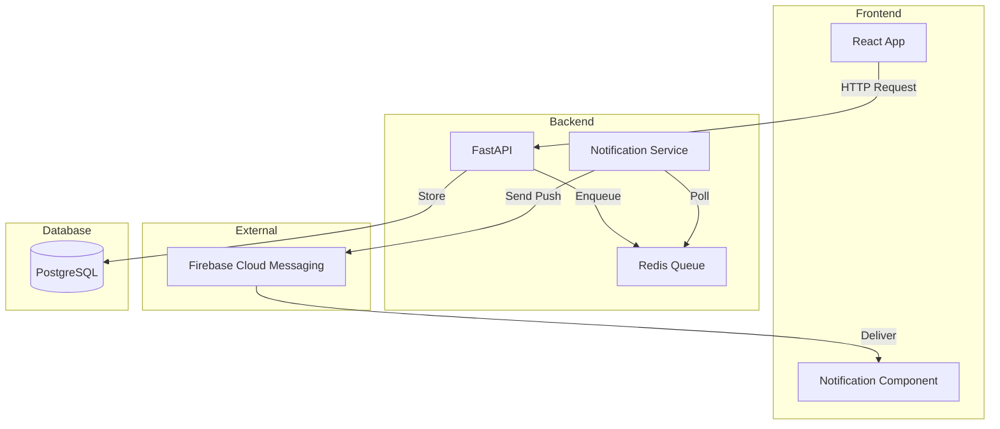

# Context2Task - Features Prioritárias Detalhadas

## 🎯 Features Selecionadas para MVP/V2

---

## 1. 🎤 Voice Input (ESSENCIAL)

### Visão Geral
Permite usuário falar sua feature ao invés de digitar. IA transcreve e estrutura automaticamente.

### Como Funciona

```
┌─────────────────────────────────────────────────────────────┐
│ Context2Task                                                 │
├─────────────────────────────────────────────────────────────┤
│                                                               │
│  💬 Digite ou fale sua feature:                              │
│  ┌──────────────────────────────────────────────┐           │
│  │ [🎤 Pressione para falar]                     │           │
│  │                                                │           │
│  │ "Quero adicionar notificações push..."       │ ← transcrição
│  └──────────────────────────────────────────────┘           │
│                                                               │
│  [⏹️ Parar gravação] [🔄 Refazer] [✅ Confirmar]            │
│                                                               │
└─────────────────────────────────────────────────────────────┘
```

### Fluxo Detalhado

```
1. Usuário clica em 🎤
   │
2. Sistema pede permissão de microfone
   │
3. Gravação começa (indicador visual pulsando)
   │
4. Transcrição em tempo real (opcional - mostra texto aparecendo)
   │
5. Usuário para gravação
   │
6. IA processa:
   ├─> Transcrição (Whisper API ou similar)
   ├─> Limpeza (remove "éééé", "tipo", etc.)
   └─> Estruturação (identifica contexto)
   │
7. Mostra resultado:
   "Detectei que você quer criar: Sistema de Notificações Push
    Repositórios envolvidos: backend, frontend
    Prosseguir com essa interpretação?"
```

### Tech Stack
- **Transcrição**: OpenAI Whisper API ou Web Speech API (browser)
- **Streaming**: WebSocket para transcrição em tempo real
- **Limpeza**: IA remove filler words automaticamente
- **Contexto**: Gemini analisa e estrutura o audio transcrito

### Casos de Uso
- Mobile: perfeito para criar specs no celular
- Multitasking: pode falar enquanto faz outra coisa
- Acessibilidade: para quem tem dificuldade de digitar
- Velocidade: falar é 3x mais rápido que digitar

### UI/UX
```
Estados:
├─ 🎤 Idle (cinza) - pronto para gravar
├─ 🔴 Recording (vermelho pulsando) - gravando
├─ ⏸️ Paused (amarelo) - pausado
└─ ✅ Done (verde) - processando

Feedback visual:
├─ Waveform ao vivo (mostra ondas sonoras)
├─ Timer (00:45 / 05:00)
└─ Transcrição parcial enquanto fala
```

---

## 2. ⚠️ Tech Debt Detector (Botão Pré-Export)

### Visão Geral
Antes de exportar spec, usuário pode pedir análise de dívida técnica relacionada à feature.

### Onde Aparece

```
┌─────────────────────────────────────────────────────────────┐
│ 📄 Spec Completa - Pronta para Export                       │
├─────────────────────────────────────────────────────────────┤
│                                                               │
│  ✅ Documento 90% completo                                   │
│                                                               │
│  [📥 Baixar .md] [📋 Copiar] [🚀 GitHub Projects]          │
│                                                               │
│  ─────────────────────────────────────────────────────────  │
│                                                               │
│  🔍 Análises Opcionais (antes de exportar):                 │
│                                                               │
│  [⚠️ Verificar Tech Debt] [🔒 Security Check] [📊 Diagram]  │
│                                                               │
└─────────────────────────────────────────────────────────────┘
```

### Fluxo ao Clicar

```
[⚠️ Verificar Tech Debt]
   ↓
[Analisando código nos repositórios selecionados...]
   ↓
┌─────────────────────────────────────────────────────────────┐
│ ⚠️ Análise Inteligente de Tech Debt (via IA)                │
├─────────────────────────────────────────────────────────────┤
│                                                               │
│ 🧠 IA Gemini 2.5 Pro analisou o código relacionado          │
│                                                               │
│ 📊 Resumo: 8 problemas encontrados | 5.5h de esforço total  │
│                                                               │
│ ━━━━━━━━━━━━━━━━━━━━━━━━━━━━━━━━━━━━━━━━━━━━━━━━━━━━━━━━━ │
│                                                               │
│ 🔴 CRÍTICOS (3) - Devem ser resolvidos antes da feature     │
│                                                               │
│ 1. Code Smell | backend/services/notification_service.py:145│
│    Método send_notification() tem 85 linhas (máx: 20)       │
│    💡 Sugestão: Extrair métodos _validate, _prepare, _send  │
│    ⏱️ Esforço: 2.0h                                          │
│                                                               │
│ 2. Anti-Pattern | backend/config.py:23                      │
│    Singleton com state global mutável                        │
│    💡 Sugestão: Usar dependency injection (FastAPI Depends) │
│    ⏱️ Esforço: 3.0h                                          │
│                                                               │
│ 3. Performance | backend/api/routes.py:67                   │
│    N+1 query: loop carrega usuários individualmente          │
│    💡 Sugestão: Usar .select_related('user')                │
│    ⏱️ Esforço: 0.5h                                          │
│                                                               │
│ ━━━━━━━━━━━━━━━━━━━━━━━━━━━━━━━━━━━━━━━━━━━━━━━━━━━━━━━━━ │
│                                                               │
│ 🟡 MÉDIOS (3) - Recomendado incluir na spec                 │
│                                                               │
│ 4. Acoplamento | backend/services/email.py:34               │
│    Circular dependency com notification_service              │
│    💡 Sugestão: Criar interface comum ou event bus          │
│    ⏱️ Esforço: 1.5h                                          │
│                                                               │
│ 5. Duplicação | frontend/components/Alert.tsx:12            │
│    Código 80% duplicado com Toast.tsx                        │
│    💡 Sugestão: Extrair BaseNotification component          │
│    ⏱️ Esforço: 1.0h                                          │
│                                                               │
│ 6. Testabilidade | backend/utils/cache.py:89                │
│    Função não testável (acessa Redis diretamente)            │
│    💡 Sugestão: Injetar redis_client via parâmetro          │
│    ⏱️ Esforço: 0.5h                                          │
│                                                               │
│ ━━━━━━━━━━━━━━━━━━━━━━━━━━━━━━━━━━━━━━━━━━━━━━━━━━━━━━━━━ │
│                                                               │
│ 🟢 BAIXOS (2) - Melhorias opcionais                         │
│                                                               │
│ 7. Naming | backend/models/user.py:12                       │
│    Variável 'x' não descritiva                               │
│    💡 Sugestão: Renomear para 'notification_count'          │
│                                                               │
│ 8. Documentação | backend/services/notification.py:1        │
│    Faltam docstrings em métodos públicos                     │
│    💡 Sugestão: Adicionar docstrings com exemplos           │
│                                                               │
│ ━━━━━━━━━━━━━━━━━━━━━━━━━━━━━━━━━━━━━━━━━━━━━━━━━━━━━━━━━ │
│                                                               │
│ 💡 RECOMENDAÇÃO:                                             │
│ Resolver os 3 problemas críticos ANTES de implementar a     │
│ feature. Esforço total: 5.5h (aprox. 1 dia)                 │
│                                                               │
│ [✅ Adicionar Todos à Spec] [⚙️ Selecionar] [👁️ Ver Código]│
└─────────────────────────────────────────────────────────────┘
```

### Como Funciona (Backend) - Análise Inteligente com IA 🧠

```python
# Pseudo-código
async def analyze_tech_debt(spec: Spec, repos: List[Repo]):
    """
    Usa IA (Gemini 2.5 Pro) com acesso ao MCP para análise 
    inteligente de tech debt - não apenas grep de TODOs!
    """
    
    # 1. Busca contexto de código relacionado à feature
    code_context = []
    for repo in repos:
        # MCP busca código relevante
        matches = await mcp_client.search_code(
            repo=repo.path,
            query=f"{spec.title} {spec.description}",
            limit=20  # Top 20 arquivos mais relevantes
        )
        code_context.extend(matches)
    
    # 2. Monta prompt especializado para IA
    tech_debt_prompt = f"""
    Você é um arquiteto de software expert em {spec.stack}.
    
    Analise o código abaixo relacionado à feature "{spec.title}" 
    e identifique tech debt estrutural e arquitetural:
    
    CATEGORIAS DE ANÁLISE:
    1. Code Smells (complexidade ciclomática, long methods, god classes)
    2. Duplicação de código
    3. Anti-patterns (singleton abuse, magic numbers, global state)
    4. Performance issues (N+1 queries, loops ineficientes)
    5. Acoplamento excessivo (tight coupling, circular dependencies)
    6. Testabilidade (código não testável, baixo coverage)
    7. Violações de best practices ({spec.stack})
    
    Para cada problema:
    - Severidade: critical/medium/low
    - Categoria
    - Arquivo e linha
    - Descrição clara
    - Sugestão de refatoração
    - Estimativa de esforço (horas)
    
    CÓDIGO:
    {format_code_for_analysis(code_context)}
    
    Responda em JSON estruturado.
    """
    
    # 3. Envia para IA via OpenRouter
    response = await openrouter_client.chat.completions.create(
        model="google/gemini-2.5-pro",
        messages=[
            {"role": "system", "content": "Você é um expert em análise de qualidade de código."},
            {"role": "user", "content": tech_debt_prompt}
        ],
        response_format={"type": "json_object"}
    )
    
    # 4. Parse resultado
    tech_debt_analysis = json.loads(response.choices[0].message.content)
    
    # 5. Classifica por severidade
    return {
        "critical": [
            item for item in tech_debt_analysis["tech_debt"] 
            if item["severity"] == "critical"
        ],
        "medium": [
            item for item in tech_debt_analysis["tech_debt"] 
            if item["severity"] == "medium"
        ],
        "low": [
            item for item in tech_debt_analysis["tech_debt"] 
            if item["severity"] == "low"
        ],
        "total_effort_hours": sum(
            item["effort_hours"] 
            for item in tech_debt_analysis["tech_debt"]
        )
    }
```

**Exemplo de Output da IA**:
```json
{
  "tech_debt": [
    {
      "severity": "critical",
      "category": "code_smell",
      "file": "backend/services/notification_service.py",
      "line": 145,
      "issue": "Método send_notification() tem 85 linhas (máx: 20)",
      "suggestion": "Extrair métodos: _validate_input(), _prepare_message(), _send_via_provider(), _log_result()",
      "effort_hours": 2.0
    },
    {
      "severity": "critical",
      "category": "anti_pattern",
      "file": "backend/config.py",
      "line": 23,
      "issue": "Singleton pattern com state global mutável",
      "suggestion": "Usar dependency injection com FastAPI Depends()",
      "effort_hours": 3.0
    },
    {
      "severity": "medium",
      "category": "performance",
      "file": "backend/api/routes.py",
      "line": 67,
      "issue": "N+1 query: loop carrega usuários individualmente",
      "suggestion": "Usar ORM .select_related('user') ou batch query",
      "effort_hours": 0.5
    }
  ]
}
```

### Benefícios da Análise Inteligente
- ✅ **Detecta problemas reais**, não apenas comentários
- ✅ **Analisa arquitetura e design**, além de sintaxe
- ✅ **Prioriza por severidade real** (crítico/médio/baixo)
- ✅ **Sugestões concretas** de refatoração
- ✅ **Estima esforço** para cada correção
- ✅ **Previne bugs futuros** identificando code smells
- ✅ **Melhora performance** detectando N+1 queries, loops ineficientes
- ✅ **Aumenta testabilidade** apontando código não testável
- ✅ **Contextualizado** - analisa apenas código relacionado à feature

---

## 3. 🛡️ Security Checklist (Baseado na Empresa)

### Visão Geral
Checklist automático de segurança baseado nos critérios específicos da sua empresa.

### Localização

```
[🔒 Security Check]
   ↓
┌─────────────────────────────────────────────────────────────┐
│ 🛡️ Checklist de Segurança - Critérios da Empresa           │
├─────────────────────────────────────────────────────────────┤
│                                                               │
│ 📋 LGPD & Dados Sensíveis                                    │
│ ☑ Feature manipula dados pessoais? SIM                      │
│   ├─> ⚠️ CPF detectado na descrição                         │
│   ├─> ⚠️ Dados de saúde mencionados                         │
│   └─> ✅ DEVE incluir consentimento LGPD                    │
│                                                               │
│ ☐ Dados são pseudonimizados?                                │
│   └─> 💡 Recomendamos hash de CPF                           │
│                                                               │
│ ☐ Tem prazo de retenção definido?                           │
│   └─> ⚠️ Obrigatório para LGPD! Adicione à spec             │
│                                                               │
│ ─────────────────────────────────────────────────────────  │
│                                                               │
│ 🔐 OWASP Top 10                                              │
│ ☑ API exposta externamente? SIM                             │
│   ├─> ✅ DEVE ter rate limiting                             │
│   ├─> ✅ DEVE ter autenticação JWT                          │
│   └─> ✅ DEVE validar inputs (XSS, SQL injection)           │
│                                                               │
│ ☑ Armazena senhas/tokens? NÃO                               │
│   └─> ✅ OK - não requer criptografia adicional             │
│                                                               │
│ ☐ Implementa logging de auditoria?                          │
│   └─> ⚠️ Recomendado para compliance                        │
│                                                               │
│ ─────────────────────────────────────────────────────────  │
│                                                               │
│ 🏥 Critérios Específicos da Empresa                         │
│ (baseado no seu setor: Healthcare)                          │
│                                                               │
│ ☑ Feature acessa prontuários? SIM                           │
│   ├─> 🚨 CRÍTICO: Requer aprovação do DPO                   │
│   ├─> 🚨 CRÍTICO: Audit trail obrigatório                   │
│   └─> 🚨 CRÍTICO: Criptografia em repouso (AES-256)         │
│                                                               │
│ ☐ Integra com sistemas externos?                            │
│   └─> Se sim, validar compliance do fornecedor              │
│                                                               │
│ ─────────────────────────────────────────────────────────  │
│                                                               │
│ 📊 Resultado: 6/9 checks passaram                           │
│ ⚠️ 3 itens críticos precisam ser endereçados!               │
│                                                               │
│ [✅ Adicionar à Spec] [📄 Ver Detalhes] [❌ Fechar]         │
└─────────────────────────────────────────────────────────────┘
```

### Configuração (customizável por empresa)

```yaml
# .context2task/security-rules.yml

lgpd:
  triggers:
    - "CPF"
    - "RG"
    - "dados pessoais"
    - "informação médica"
  rules:
    - "Consentimento explícito obrigatório"
    - "Prazo de retenção definido"
    - "Direito ao esquecimento implementado"

owasp:
  api_exposed:
    - "Rate limiting"
    - "Autenticação JWT"
    - "Validação de inputs"
    - "CORS configurado"
  
company_specific:
  sector: "healthcare"
  rules:
    prontuario:
      - "Aprovação do DPO"
      - "Audit trail completo"
      - "Criptografia AES-256"
      - "Acesso role-based"
    integracao_externa:
      - "Validar compliance fornecedor"
      - "Contrato de DPA assinado"
```

---

## 4. 👀 Markdown Preview Side-by-Side

### Visão Geral
Editor + Preview em tempo real, lado a lado.

### Layout

```
┌─────────────────────────────────────────────────────────────┐
│ Context2Task                          [👁️ Preview On/Off]   │
├─────────────────────┬───────────────────────────────────────┤
│ CHAT (40%)          │ PREVIEW (60%)                         │
├─────────────────────┼───────────────────────────────────────┤
│                     │                                        │
│ 💬 IA: "Qual a      │ ## 📌 Descrição / Contexto           │
│ prioridade?"        │ Implementar sistema de notificações   │
│                     │ push via Firebase...                  │
│ User: "Alta"        │                                        │
│                     │ ## 👤 User Story                      │
│ IA: "Perfeito!      │ Como paciente, quero receber...       │
│ Vou adicionar..."   │ [ATUALIZANDO ✨]                      │
│                     │                                        │
│ [Scroll             │ ## ⚙️ Detalhes Técnicos               │
│  independente]      │ 1. Configurar Firebase                │
│                     │ 2. Adicionar SDK...                   │
│                     │                                        │
│ [Digite...]         │ [Scroll independente]                 │
└─────────────────────┴───────────────────────────────────────┘

┌─ Controles ────────────────────────────────────────────────┐
│ [👁️] Toggle Preview  [⚡] Auto-scroll  [📝] Edit Mode      │
└────────────────────────────────────────────────────────────┘
```

### Modos

**Modo 1: Split View (padrão)**
- 40% Chat / 60% Preview
- Ambos scrolláveis independentemente
- Preview atualiza em tempo real

**Modo 2: Preview Only**
- 100% Preview
- Para revisar documento completo
- Pode editar inline

**Modo 3: Chat Only**
- 100% Chat
- Preview minimizado no rodapé
- Modo focado em conversa

### Features do Preview
- ✅ Syntax highlighting de código
- ✅ Emojis renderizados
- ✅ Links clicáveis
- ✅ Checkboxes interativas
- ✅ Tabelas formatadas
- ✅ Diagramas Mermaid renderizados

---

## 5. ✅ Review Mode + @Mentions

### Visão Geral
Workflow de aprovação: Draft → Review → Approved

### Estados da Spec

```
📝 Draft (Rascunho)
   ↓
   [Enviar para Review]
   ↓
👀 In Review (Em Revisão)
   ├─> @mentions ativos
   ├─> Comentários inline
   └─> Pode rejeitar e voltar para Draft
   ↓
   [Aprovar]
   ↓
✅ Approved (Aprovado)
   └─> Pronto para criar Card no GitHub Projects
```

### Interface de Review

```
┌─────────────────────────────────────────────────────────────┐
│ 📄 Spec: Sistema de Notificações Push                       │
│ Status: 👀 In Review                                         │
├─────────────────────────────────────────────────────────────┤
│                                                               │
│ 👥 Reviewers:                                                │
│ • @maria (Tech Lead) - ⏳ Aguardando                         │
│ • @joao (Backend) - ✅ Aprovado                              │
│ • @pedro (Frontend) - 💬 Comentou                            │
│                                                               │
│ ─────────────────────────────────────────────────────────  │
│                                                               │
│ ## 📌 Descrição                                              │
│ Implementar notificações push...                            │
│                                                               │
│ 💬 @pedro: "E notificações de email? Deveria incluir?"      │
│    └─ @autor: "Boa pergunta, vou adicionar"                 │
│    └─ [Resolved ✓]                                           │
│                                                               │
│ ## ⚙️ Detalhes Técnicos                                      │
│ 1. Firebase Cloud Messaging                                  │
│ 2. ...                                                       │
│                                                               │
│ 💬 @maria: "Considerar rate limiting? 💡"                   │
│    └─ @autor: [Adicionar comentário...]                     │
│    └─ [Não resolvido ⏳]                                     │
│                                                               │
│ ─────────────────────────────────────────────────────────  │
│                                                               │
│ [✅ Aprovar] [❌ Rejeitar] [💬 Comentar] [✏️ Sugerir Edit]  │
└─────────────────────────────────────────────────────────────┘
```

### @Mentions

```
Digitando:
"@mar..."
   ↓
┌────────────────┐
│ @maria (Tech)  │ ← autocomplete
│ @marcos (PM)   │
└────────────────┘

Ao mencionar:
├─> Pessoa recebe notificação (email/Slack)
├─> Aparece na lista de reviewers
└─> Pode aprovar/comentar
```

---

## 6. 📑 Template Sharing

### Visão Geral
Compartilha templates de specs entre times.

### Marketplace de Templates

```
┌─────────────────────────────────────────────────────────────┐
│ 📑 Marketplace de Templates                                  │
├─────────────────────────────────────────────────────────────┤
│                                                               │
│ 🔍 [Buscar templates...]                                     │
│                                                               │
│ 📁 Seus Templates (3)                                        │
│ ├─ 🔐 API REST com Auth                                      │
│ │  └─ Usado 12x | 4.8⭐ | Atualizado há 1 semana           │
│ ├─ 📱 Feature Mobile com Backend                             │
│ │  └─ Usado 8x | 4.5⭐ | Atualizado há 2 meses             │
│ └─ 🔔 Sistema de Notificações                                │
│    └─ Usado 5x | 5.0⭐ | Atualizado há 3 dias              │
│                                                               │
│ 🌟 Templates da Empresa (8)                                  │
│ ├─ 🔑 Autenticação & Autorização                             │
│ │  └─ Por @tech-leads | Oficial ✓ | 45 usos                │
│ ├─ 💳 Integração de Pagamento                                │
│ │  └─ Por @produto | Compliance ✓ | 23 usos                │
│ └─ 📊 Dashboard com Analytics                                │
│    └─ Por @data-team | Boas práticas ✓ | 34 usos           │
│                                                               │
│ 🌐 Templates Públicos (Community)                            │
│ ├─ CRUD Básico                                               │
│ ├─ Webhook Integration                                       │
│ └─ Real-time Chat                                            │
│                                                               │
│ [+ Criar Novo Template] [↗️ Importar] [⚙️ Configurar]       │
└─────────────────────────────────────────────────────────────┘
```

### Criar Template

```
[+ Criar Novo Template]
   ↓
┌─────────────────────────────────────────────────────────────┐
│ Criar Template                                               │
├─────────────────────────────────────────────────────────────┤
│                                                               │
│ Nome: [API REST com Autenticação]                           │
│                                                               │
│ Descrição:                                                   │
│ [Template para APIs REST que requerem autenticação JWT]     │
│                                                               │
│ Tags: #api #rest #auth #backend                             │
│                                                               │
│ Visibilidade:                                                │
│ ○ Privado (só você)                                         │
│ ● Time (backend-team)                                        │
│ ○ Empresa (todos)                                            │
│ ○ Público (community)                                        │
│                                                               │
│ Pre-fill fields:                                             │
│ ☑ Adicionar checklist de segurança automático              │
│ ☑ Incluir seção de rate limiting                            │
│ ☐ Sugerir testes de carga                                   │
│                                                               │
│ [📄 Editar Conteúdo do Template]                            │
│ [✅ Salvar] [❌ Cancelar]                                    │
└─────────────────────────────────────────────────────────────┘
```

---

## 7. 🎓 Interactive Tutorial

### Visão Geral
Walkthrough guiado na primeira vez que usa o sistema.

### Fluxo do Tutorial

```
Primeiro acesso:
   ↓
┌─────────────────────────────────────────────────────────────┐
│ 👋 Bem-vindo ao Context2Task!                                │
├─────────────────────────────────────────────────────────────┤
│                                                               │
│ Vou te guiar para criar sua primeira spec em 5 minutos!     │
│                                                               │
│ [🚀 Começar Tutorial] [⏭️ Pular]                            │
└─────────────────────────────────────────────────────────────┘
   ↓
┌─────────────────────────────────────────────────────────────┐
│ Passo 1/7: Selecione seu Perfil                             │
├─────────────────────────────────────────────────────────────┤
│                                                               │
│ ┌─────────────────┐  ┌─────────────────┐                   │
│ │ 👔 Não-Técnico  │  │ 💻 Técnico      │ ← clique aqui     │
│ │                 │  │                 │                    │
│ │ Product Owner,  │  │ Developer,      │                    │
│ │ stakeholder     │  │ Tech Lead       │                    │
│ └─────────────────┘  └─────────────────┘                   │
│                                                               │
│ 💡 Dica: Isso ajusta a profundidade das respostas           │
│                                                               │
│ [Anterior] [Próximo →]                                       │
└─────────────────────────────────────────────────────────────┘
   ↓
Passo 2/7: Selecione Repositórios
Passo 3/7: Digite ou Fale sua Feature (demo voice)
Passo 4/7: Responda Perguntas da IA
Passo 5/7: Veja Preview em Tempo Real
Passo 6/7: Análises Opcionais (Tech Debt, Security)
Passo 7/7: Export e Pronto!
   ↓
✅ Parabéns! Você criou sua primeira spec!
```

---

## 8. 📐 Mermaid Diagrams (Opcional, Sob Demanda)

### Visão Geral
Gera diagramas de arquitetura Mermaid opcionalmente ao final.

### Quando Aparece

```
[📊 Gerar Diagrama] ← botão opcional antes de exportar
   ↓
┌─────────────────────────────────────────────────────────────┐
│ 📐 Geração de Diagramas                                      │
├─────────────────────────────────────────────────────────────┤
│                                                               │
│ Que tipo de diagrama quer gerar?                            │
│                                                               │
│ ○ Arquitetura de Sistema (recomendado)                      │
│   └─> Mostra componentes, APIs, databases                   │
│                                                               │
│ ○ Fluxo de Dados                                             │
│   └─> Mostra como dados fluem entre serviços                │
│                                                               │
│ ○ Sequência de Processos                                     │
│   └─> Mostra interações temporais                           │
│                                                               │
│ ○ Entidade-Relacionamento                                    │
│   └─> Mostra models e relações                              │
│                                                               │
│ ☑ Incluir diagrama na spec final                            │
│                                                               │
│ [✨ Gerar] [❌ Cancelar]                                     │
└─────────────────────────────────────────────────────────────┘
```

### Exemplo de Output

```markdown
## 📐 Diagrama de Arquitetura


```

**IA explica automaticamente:**
"Este diagrama mostra como o sistema de notificações funciona:
1. Frontend envia request via API
2. Backend armazena no banco e enfileira no Redis
3. NotificationService processa fila assincronamente
4. Envia push via Firebase
5. Firebase entrega ao dispositivo do usuário"

---

## 9. 🕸️ Dependency Graph (Menor Prioridade)

### Visão Geral
Visualiza dependências entre features (V2/V3).

### Exemplo

```
┌─────────────────────────────────────────────────────────────┐
│ 🕸️ Grafo de Dependências                                    │
├─────────────────────────────────────────────────────────────┤
│                                                               │
│     ┌──────────────┐                                         │
│     │ Auth System  │ ← Implementado                         │
│     └──────┬───────┘                                         │
│            │                                                  │
│     ┌──────▼───────┐     ┌──────────────┐                  │
│     │  User Roles  │────▶│  Permissions │                   │
│     └──────┬───────┘     └──────────────┘                   │
│            │                                                  │
│     ┌──────▼────────┐                                        │
│     │ Notifications │ ← Esta feature                        │
│     └──────┬────────┘                                        │
│            │                                                  │
│     ┌──────▼───────┐                                         │
│     │ Email Alerts │ ← Depende desta                        │
│     └──────────────┘                                         │
│                                                               │
│ ⚠️ ALERTA: "Email Alerts" está bloqueada até você           │
│    implementar "Notifications"                               │
└─────────────────────────────────────────────────────────────┘
```

---

## 📊 Priorização das Features

| Feature | Prioridade | Esforço | ROI | Versão |
|---------|-----------|---------|-----|--------|
| Voice Input 🎤 | ESSENCIAL | Médio | Alto | V1/V2 |
| Markdown Preview 👀 | Alta | Baixo | Alto | V1 |
| Tech Debt Detector ⚠️ | Alta | Médio | Muito Alto | V1 |
| Security Checklist 🛡️ | Alta | Alto | Muito Alto | V1 |
| Interactive Tutorial 🎓 | Alta | Médio | Alto | V1 |
| Review Mode + @Mentions ✅ | Média | Alto | Alto | V2 |
| Template Sharing 📑 | Média | Médio | Médio | V2 |
| Mermaid Diagrams 📐 | Média | Baixo | Médio | V2 |
| Dependency Graph 🕸️ | Baixa | Alto | Médio | V3 |

---

Todas essas features estão alinhadas com o objetivo do Context2Task! Quer detalhar mais alguma? 🚀

