# Context2Task - Diagrama de Fluxo do Sistema

## 🎯 Visão Geral

Este documento contém os diagramas Mermaid que representam toda a arquitetura e fluxos da plataforma Context2Task.

### 📑 Índice de Diagramas

1. **Casos de Uso Principais** - Visão geral de usuários, features e integrações
2. **Fluxo Completo de Criação de Spec** - Do input até export final
3. **Arquitetura Técnica** - Stack e componentes do sistema
4. **Fluxo Multi-Spec** - Feature que impacta múltiplos repositórios
5. **Voice Input Flow** - Sequência de gravação e transcrição
6. **Security & Tech Debt Analysis** - Análises opcionais pré-export
7. **Review Mode Workflow** - Estados de aprovação
8. **Data Flow & Integration** - Fluxo de dados entre componentes
9. **Casos de Uso por Perfil** - Separado por técnico vs não-técnico
10. **Tech Debt Detector Inteligente** 🧠 **NOVO** - Análise via IA (não grep/regex)
11. **GitHub Projects Integration** ⭐ **NOVO** - Export para GitHub Projects (não Issues)

---

## 📊 Diagrama 1: Casos de Uso Principais

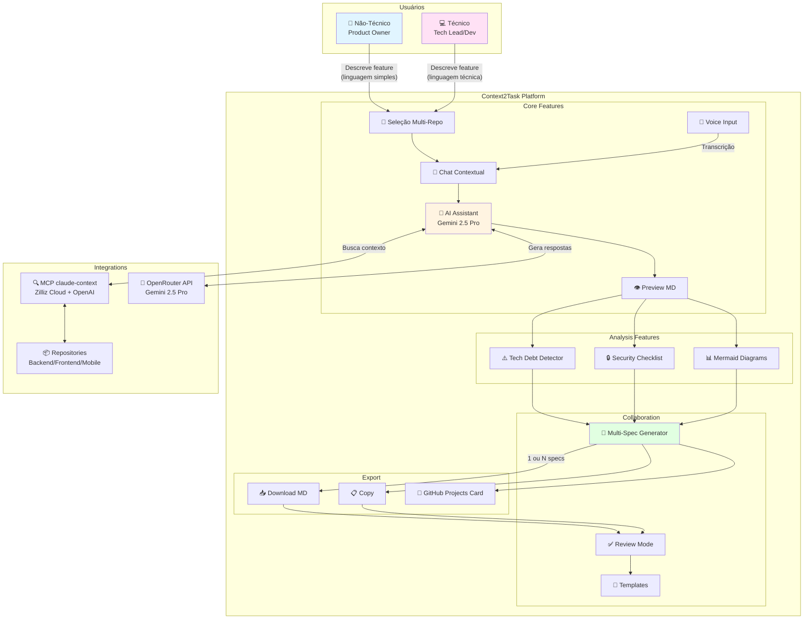

---

## 🔄 Diagrama 2: Fluxo Completo de Criação de Spec

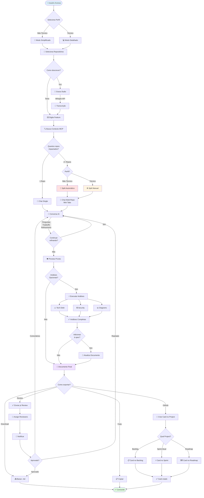

---

## 🏗️ Diagrama 3: Arquitetura Técnica

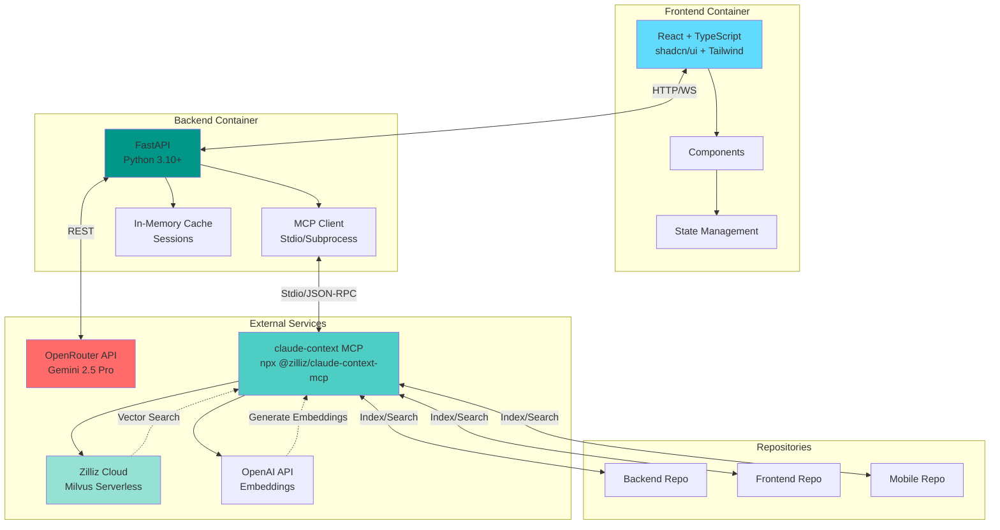

---

## 🎭 Diagrama 4: Fluxo Multi-Spec (Feature Complexa)

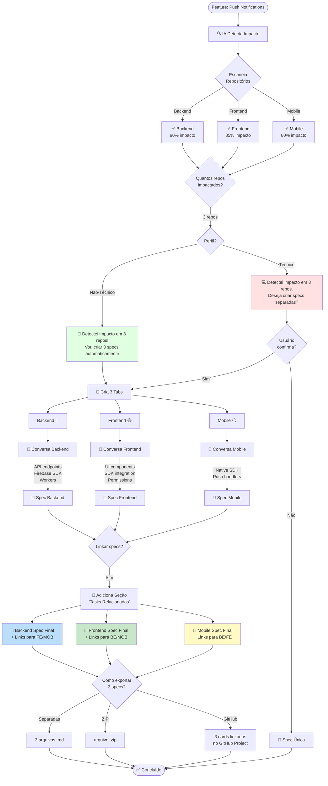

---

## 🎤 Diagrama 5: Voice Input Flow

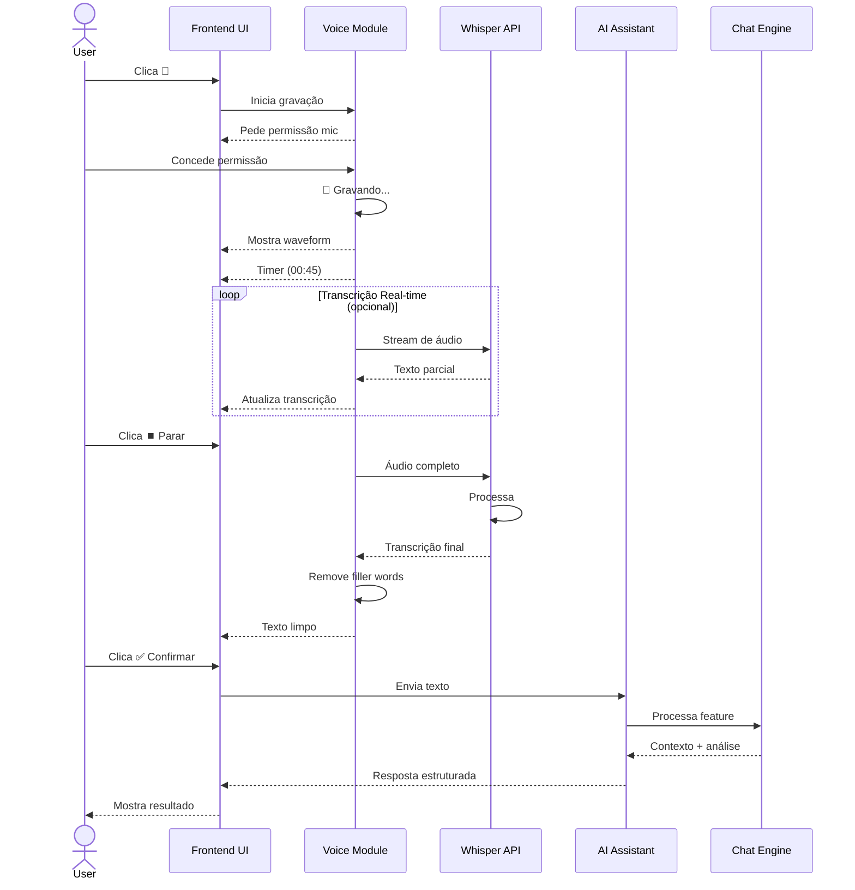

---

## 🔒 Diagrama 6: Security & Tech Debt Analysis Flow

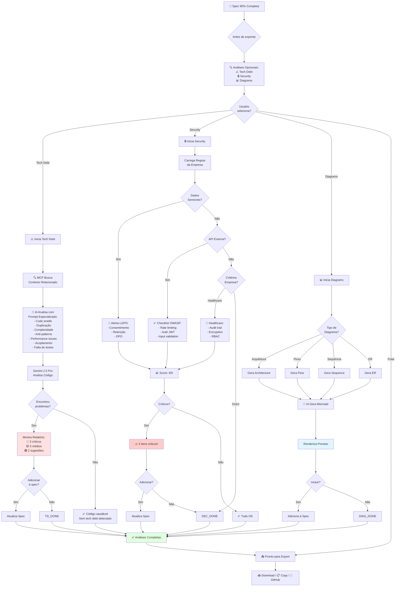

---

## 🔄 Diagrama 7: Review Mode Workflow

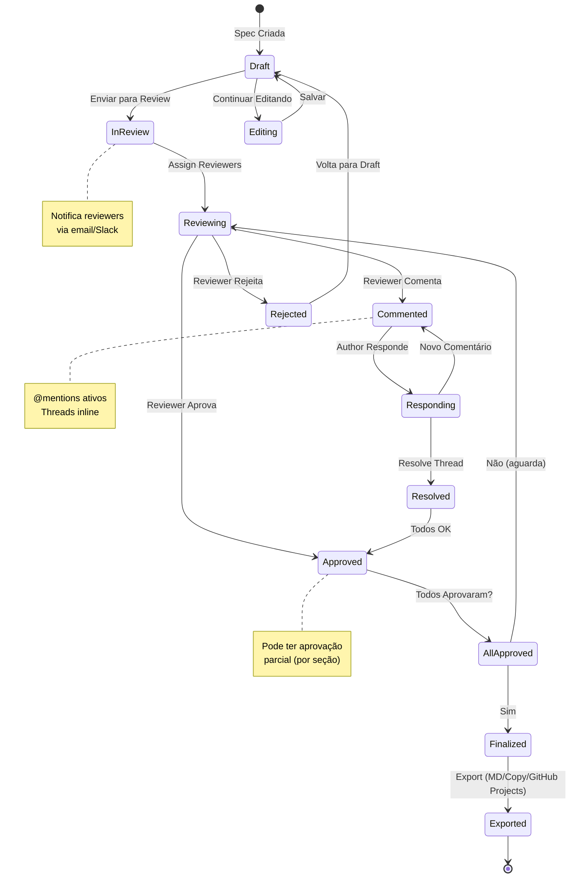

---

## 📊 Diagrama 8: Data Flow & Integration

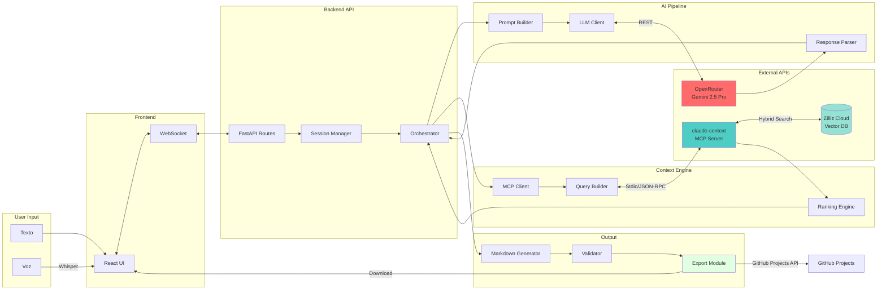

---

## 🎯 Diagrama 9: Casos de Uso por Perfil

```mermaid
graph TB
    subgraph "Perfil Não-Técnico 👔"
        NT_UC1[UC1: Criar Spec Simples<br/>Linguagem natural]
        NT_UC2[UC2: Voice Input<br/>Falar feature]
        NT_UC3[UC3: Ver Preview<br/>Documento em tempo real]
        NT_UC4[UC4: Split Automático<br/>Multi-repo sem decisão]
        NT_UC5[UC5: Enviar para Dev<br/>Download/Copy]
    end
    
    subgraph "Perfil Técnico 💻"
        TEC_UC1[UC1: Spec Detalhada<br/>Análise técnica profunda]
        TEC_UC2[UC2: Explorar Tradeoffs<br/>Comparar arquiteturas]
        TEC_UC3[UC3: Ver Código<br/>Snippets relevantes]
        TEC_UC4[UC4: Split Manual<br/>Controle fino de repos]
        TEC_UC5[UC5: Tech Debt Analysis<br/>TODOs/FIXMEs]
        TEC_UC6[UC6: Security Check<br/>OWASP/LGPD]
        TEC_UC7[UC7: Gerar Diagramas<br/>Mermaid arquitetura]
    end
    
    subgraph "Casos de Uso Comuns"
        COM_UC1[UC8: Histórico<br/>Ver specs anteriores]
        COM_UC2[UC9: Templates<br/>Reutilizar padrões]
        COM_UC3[UC10: Review Mode<br/>Aprovar specs]
        COM_UC4[UC11: Export<br/>MD/JSON/GitHub Projects]
    end
    
    subgraph "Sistema"
        SYS[Context2Task]
    end
    
    NT_UC1 --> SYS
    NT_UC2 --> SYS
    NT_UC3 --> SYS
    NT_UC4 --> SYS
    NT_UC5 --> SYS
    
    TEC_UC1 --> SYS
    TEC_UC2 --> SYS
    TEC_UC3 --> SYS
    TEC_UC4 --> SYS
    TEC_UC5 --> SYS
    TEC_UC6 --> SYS
    TEC_UC7 --> SYS
    
    COM_UC1 --> SYS
    COM_UC2 --> SYS
    COM_UC3 --> SYS
    COM_UC4 --> SYS
    
    style NT_UC1 fill:#e1f5ff
    style NT_UC2 fill:#e1f5ff
    style NT_UC3 fill:#e1f5ff
    style NT_UC4 fill:#e1f5ff
    style NT_UC5 fill:#e1f5ff
    
    style TEC_UC1 fill:#ffe1f5
    style TEC_UC2 fill:#ffe1f5
    style TEC_UC3 fill:#ffe1f5
    style TEC_UC4 fill:#ffe1f5
    style TEC_UC5 fill:#ffe1f5
    style TEC_UC6 fill:#ffe1f5
    style TEC_UC7 fill:#ffe1f5
    
    style COM_UC1 fill:#fff4e1
    style COM_UC2 fill:#fff4e1
    style COM_UC3 fill:#fff4e1
    style COM_UC4 fill:#fff4e1
```

---

## 🧠 Diagrama 10: Tech Debt Detector Inteligente (IA)

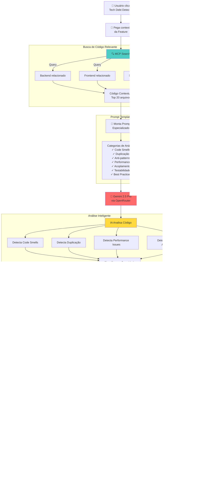

### Comparação: Abordagem Antiga vs Nova

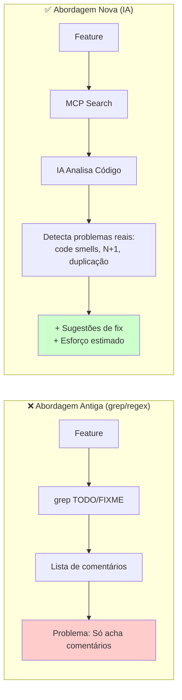

---

## 🎯 Diagrama 11: GitHub Projects Integration

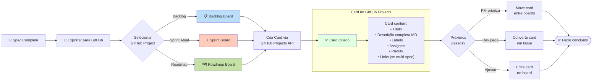

### Exemplo: Multi-Spec → 3 Cards Linkados

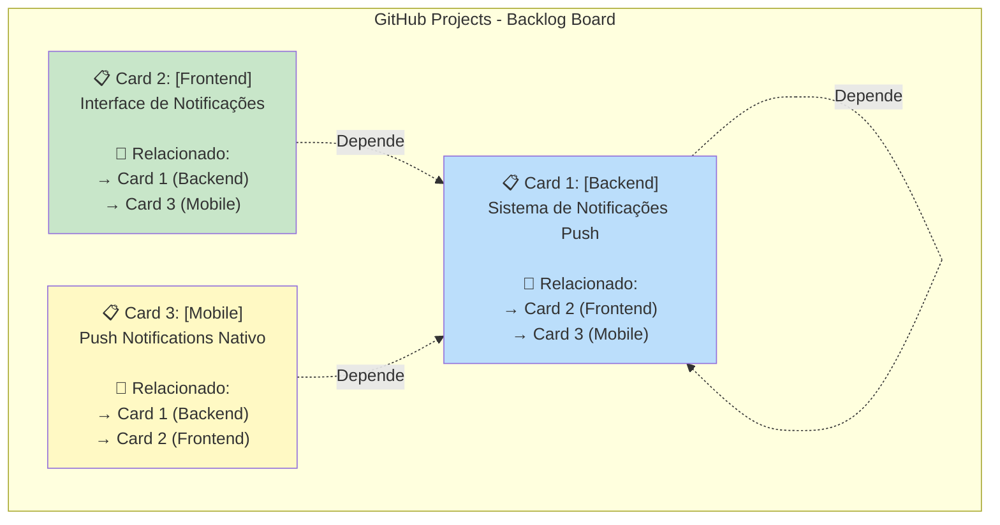

---

## 📝 Legenda e Notas

### Cores
- 🔵 **Azul claro**: Features não-técnicas
- 🟣 **Rosa claro**: Features técnicas
- 🟡 **Amarelo claro**: Features comuns
- 🟢 **Verde claro**: Estados finais/sucesso
- 🔴 **Vermelho claro**: Alertas/decisões críticas

### Símbolos
- 📁 Repositórios
- 💬 Chat/Conversa
- 🤖 IA/Automação
- 🔍 Busca/Análise
- 📄 Documentos
- ⚠️ Alertas/Tech Debt
- 🔒 Segurança
- 👤 Usuário
- 🎤 Voice Input
- ✅ Aprovação/Sucesso
- 🚀 Export/Deploy

### 📝 Notas Importantes

#### Tech Debt Detector Inteligente 🧠

A análise de tech debt **não usa grep/regex** para procurar TODOs/FIXMEs (abordagem ultrapassada). Ao invés disso, usa **IA com acesso ao código via MCP** para análise profunda:

**Fluxo de Análise**:
1. **MCP Search**: Busca código relacionado à feature nos repositórios selecionados
2. **Prompt Especializado**: Envia código para IA com prompt focado em detectar:
   - 🔴 **Code Smells**: Long methods, god classes, shotgun surgery
   - 🔴 **Duplicação**: Código repetido, falta de abstração
   - 🔴 **Complexidade Ciclomática**: Funções muito complexas (> 10)
   - 🔴 **Anti-patterns**: Singleton abuse, magic numbers, global state
   - 🟡 **Performance**: N+1 queries, loops desnecessários, alocações excessivas
   - 🟡 **Acoplamento**: Dependências circulares, tight coupling
   - 🟡 **Falta de Testes**: Coverage baixo, código não testável
   - 🟢 **Violações de Padrões**: Naming conventions, estrutura de pastas
   - 🟢 **Documentação**: Falta de docstrings, comentários obsoletos

**Prompt Example**:
```
Você é um arquiteto de software expert. Analise o código abaixo relacionado 
à feature "{feature_description}" e identifique tech debt nos seguintes aspectos:

1. Code Smells (complexidade, tamanho de métodos, god classes)
2. Duplicação de código
3. Anti-patterns (singleton abuse, magic numbers, etc.)
4. Performance issues (N+1, loops ineficientes)
5. Acoplamento excessivo
6. Falta de testes ou código não testável
7. Violações de best practices da stack ({stack_tech})

Para cada problema encontrado, forneça:
- Severidade (Crítico/Médio/Baixo)
- Localização (arquivo:linha)
- Descrição clara do problema
- Sugestão de refatoração
- Estimativa de esforço (horas)

Código a analisar:
{code_context_from_mcp}
```

**Output da IA**:
```json
{
  "tech_debt": [
    {
      "severity": "critical",
      "category": "code_smell",
      "file": "backend/services/notification_service.py",
      "line": 145,
      "issue": "Método send_notification() tem 85 linhas (máx recomendado: 20)",
      "suggestion": "Quebrar em métodos menores: _validate, _prepare, _send, _log",
      "effort_hours": 2
    },
    {
      "severity": "medium",
      "category": "performance",
      "file": "backend/api/routes.py",
      "line": 67,
      "issue": "N+1 query: loop carrega usuários um por um",
      "suggestion": "Usar select_related() ou prefetch_related()",
      "effort_hours": 0.5
    }
  ]
}
```

**Vantagens sobre grep de TODOs**:
- ✅ Detecta problemas reais no código (não apenas comentários)
- ✅ Analisa qualidade arquitetural
- ✅ Prioriza por severidade real
- ✅ Dá sugestões concretas de refatoração
- ✅ Estima esforço para correção

---

#### Integração GitHub Projects
A plataforma **não cria Issues diretamente**, mas sim **Cards no GitHub Projects**:

1. **Fluxo de Export para GitHub**:
   - Usuário clica em "🚀 Exportar para GitHub"
   - Sistema pergunta: "Qual Project?" (Backlog / Sprint Atual / Roadmap)
   - Cria card no board selecionado via GitHub Projects API
   - Cards podem depois ser convertidos em Issues pelos devs

2. **Multi-Spec → GitHub Projects**:
   - Quando há 3 specs (Backend/Frontend/Mobile)
   - Sistema cria **3 cards linkados** no mesmo Project
   - Cards referenciam uns aos outros (tasks relacionadas)
   - Permite paralelização do trabalho entre times

3. **Vantagens**:
   - ✅ Cards vão direto pro board de gestão (Backlog, Sprint, etc.)
   - ✅ Já aparecem organizados no fluxo de trabalho
   - ✅ Não poluem as Issues do repo antes da priorização
   - ✅ PMs podem mover cards entre boards antes de virar Issue

---

## 🔗 Documentos de Referência

Estes diagramas foram gerados a partir de:
- `spec.md` - Especificação completa
- `interface-final-v2.md` - Interface ajustada
- `user-flows.md` - Fluxos detalhados
- `multi-spec-feature.md` - Feature multi-repo
- `priority-features-detail.md` - Features prioritárias
- `mcp-integration-notes.md` - Integração MCP
- `openrouter-integration-notes.md` - Integração LLM

---

**Criado**: 2025-10-19  
**Status**: Documentação Completa  
**Plataforma**: Context2Task

