# Implementation Tasks: Context2Task

**Feature ID**: ai-feature-assistant-platform  
**Platform**: Context2Task - AI-powered platform for transforming codebase context into actionable task specifications

---

## Overview

This document breaks down the technical implementation of Context2Task into discrete, manageable development tasks. The platform consists of a React frontend, FastAPI backend with LangGraph agent orchestration, and integrations with OpenRouter (Gemini 2.5 Pro) and MCP for codebase indexing.

**Total Estimated Effort**: 12-15 days (MVP)  
**Target Timeline**: 3 weeks for V1  
**Team Size**: 1-2 developers  
**Technology Stack**: React + TypeScript + FastAPI + LangGraph + Gemini 2.5 Pro + MCP

---

## Task Breakdown

### Phase 1: Foundation & Setup (Days 1-3)

#### TASK-001: Docker Infrastructure Setup
**Description**: Set up complete Docker infrastructure for local development with single-command startup

**Acceptance Criteria**:
- `docker-compose.yml` configured with frontend, backend services
- Multi-stage Dockerfile for frontend (build + nginx)
- Backend Dockerfile with Python 3.10+
- `.env.example` with all required environment variables
- `scripts/start.sh` and `scripts/stop.sh` helpers
- Health check endpoints for both services
- Services can communicate via internal Docker network
- README with setup instructions

**Dependencies**: None  
**Estimated Effort**: 0.5 days  
**Priority**: P0 (Blocker)  
**Assignee**: Backend Developer  
**Status**: Not Started

**Technical Notes**:
```yaml
# docker-compose.yml structure
services:
  frontend:
    build: ./frontend
    ports: ["3000:80"]
    environment:
      - VITE_API_URL=http://backend:8000
      
  backend:
    build: ./backend
    ports: ["8000:8000"]
    environment:
      - OPENROUTER_API_KEY=${OPENROUTER_API_KEY}
      - ZILLIZ_API_KEY=${ZILLIZ_API_KEY}
      - OPENAI_API_KEY=${OPENAI_API_KEY}
```

**Validation**:
```bash
$ docker-compose up
# ✅ Frontend accessible at localhost:3000
# ✅ Backend accessible at localhost:8000
# ✅ curl localhost:8000/health returns {"status": "healthy"}
```

---

#### TASK-002: Frontend Base Setup
**Description**: Initialize React + TypeScript + Vite project with shadcn/ui and Tailwind CSS

**Acceptance Criteria**:
- Vite project created with TypeScript template
- shadcn/ui installed and configured
- Tailwind CSS configured with custom theme
- Folder structure created (components/, pages/, stores/, api/, types/)
- **Base shadcn components conforme `interface-final-v2.md`**:
  - ✅ Button, Input, Card
  - ✅ **DropdownMenu** (para sidebar com dropdowns - CRÍTICO)
  - ✅ **Tabs** (para multi-spec mini tabs - CRÍTICO)
  - ✅ **Dialog** (para preview modal fullscreen - CRÍTICO)
  - ✅ Badge (para status indicators)
  - ✅ Textarea, Select, Checkbox
- React Router v6 configured
- Zustand store setup
- TypeScript strict mode enabled
- ESLint + Prettier configured

**Dependencies**: TASK-001  
**Estimated Effort**: 1 day  
**Priority**: P0  
**Assignee**: Frontend Developer  
**Status**: Not Started

**Technical Notes**:
```typescript
// Folder structure conforme interface-final-v2.md
frontend/src/
├── components/
│   ├── ui/              // shadcn components
│   │   ├── button.tsx
│   │   ├── input.tsx
│   │   ├── card.tsx
│   │   ├── dropdown-menu.tsx  ← NOVO (sidebar dropdowns)
│   │   ├── tabs.tsx           ← NOVO (multi-spec tabs)
│   │   ├── dialog.tsx         ← NOVO (preview modal)
│   │   └── badge.tsx          ← NOVO (status indicators)
│   ├── chat/
│   │   ├── ChatMessage.tsx
│   │   ├── ChatInput.tsx
│   │   ├── ChatHistory.tsx
│   │   └── VoiceInput.tsx     ← NOVO
│   ├── sidebar/
│   │   ├── Sidebar.tsx                 # Com dropdowns!
│   │   ├── RepoSelectorDropdown.tsx    ← NOVO
│   │   ├── ProfileSelectorDropdown.tsx ← NOVO
│   │   ├── ActionsDropdown.tsx         ← NOVO
│   │   └── MultiSpecProgress.tsx       ← NOVO
│   └── preview/
│       ├── MarkdownPreviewModal.tsx    ← Modal fullscreen!
│       └── MermaidDiagram.tsx
├── pages/
│   ├── Home.tsx
│   ├── Session.tsx      # Chat 100% durante conversa
│   └── Review.tsx       # Página separada
├── stores/
│   └── session.ts       // Zustand
├── api/
│   └── client.ts
├── types/
│   └── index.ts
└── App.tsx
```

**Instalação shadcn components**:
```bash
# Componentes essenciais para interface-final-v2.md
npx shadcn-ui@latest add button input card
npx shadcn-ui@latest add dropdown-menu  # CRÍTICO para sidebar
npx shadcn-ui@latest add tabs           # CRÍTICO para multi-spec
npx shadcn-ui@latest add dialog         # CRÍTICO para preview
npx shadcn-ui@latest add badge textarea select checkbox
```

---

#### TASK-003: Backend Base Setup
**Description**: Initialize FastAPI application with project structure and basic endpoints

**Acceptance Criteria**:
- FastAPI project created with Python 3.10+
- Project structure implemented (api/, models/, services/, utils/)
- Health check endpoint (`/health`)
- Session management with in-memory storage
- CORS middleware configured for frontend
- Structured logging with structlog
- Error handling middleware
- Pydantic models for API requests/responses
- pytest setup with async support
- OpenAPI docs accessible at `/docs`

**Dependencies**: TASK-001  
**Estimated Effort**: 1 day  
**Priority**: P0  
**Assignee**: Backend Developer  
**Status**: Not Started

**Technical Notes**:
```python
# backend/ structure
backend/
├── main.py
├── api/
│   ├── __init__.py
│   ├── sessions.py
│   ├── conversations.py
│   └── analysis.py
├── agent/
│   ├── __init__.py
│   ├── graph.py           # LangGraph workflow
│   ├── state.py           # AgentState definition
│   ├── nodes/             # Individual graph nodes
│   │   ├── conversation.py
│   │   ├── analysis.py
│   │   └── export.py
│   └── edges.py           # Conditional routing
├── models/
│   ├── session.py
│   ├── message.py
│   └── spec.py
├── services/
│   ├── llm_service.py     # OpenRouter client
│   ├── mcp_service.py     # MCP subprocess client
│   └── spec_generator.py
├── utils/
│   ├── logging.py
│   └── validation.py
├── config.py
├── requirements.txt
└── tests/
```

**Validation**:
```bash
$ curl http://localhost:8000/health
{"status": "healthy", "version": "1.0.0"}

$ curl -X POST http://localhost:8000/api/sessions \
  -H "Content-Type: application/json" \
  -d '{"user_profile": "technical", "repositories": ["/test"]}'
{"session_id": "sess_abc123", "status": "created"}
```

---

### Phase 2: Core Integrations (Days 4-7)

#### TASK-004: OpenRouter + Gemini Integration
**Description**: Implement LLM integration with OpenRouter API using Gemini 2.5 Pro

**Acceptance Criteria**:
- OpenRouter client configured (compatible with OpenAI SDK)
- Support for streaming responses
- Token counting and cost tracking
- Retry logic with exponential backoff
- Error handling for rate limits and API errors
- System prompts for technical vs non-technical profiles
- Async support for FastAPI
- Unit tests for LLM service

**Dependencies**: TASK-003  
**Estimated Effort**: 1 day  
**Priority**: P0  
**Assignee**: Backend Developer  
**Status**: Not Started

**Technical Notes**:
```python
# backend/services/llm_service.py
from openai import AsyncOpenAI

class LLMService:
    def __init__(self):
        self.client = AsyncOpenAI(
            base_url="https://openrouter.ai/api/v1",
            api_key=settings.OPENROUTER_API_KEY,
        )
        self.model = "google/gemini-2.0-flash-exp:free"
    
    async def chat_completion(
        self,
        messages: list[dict],
        stream: bool = False,
        temperature: float = 0.7,
    ):
        response = await self.client.chat.completions.create(
            model=self.model,
            messages=messages,
            stream=stream,
            temperature=temperature,
            extra_headers={
                "HTTP-Referer": "https://context2task.local",
                "X-Title": "Context2Task",
            }
        )
        return response
```

---

#### TASK-005: MCP Client Implementation
**Description**: Implement MCP client to communicate with claude-context server via subprocess

**Acceptance Criteria**:
- Subprocess management for `npx @zilliztech/mcp-server-claude-context`
- JSON-RPC communication via stdio
- Support for `search_code`, `index_codebase`, `get_indexing_status`
- Process lifecycle management (start, stop, restart)
- Error handling for subprocess failures
- Timeout handling
- Async wrapper for subprocess communication
- Unit tests with mocked subprocess

**Dependencies**: TASK-003  
**Estimated Effort**: 1.5 days  
**Priority**: P0  
**Assignee**: Backend Developer  
**Status**: Not Started

**Technical Notes**:
```python
# backend/services/mcp_service.py
import asyncio
import json
from typing import Dict, List

class MCPService:
    def __init__(self):
        self.process = None
        self.request_id = 0
    
    async def start(self):
        """Start MCP server subprocess"""
        self.process = await asyncio.create_subprocess_exec(
            "npx", "@zilliztech/mcp-server-claude-context",
            stdin=asyncio.subprocess.PIPE,
            stdout=asyncio.subprocess.PIPE,
            stderr=asyncio.subprocess.PIPE,
        )
    
    async def search_code(
        self,
        path: str,
        query: str,
        limit: int = 10
    ) -> List[Dict]:
        """Search codebase using MCP"""
        request = {
            "jsonrpc": "2.0",
            "id": self.request_id,
            "method": "tools/call",
            "params": {
                "name": "search_code",
                "arguments": {
                    "path": path,
                    "query": query,
                    "limit": limit
                }
            }
        }
        self.request_id += 1
        
        # Send request
        self.process.stdin.write(json.dumps(request).encode() + b"\n")
        await self.process.stdin.drain()
        
        # Read response
        response_line = await self.process.stdout.readline()
        response = json.loads(response_line.decode())
        
        return response.get("result", {}).get("content", [])
```

---

#### TASK-006: LangGraph Agent Architecture (EXPANDIDA EM SUBTASKS)

**ATENÇÃO**: Esta task foi expandida em 8 subtasks (TASK-006-a até TASK-006-h) para melhor organização e cobertura.

**Veja abaixo as subtasks detalhadas**:

---

#### TASK-006-a: AgentState TypedDict Definition
**Description**: Define complete AgentState TypedDict with all 20+ fields for graph state management

**Acceptance Criteria**:
- ✅ `AgentState` TypedDict com **20+ campos** (conforme `langgraph-architecture.md`)
- ✅ Campos para session (`session_id`, `user_profile`)
- ✅ Campos para repositories (`selected_repositories`)
- ✅ Campos para conversation (`messages` com `add_messages` reducer)
- ✅ Campos para spec (`spec_sections`, `completion_percentage`)
- ✅ Campos para features opcionais (`tech_debt_report`, `security_report`, `mermaid_diagram`)
- ✅ Campos para multi-spec (`is_multi_spec`, `affected_repositories`, `multi_spec_details`)
- ✅ Campos de controle (`should_analyze_tech_debt`, `should_check_security`, etc.)
- ✅ `UserCommand` enum com 8+ comandos
- ✅ Type hints completos com `Annotated`, `Optional`, `Literal`
- ✅ Docstrings para cada campo

**Dependencies**: TASK-004  
**Estimated Effort**: 0.5 days  
**Priority**: P0  
**Assignee**: Backend Developer  
**Status**: Not Started

**Technical Notes** (Baseado em LangGraph 0.6.0 docs):
```python
# backend/agent/state.py
# ⚠️ Baseado em LangGraph 0.6.0 official docs

from typing import Annotated, List, Dict, Optional, Literal
from typing_extensions import TypedDict, NotRequired
from operator import add
from enum import Enum

from langgraph.graph.message import add_messages


class UserCommand(str, Enum):
    """User-triggered commands for explicit graph control"""
    CONTINUE = "continue"  # Continue conversation
    ANALYZE_TECH_DEBT = "analyze_tech_debt"  # Trigger tech debt analysis
    CHECK_SECURITY = "check_security"  # Trigger security check
    GENERATE_DIAGRAM = "generate_diagram"  # Generate Mermaid diagram
    DETECT_MULTI_SPEC = "detect_multi_spec"  # Detect multi-repo split
    PREVIEW_SPEC = "preview_spec"  # Preview generated spec
    EXPORT = "export"  # Export final spec
    CANCEL = "cancel"  # Cancel current operation


class AgentState(TypedDict):
    """
    Complete state schema for Context2Task agent.
    
    Based on LangGraph 0.6.0 StateGraph patterns:
    - Uses TypedDict for structured state
    - Annotated reducers for list aggregation
    - NotRequired for optional fields
    """
    
    # ===== SESSION INFO =====
    session_id: str  # Unique session identifier
    user_profile: Literal["technical", "non_technical"]  # User profile type
    
    # ===== REPOSITORIES =====
    selected_repositories: List[str]  # List of repository paths
    codebase_context: List[Dict]  # MCP search results (relevant code snippets)
    
    # ===== CONVERSATION =====
    # Using add_messages reducer from langgraph.graph.message
    messages: Annotated[List[Dict[str, str]], add_messages]  # Chat history
    
    # ===== FEATURE ANALYSIS =====
    feature_summary: str  # Extracted feature description
    feature_complexity: NotRequired[int]  # Complexity score (1-5)
    
    # ===== SPEC GENERATION =====
    spec_sections: Dict[str, str]  # 10 sections from company-task-template.md
    completion_percentage: int  # 0-100 (threshold: 80%)
    
    # ===== OPTIONAL FEATURES =====
    tech_debt_report: NotRequired[Dict]  # AI-powered tech debt analysis
    security_report: NotRequired[Dict]  # LGPD + OWASP + Company rules
    mermaid_diagram: NotRequired[str]  # Generated Mermaid code
    
    # ===== MULTI-SPEC =====
    is_multi_spec: bool  # Whether to split into multiple specs
    affected_repositories: List[str]  # Repos impacted by feature
    multi_spec_details: NotRequired[Dict]  # Split details per repo
    
    # ===== CONTROL FLAGS =====
    should_analyze_tech_debt: bool  # User requested tech debt check
    should_check_security: bool  # User requested security check
    should_generate_diagram: bool  # User requested diagram
    
    # ===== USER COMMANDS =====
    last_user_command: NotRequired[UserCommand]  # Last explicit command
    
    # ===== METADATA =====
    iteration_count: Annotated[int, add]  # Number of conversation turns
    current_node: NotRequired[str]  # Current graph node (for debugging)


# Helper type for node return values
class StateUpdate(TypedDict, total=False):
    """Partial state update (any subset of AgentState fields)"""
    session_id: str
    user_profile: Literal["technical", "non_technical"]
    selected_repositories: List[str]
    codebase_context: List[Dict]
    messages: List[Dict[str, str]]
    feature_summary: str
    feature_complexity: int
    spec_sections: Dict[str, str]
    completion_percentage: int
    tech_debt_report: Dict
    security_report: Dict
    mermaid_diagram: str
    is_multi_spec: bool
    affected_repositories: List[str]
    multi_spec_details: Dict
    should_analyze_tech_debt: bool
    should_check_security: bool
    should_generate_diagram: bool
    last_user_command: UserCommand
    iteration_count: int
    current_node: str
```

**Validation Tests**:
```python
# tests/agent/test_state.py
import pytest
from backend.agent.state import AgentState, UserCommand


def test_agent_state_structure():
    """Validate AgentState has all required fields"""
    state: AgentState = {
        "session_id": "test-123",
        "user_profile": "technical",
        "selected_repositories": ["/path/to/repo"],
        "codebase_context": [],
        "messages": [],
        "feature_summary": "Test feature",
        "spec_sections": {},
        "completion_percentage": 0,
        "is_multi_spec": False,
        "affected_repositories": [],
        "should_analyze_tech_debt": False,
        "should_check_security": False,
        "should_generate_diagram": False,
        "iteration_count": 0,
    }
    
    assert state["session_id"] == "test-123"
    assert state["user_profile"] in ["technical", "non_technical"]


def test_user_command_enum():
    """Validate all UserCommand values"""
    assert UserCommand.CONTINUE == "continue"
    assert UserCommand.ANALYZE_TECH_DEBT == "analyze_tech_debt"
    assert UserCommand.EXPORT == "export"
    
    # Test enum has 8 commands
    assert len(UserCommand) == 8
```

---

#### TASK-006-b: Core Graph Nodes Implementation
**Description**: Implement 6 core nodes for main conversation loop

**Acceptance Criteria**:
- ✅ `analyze_feature_node`: Extract feature summary, complexity, affected components
- ✅ `search_codebase_node`: Query MCP with relevant search terms
- ✅ `llm_response_node`: Generate AI response with Gemini 2.5 Pro
- ✅ `update_spec_node`: Update spec sections progressively
- ✅ `check_completion_node`: Calculate completion % based on filled sections
- ✅ `wait_user_input_node`: Interrupt point for user input
- ✅ Cada node retorna `StateUpdate` (partial state)
- ✅ Async functions com proper error handling
- ✅ Integration com LLMService e MCPService
- ✅ Unit tests para cada node

**Dependencies**: TASK-004, TASK-005, TASK-006-a  
**Estimated Effort**: 2 days  
**Priority**: P0  
**Assignee**: Backend Developer  
**Status**: Not Started

**Technical Notes** (Baseado em LangGraph 0.6.0 + FastAPI 0.116.1):
```python
# backend/agent/nodes/core.py
# ⚠️ Baseado em LangGraph 0.6.0 official docs

from typing import Dict
from ..state import AgentState, StateUpdate
from ...services.llm import LLMService
from ...services.mcp import MCPService


async def analyze_feature_node(state: AgentState) -> StateUpdate:
    """
    Analyze user feature request and extract key information.
    
    Based on LangGraph pattern: async node function returning partial state.
    """
    llm_service = LLMService()
    
    # Get last user message
    last_message = state["messages"][-1]["content"]
    
    # Análise com LLM
    prompt = f"""
    Analyze this feature request and extract:
    1. Main goal (1-2 sentences)
    2. Affected components (list)
    3. Technical complexity (1-5 scale)
    4. 3 specific questions to ask user
    
    Feature request: {last_message}
    
    Context available:
    - Repositories: {state["selected_repositories"]}
    - User profile: {state["user_profile"]}
    
    Respond in JSON format.
    """
    
    response = await llm_service.chat_completion(
        messages=[{"role": "user", "content": prompt}],
        response_format={"type": "json_object"},
        model="google/gemini-2.0-flash-exp:free"
    )
    
    result = json.loads(response.choices[0].message.content)
    
    return {
        "feature_summary": result["main_goal"],
        "feature_complexity": result["complexity"],
        "messages": [{
            "role": "assistant",
            "content": f"Entendi! {result['main_goal']}\n\n" + "\n".join(result["questions"])
        }],
        "current_node": "analyze"
    }


async def search_codebase_node(state: AgentState) -> StateUpdate:
    """
    Search codebase using MCP for relevant context.
    
    Generates search queries based on feature summary and executes them.
    """
    mcp_service = MCPService()
    
    # Generate search queries
    queries = [
        f"implementation of {state['feature_summary']}",
        "related components and dependencies",
        "similar features or patterns",
    ]
    
    all_results = []
    for repo in state["selected_repositories"]:
        for query in queries:
            results = await mcp_service.search_code(
                path=repo,
                query=query,
                limit=5
            )
            all_results.extend(results)
    
    return {
        "codebase_context": all_results[:15],  # Top 15 results
        "current_node": "search"
    }


async def llm_response_node(state: AgentState) -> StateUpdate:
    """
    Generate AI response using context and conversation history.
    
    Uses profile-based prompts from prompts-library.md.
    """
    from ..prompts.profiles import get_system_prompt
    
    llm_service = LLMService()
    
    # Get appropriate system prompt
    system_prompt = get_system_prompt(state["user_profile"])
    
    # Build context
    context_summary = format_codebase_context(state["codebase_context"][:5])
    
    # Generate response
    response = await llm_service.chat_completion(
        messages=[
            {"role": "system", "content": system_prompt},
            *state["messages"],
            {"role": "system", "content": f"Relevant code context:\n{context_summary}"}
        ],
        model="google/gemini-2.5-pro"
    )
    
    return {
        "messages": [{
            "role": "assistant",
            "content": response.choices[0].message.content
        }],
        "iteration_count": 1,
        "current_node": "llm_response"
    }


async def update_spec_node(state: AgentState) -> StateUpdate:
    """
    Update spec sections progressively based on conversation.
    
    Fills company-task-template.md sections as information becomes available.
    """
    llm_service = LLMService()
    
    # Extract info for spec sections
    prompt = f"""
    Based on this conversation, extract information to fill these spec sections:
    
    Current sections: {list(state["spec_sections"].keys())}
    Conversation: {state["messages"][-5:]}  # Last 5 messages
    
    For each section, provide content if enough information is available.
    Return JSON: {{"section_name": "content or null"}}
    
    Sections to fill:
    1. Descrição / Contexto
    2. User Story
    3. Resultado Esperado
    4. Detalhes Técnicos / Escopo
    5. Checklist de Tarefas
    6. Critérios de Aceite
    7. Definição de Done
    8. Observações Adicionais
    9. Referências / Links Úteis
    10. Riscos ou Limitações
    """
    
    response = await llm_service.chat_completion(
        messages=[{"role": "user", "content": prompt}],
        response_format={"type": "json_object"}
    )
    
    updates = json.loads(response.choices[0].message.content)
    
    # Merge with existing sections
    updated_sections = {**state["spec_sections"], **{k: v for k, v in updates.items() if v}}
    
    return {
        "spec_sections": updated_sections,
        "current_node": "update_spec"
    }


async def check_completion_node(state: AgentState) -> StateUpdate:
    """
    Calculate spec completion percentage.
    
    Based on filled sections (10 sections total).
    """
    filled_sections = sum(1 for v in state["spec_sections"].values() if v and len(v) > 20)
    total_sections = 10
    
    completion = int((filled_sections / total_sections) * 100)
    
    return {
        "completion_percentage": completion,
        "current_node": "check_completion"
    }


async def wait_user_input_node(state: AgentState) -> StateUpdate:
    """
    Interrupt point - waits for user input.
    
    This node is marked as interrupt_before in graph compilation.
    """
    return {
        "current_node": "wait_input"
    }


def format_codebase_context(results: List[Dict]) -> str:
    """Helper to format MCP search results"""
    lines = []
    for r in results:
        lines.append(f"File: {r['file']}:{r['line']}")
        lines.append(f"```\n{r['content']}\n```\n")
    return "\n".join(lines)
```

**Validation Tests**:
```python
# tests/agent/nodes/test_core.py
import pytest
from backend.agent.nodes.core import (
    analyze_feature_node,
    search_codebase_node,
    check_completion_node
)
from backend.agent.state import AgentState


@pytest.mark.asyncio
async def test_analyze_feature_node():
    state: AgentState = {
        "session_id": "test",
        "user_profile": "technical",
        "selected_repositories": ["/repo1"],
        "messages": [{"role": "user", "content": "Add user authentication"}],
        "feature_summary": "",
        "spec_sections": {},
        "completion_percentage": 0,
        "is_multi_spec": False,
        "affected_repositories": [],
        "should_analyze_tech_debt": False,
        "should_check_security": False,
        "should_generate_diagram": False,
        "iteration_count": 0,
        "codebase_context": [],
    }
    
    result = await analyze_feature_node(state)
    
    assert "feature_summary" in result
    assert len(result["feature_summary"]) > 0
    assert "messages" in result


@pytest.mark.asyncio
async def test_check_completion_node():
    state: AgentState = {
        # ... base state
        "spec_sections": {
            "descricao": "Test description with more than 20 chars",
            "user_story": "As a user, I want...",
            # 2 of 10 filled
        },
        "completion_percentage": 0,
    }
    
    result = await check_completion_node(state)
    
    assert result["completion_percentage"] == 20  # 2/10 = 20%
```

---

#### TASK-006-c: Optional Feature Nodes (Already Implemented)
**Description**: Verify and integrate optional feature nodes (tech_debt, security, diagram, multi_spec)

**Acceptance Criteria**:
- ✅ `tech_debt_node` → TASK-011 (já implementado com prompt integration ✅)
- ✅ `security_check_node` → TASK-012 (já implementado com prompt integration ✅)
- ✅ `generate_diagram_node` → TASK-013 (já implementado com prompt integration ✅)
- ✅ `detect_multi_spec_node` → TASK-010 (já implementado com prompt integration ✅)
- ✅ Cada node segue padrão: async function returning StateUpdate
- ✅ Nodes invocados por `UserCommand` routing
- ✅ Unit tests validam integração com state

**Dependencies**: TASK-006-a, TASK-010, TASK-011, TASK-012, TASK-013  
**Estimated Effort**: 0 days (já implementado)  
**Priority**: P0  
**Assignee**: Backend Developer  
**Status**: Not Started (validation only)

**Technical Notes**:
```python
# backend/agent/nodes/__init__.py
# Consolidate all nodes

from .core import (
    analyze_feature_node,
    search_codebase_node,
    llm_response_node,
    update_spec_node,
    check_completion_node,
    wait_user_input_node,
)

from .tech_debt import tech_debt_node  # TASK-011
from .security import security_check_node  # TASK-012
from .diagram import generate_diagram_node  # TASK-013
from .multi_spec import detect_multi_spec_node  # TASK-010

__all__ = [
    # Core
    "analyze_feature_node",
    "search_codebase_node",
    "llm_response_node",
    "update_spec_node",
    "check_completion_node",
    "wait_user_input_node",
    # Optional
    "tech_debt_node",
    "security_check_node",
    "generate_diagram_node",
    "detect_multi_spec_node",
]
```

---

#### TASK-006-d: UserCommand Routing & Conditional Edges
**Description**: Implement routing logic and conditional edges for graph flow control

**Acceptance Criteria**:
- ✅ `route_user_command()` function com lógica de roteamento
- ✅ Routing baseado em `last_user_command` e `completion_percentage`
- ✅ 8 routes possíveis (continue, tech_debt, security, diagram, multi_spec, preview, export, cancel)
- ✅ Default route quando sem comando explícito
- ✅ Logging de decisões de routing
- ✅ Unit tests para cada route

**Dependencies**: TASK-006-a  
**Estimated Effort**: 0.5 days  
**Priority**: P0  
**Assignee**: Backend Developer  
**Status**: Not Started

**Technical Notes** (Baseado em LangGraph conditional_edges):
```python
# backend/agent/edges.py
# ⚠️ Baseado em LangGraph 0.6.0 conditional edges pattern

from typing import Literal
from .state import AgentState, UserCommand
import logging

logger = logging.getLogger(__name__)


def route_user_command(
    state: AgentState
) -> Literal[
    "analyze",
    "tech_debt",
    "security",
    "diagram",
    "multi_spec",
    "preview",
    "export",
    "__end__"
]:
    """
    Conditional routing based on user command or AI decision.
    
    Based on LangGraph pattern:
    - Returns string matching node name or "__end__"
    - Used in graph.add_conditional_edges()
    """
    
    command = state.get("last_user_command")
    completion = state["completion_percentage"]
    
    # Explicit user commands
    if command == UserCommand.ANALYZE_TECH_DEBT:
        logger.info(f"[{state['session_id']}] Routing to tech_debt (user command)")
        return "tech_debt"
    
    elif command == UserCommand.CHECK_SECURITY:
        logger.info(f"[{state['session_id']}] Routing to security (user command)")
        return "security"
    
    elif command == UserCommand.GENERATE_DIAGRAM:
        logger.info(f"[{state['session_id']}] Routing to diagram (user command)")
        return "diagram"
    
    elif command == UserCommand.DETECT_MULTI_SPEC:
        logger.info(f"[{state['session_id']}] Routing to multi_spec (user command)")
        return "multi_spec"
    
    elif command == UserCommand.PREVIEW_SPEC:
        logger.info(f"[{state['session_id']}] Routing to preview")
        return "preview"
    
    elif command == UserCommand.EXPORT:
        logger.info(f"[{state['session_id']}] Routing to export (END)")
        return "export"
    
    elif command == UserCommand.CANCEL:
        logger.info(f"[{state['session_id']}] Routing to END (cancel)")
        return "__end__"
    
    # AI-driven decision
    if completion >= 80:
        # Spec is complete, ready for optional features or export
        logger.info(f"[{state['session_id']}] Spec {completion}% complete, waiting for user decision")
        return "preview"  # Show preview, wait for export
    
    else:
        # Continue conversation loop
        logger.info(f"[{state['session_id']}] Spec {completion}% complete, continuing conversation")
        return "analyze"


def should_loop_or_finish(state: AgentState) -> Literal["wait_input", "__end__"]:
    """
    Decide if should continue loop or finish.
    
    Used after update_spec node.
    """
    completion = state["completion_percentage"]
    max_iterations = 20  # Safety limit
    
    if state["iteration_count"] >= max_iterations:
        logger.warning(f"[{state['session_id']}] Max iterations reached, ending")
        return "__end__"
    
    if completion >= 100:
        logger.info(f"[{state['session_id']}] Spec 100% complete, ending")
        return "__end__"
    
    return "wait_input"
```

**Validation Tests**:
```python
# tests/agent/test_edges.py
import pytest
from backend.agent.edges import route_user_command
from backend.agent.state import AgentState, UserCommand


def test_route_explicit_tech_debt():
    state: AgentState = {
        # ... base state
        "last_user_command": UserCommand.ANALYZE_TECH_DEBT,
        "completion_percentage": 50,
    }
    
    route = route_user_command(state)
    assert route == "tech_debt"


def test_route_completion_triggers_preview():
    state: AgentState = {
        # ... base state
        "completion_percentage": 85,  # >= 80%
    }
    
    route = route_user_command(state)
    assert route == "preview"


def test_route_continue_when_incomplete():
    state: AgentState = {
        # ... base state
        "completion_percentage": 40,
    }
    
    route = route_user_command(state)
    assert route == "analyze"
```

---

#### TASK-006-e: Graph Construction & Compilation
**Description**: Build complete StateGraph with all nodes, edges, and checkpointing

**Acceptance Criteria**:
- ✅ `create_agent_graph()` function constructs StateGraph
- ✅ All 10+ nodes adicionados (core + optional)
- ✅ Direct edges entre core nodes
- ✅ Conditional edges com route_user_command
- ✅ Entry point definido (START -> analyze)
- ✅ Terminal edges para END
- ✅ Graph compilation com MemorySaver
- ✅ `interrupt_before=["wait_input"]` configurado
- ✅ Mermaid diagram do grafo gerado para documentação

**Dependencies**: TASK-006-a, TASK-006-b, TASK-006-c, TASK-006-d  
**Estimated Effort**: 0.5 days  
**Priority**: P0  
**Assignee**: Backend Developer  
**Status**: Not Started

**Technical Notes** (Baseado em LangGraph 0.6.0 graph construction):
```python
# backend/agent/graph.py
# ⚠️ Baseado em LangGraph 0.6.0 StateGraph + checkpointing

from langgraph.graph import StateGraph, START, END
from langgraph.checkpoint.memory import MemorySaver

from .state import AgentState
from .nodes import (
    # Core nodes
    analyze_feature_node,
    search_codebase_node,
    llm_response_node,
    update_spec_node,
    check_completion_node,
    wait_user_input_node,
    # Optional nodes
    tech_debt_node,
    security_check_node,
    generate_diagram_node,
    detect_multi_spec_node,
)
from .edges import route_user_command, should_loop_or_finish


def create_agent_graph():
    """
    Create and compile LangGraph StateGraph for Context2Task agent.
    
    Based on LangGraph 0.6.0 patterns:
    - StateGraph with TypedDict state
    - MemorySaver for checkpointing
    - Conditional edges for routing
    - Interrupt points for human-in-the-loop
    """
    
    # Initialize builder
    builder = StateGraph(AgentState)
    
    # ===== ADD CORE NODES =====
    builder.add_node("analyze", analyze_feature_node)
    builder.add_node("search", search_codebase_node)
    builder.add_node("llm_response", llm_response_node)
    builder.add_node("update_spec", update_spec_node)
    builder.add_node("check_completion", check_completion_node)
    builder.add_node("wait_input", wait_user_input_node)
    
    # ===== ADD OPTIONAL NODES =====
    builder.add_node("tech_debt", tech_debt_node)
    builder.add_node("security", security_check_node)
    builder.add_node("diagram", generate_diagram_node)
    builder.add_node("multi_spec", detect_multi_spec_node)
    
    # ===== DEFINE CORE FLOW (LINEAR) =====
    builder.add_edge(START, "analyze")
    builder.add_edge("analyze", "search")
    builder.add_edge("search", "llm_response")
    builder.add_edge("llm_response", "update_spec")
    builder.add_edge("update_spec", "check_completion")
    
    # ===== CONDITIONAL EDGE: Should loop or finish? =====
    builder.add_conditional_edges(
        "check_completion",
        should_loop_or_finish,
        {
            "wait_input": "wait_input",
            "__end__": END
        }
    )
    
    # ===== CONDITIONAL EDGE: User command routing =====
    builder.add_conditional_edges(
        "wait_input",
        route_user_command,
        {
            "analyze": "analyze",  # Continue conversation
            "tech_debt": "tech_debt",
            "security": "security",
            "diagram": "diagram",
            "multi_spec": "multi_spec",
            "preview": "wait_input",  # Stay in wait, show preview
            "export": END,
            "__end__": END,
        }
    )
    
    # ===== OPTIONAL NODES → BACK TO MAIN LOOP =====
    builder.add_edge("tech_debt", "wait_input")
    builder.add_edge("security", "wait_input")
    builder.add_edge("diagram", "wait_input")
    builder.add_edge("multi_spec", "wait_input")
    
    # ===== COMPILE WITH CHECKPOINTING =====
    memory = MemorySaver()
    
    graph = builder.compile(
        checkpointer=memory,
        interrupt_before=["wait_input"],  # Pause before user input
    )
    
    return graph


# Global graph instance
agent_graph = create_agent_graph()
```

**Graph Visualization** (Mermaid):

```mermaid
graph TD
    START([START]) --> analyze[analyze_feature]
    analyze --> search[search_codebase]
    search --> llm[llm_response]
    llm --> update[update_spec]
    update --> check[check_completion]
    
    check -->|completion < 80%| wait[wait_user_input 🔴 INTERRUPT]
    check -->|iterations > 20| END([END])
    
    wait -->|UserCommand.CONTINUE| analyze
    wait -->|UserCommand.ANALYZE_TECH_DEBT| tech_debt[tech_debt_node]
    wait -->|UserCommand.CHECK_SECURITY| security[security_check_node]
    wait -->|UserCommand.GENERATE_DIAGRAM| diagram[diagram_node]
    wait -->|UserCommand.DETECT_MULTI_SPEC| multi_spec[multi_spec_node]
    wait -->|UserCommand.EXPORT| END
    
    tech_debt --> wait
    security --> wait
    diagram --> wait
    multi_spec --> wait
```


**Validation Tests**:
```python
# tests/agent/test_graph.py
import pytest
from backend.agent.graph import create_agent_graph


def test_graph_compilation():
    """Validate graph compiles without errors"""
    graph = create_agent_graph()
    
    assert graph is not None
    assert hasattr(graph, "invoke")
    assert hasattr(graph, "ainvoke")


@pytest.mark.asyncio
async def test_graph_execution():
    """Test basic graph execution"""
    graph = create_agent_graph()
    
    config = {"configurable": {"thread_id": "test-123"}}
    
    initial_state = {
        "session_id": "test-123",
        "user_profile": "technical",
        "selected_repositories": ["/test/repo"],
        "messages": [{"role": "user", "content": "Add user login"}],
        "feature_summary": "",
        "spec_sections": {},
        "completion_percentage": 0,
        "is_multi_spec": False,
        "affected_repositories": [],
        "should_analyze_tech_debt": False,
        "should_check_security": False,
        "should_generate_diagram": False,
        "iteration_count": 0,
        "codebase_context": [],
    }
    
    # Should interrupt at wait_input
    result = await graph.ainvoke(initial_state, config)
    
    assert result is not None
    assert "messages" in result
```

---

#### TASK-006-f: Checkpointing & Session Management
**Description**: Implement session persistence with MemorySaver and recovery

**Acceptance Criteria**:
- ✅ MemorySaver configurado no graph compilation
- ✅ `thread_id` usado para session isolation
- ✅ Checkpoint saved após cada node execution
- ✅ Session recovery via `graph.aget_state(config)`
- ✅ Session resumption via `graph.ainvoke(..., config)`
- ✅ `checkpoint_id` tracking para time-travel (opcional)
- ✅ Integration tests para session persistence

**Dependencies**: TASK-006-e  
**Estimated Effort**: 0.5 days  
**Priority**: P0  
**Assignee**: Backend Developer  
**Status**: Not Started

**Technical Notes** (Baseado em LangGraph checkpointing):
```python
# backend/agent/checkpointing.py
# ⚠️ Baseado em LangGraph 0.6.0 checkpointing patterns

from typing import Optional, Dict, Any
from langgraph.checkpoint.memory import MemorySaver
from .graph import agent_graph
import logging

logger = logging.getLogger(__name__)


class SessionManager:
    """
    Manages agent sessions with checkpointing.
    
    Based on LangGraph MemorySaver patterns.
    """
    
    def __init__(self):
        self.graph = agent_graph
    
    async def invoke_agent(
        self,
        session_id: str,
        user_message: str,
        user_command: Optional[str] = None
    ) -> Dict[str, Any]:
        """
        Invoke agent with checkpointing.
        
        Args:
            session_id: Unique session identifier (thread_id)
            user_message: User's message content
            user_command: Optional explicit command
        
        Returns:
            Updated agent state
        """
        config = {"configurable": {"thread_id": session_id}}
        
        # Build input
        input_state = {
            "messages": [{"role": "user", "content": user_message}],
        }
        
        if user_command:
            input_state["last_user_command"] = user_command
        
        try:
            # Invoke with automatic checkpointing
            result = await self.graph.ainvoke(input_state, config)
            
            logger.info(f"[{session_id}] Agent invoked successfully")
            return result
        
        except Exception as e:
            logger.error(f"[{session_id}] Agent invocation failed: {e}")
            raise
    
    async def get_session_state(self, session_id: str) -> Optional[Dict[str, Any]]:
        """
        Retrieve current session state.
        
        Args:
            session_id: Session identifier
        
        Returns:
            Current state or None if session doesn't exist
        """
        config = {"configurable": {"thread_id": session_id}}
        
        try:
            state = await self.graph.aget_state(config)
            return state.values if state else None
        except Exception as e:
            logger.error(f"[{session_id}] Failed to get state: {e}")
            return None
    
    async def resume_session(
        self,
        session_id: str,
        user_message: str
    ) -> Dict[str, Any]:
        """
        Resume existing session with new message.
        
        The graph will automatically load checkpoint and continue.
        """
        return await self.invoke_agent(session_id, user_message)
    
    async def list_session_checkpoints(self, session_id: str):
        """
        List all checkpoints for a session (for debugging).
        
        Useful for time-travel features.
        """
        config = {"configurable": {"thread_id": session_id}}
        
        checkpoints = []
        async for checkpoint in self.graph.alist_checkpoints(config):
            checkpoints.append({
                "checkpoint_id": checkpoint.id,
                "timestamp": checkpoint.ts,
                "node": checkpoint.channel_values.get("current_node"),
                "completion": checkpoint.channel_values.get("completion_percentage", 0),
            })
        
        return checkpoints
```

**Validation Tests**:
```python
# tests/agent/test_checkpointing.py
import pytest
from backend.agent.checkpointing import SessionManager


@pytest.mark.asyncio
async def test_session_persistence():
    """Test that session state persists across invocations"""
    manager = SessionManager()
    session_id = "test-persistence-123"
    
    # First invocation
    result1 = await manager.invoke_agent(
        session_id=session_id,
        user_message="Add user authentication"
    )
    
    assert result1 is not None
    assert result1["session_id"] == session_id
    
    # Second invocation (should resume)
    result2 = await manager.resume_session(
        session_id=session_id,
        user_message="Use Firebase for authentication"
    )
    
    # Should have both messages in history
    assert len(result2["messages"]) > len(result1["messages"])


@pytest.mark.asyncio
async def test_get_session_state():
    """Test retrieving session state"""
    manager = SessionManager()
    session_id = "test-get-state-456"
    
    # Create session
    await manager.invoke_agent(session_id, "Test message")
    
    # Get state
    state = await manager.get_session_state(session_id)
    
    assert state is not None
    assert state["session_id"] == session_id
```

---

#### TASK-006-g: FastAPI Integration
**Description**: Integrate LangGraph agent with FastAPI endpoints

**Acceptance Criteria**:
- ✅ `/api/chat` endpoint para enviar mensagens
- ✅ `/api/command/{session_id}/{command}` para comandos explícitos
- ✅ `/api/session/{session_id}/state` para ver estado atual
- ✅ `/api/session/{session_id}/checkpoints` para listar checkpoints
- ✅ Request/Response models com Pydantic
- ✅ Error handling com HTTP status codes apropriados
- ✅ Async endpoints com proper error handling
- ✅ Integration tests com TestClient

**Dependencies**: TASK-003, TASK-006-e, TASK-006-f  
**Estimated Effort**: 1 day  
**Priority**: P0  
**Assignee**: Backend Developer  
**Status**: Not Started

**Technical Notes** (Baseado em FastAPI 0.116.1 async patterns):
```python
# backend/api/agent.py
# ⚠️ Baseado em FastAPI 0.116.1 async endpoints

from fastapi import APIRouter, HTTPException, status
from pydantic import BaseModel
from typing import Optional, List, Dict, Any

from ..agent.checkpointing import SessionManager
from ..agent.state import UserCommand

router = APIRouter(prefix="/api", tags=["agent"])
session_manager = SessionManager()


# ===== REQUEST/RESPONSE MODELS =====

class ChatRequest(BaseModel):
    session_id: str
    message: str
    command: Optional[UserCommand] = None


class ChatResponse(BaseModel):
    session_id: str
    ai_response: str
    completion_percentage: int
    spec_sections: Dict[str, str]
    is_complete: bool


class SessionStateResponse(BaseModel):
    session_id: str
    user_profile: str
    selected_repositories: List[str]
    completion_percentage: int
    current_node: Optional[str]
    iteration_count: int


# ===== ENDPOINTS =====

@router.post("/chat", response_model=ChatResponse)
async def chat(request: ChatRequest):
    """
    Main chat endpoint - send message to agent.
    
    Automatically resumes session if exists, creates new if doesn't.
    """
    try:
        result = await session_manager.invoke_agent(
            session_id=request.session_id,
            user_message=request.message,
            user_command=request.command
        )
        
        # Extract AI response
        ai_messages = [m for m in result["messages"] if m["role"] == "assistant"]
        ai_response = ai_messages[-1]["content"] if ai_messages else ""
        
        return ChatResponse(
            session_id=result["session_id"],
            ai_response=ai_response,
            completion_percentage=result["completion_percentage"],
            spec_sections=result["spec_sections"],
            is_complete=result["completion_percentage"] >= 80
        )
    
    except Exception as e:
        raise HTTPException(
            status_code=status.HTTP_500_INTERNAL_SERVER_ERROR,
            detail=f"Agent invocation failed: {str(e)}"
        )


@router.post("/command/{session_id}/{command}")
async def execute_command(session_id: str, command: UserCommand):
    """
    Execute explicit user command.
    
    Examples:
    - POST /api/command/session-123/analyze_tech_debt
    - POST /api/command/session-123/export
    """
    try:
        result = await session_manager.invoke_agent(
            session_id=session_id,
            user_message="",  # Empty message for commands
            user_command=command
        )
        
        return {"status": "success", "result": result}
    
    except Exception as e:
        raise HTTPException(
            status_code=status.HTTP_500_INTERNAL_SERVER_ERROR,
            detail=f"Command execution failed: {str(e)}"
        )


@router.get("/session/{session_id}/state", response_model=SessionStateResponse)
async def get_session_state(session_id: str):
    """
    Get current session state.
    
    Useful for debugging and displaying current progress in UI.
    """
    state = await session_manager.get_session_state(session_id)
    
    if not state:
        raise HTTPException(
            status_code=status.HTTP_404_NOT_FOUND,
            detail=f"Session {session_id} not found"
        )
    
    return SessionStateResponse(
        session_id=state["session_id"],
        user_profile=state["user_profile"],
        selected_repositories=state["selected_repositories"],
        completion_percentage=state["completion_percentage"],
        current_node=state.get("current_node"),
        iteration_count=state["iteration_count"]
    )


@router.get("/session/{session_id}/checkpoints")
async def list_checkpoints(session_id: str):
    """
    List all checkpoints for session (debugging).
    
    Useful for implementing time-travel features.
    """
    checkpoints = await session_manager.list_session_checkpoints(session_id)
    
    return {"session_id": session_id, "checkpoints": checkpoints}
```

**Validation Tests**:
```python
# tests/api/test_agent.py
import pytest
from fastapi.testclient import TestClient
from backend.main import app

client = TestClient(app)


def test_chat_endpoint():
    """Test main chat endpoint"""
    response = client.post(
        "/api/chat",
        json={
            "session_id": "test-api-123",
            "message": "Add user authentication",
            "command": None
        }
    )
    
    assert response.status_code == 200
    data = response.json()
    assert "ai_response" in data
    assert "completion_percentage" in data


def test_command_endpoint():
    """Test explicit command endpoint"""
    # First create session
    client.post("/api/chat", json={"session_id": "test-cmd-456", "message": "Test"})
    
    # Execute command
    response = client.post("/api/command/test-cmd-456/analyze_tech_debt")
    
    assert response.status_code == 200


def test_get_session_state():
    """Test get session state endpoint"""
    # Create session
    client.post("/api/chat", json={"session_id": "test-state-789", "message": "Test"})
    
    # Get state
    response = client.get("/api/session/test-state-789/state")
    
    assert response.status_code == 200
    data = response.json()
    assert data["session_id"] == "test-state-789"
```

---

#### TASK-006-h: Integration Testing & Validation
**Description**: Comprehensive testing of complete LangGraph agent workflow

**Acceptance Criteria**:
- ✅ Integration tests para fluxo completo (início ao fim)
- ✅ Test multi-turn conversations
- ✅ Test session persistence across invocations
- ✅ Test all user commands (8 commands)
- ✅ Test conditional routing logic
- ✅ Test completion threshold (80%)
- ✅ Test error scenarios (MCP offline, LLM timeout)
- ✅ Performance tests (response time < 3s)
- ✅ Test coverage > 85% para agent module

**Dependencies**: TASK-006-a through TASK-006-g  
**Estimated Effort**: 1 day  
**Priority**: P0  
**Assignee**: Backend Developer  
**Status**: Not Started

**Technical Notes**:
```python
# tests/integration/test_agent_workflow.py
import pytest
from backend.agent.checkpointing import SessionManager
from backend.agent.state import UserCommand


@pytest.mark.integration
@pytest.mark.asyncio
async def test_complete_conversation_workflow():
    """Test complete flow: user request → conversation → spec generation → export"""
    manager = SessionManager()
    session_id = "integration-test-001"
    
    # Step 1: Initial feature request
    result1 = await manager.invoke_agent(
        session_id=session_id,
        user_message="I want to add user authentication with email and password"
    )
    
    assert result1["completion_percentage"] < 80
    assert len(result1["messages"]) > 0
    
    # Step 2: Continue conversation
    result2 = await manager.resume_session(
        session_id=session_id,
        user_message="Use Firebase Authentication for the backend"
    )
    
    assert result2["completion_percentage"] > result1["completion_percentage"]
    
    # Step 3: Answer more questions...
    # (simulate multiple turns)
    for i in range(5):
        result_i = await manager.resume_session(
            session_id=session_id,
            user_message=f"Additional detail {i}"
        )
        
        if result_i["completion_percentage"] >= 80:
            break
    
    # Step 4: Trigger tech debt analysis
    result_tech_debt = await manager.invoke_agent(
        session_id=session_id,
        user_message="",
        user_command=UserCommand.ANALYZE_TECH_DEBT
    )
    
    assert "tech_debt_report" in result_tech_debt
    
    # Step 5: Export
    result_export = await manager.invoke_agent(
        session_id=session_id,
        user_message="",
        user_command=UserCommand.EXPORT
    )
    
    assert result_export["completion_percentage"] >= 80
    assert len(result_export["spec_sections"]) > 0


@pytest.mark.integration
@pytest.mark.asyncio
async def test_all_user_commands():
    """Test all 8 user commands work correctly"""
    manager = SessionManager()
    session_id = "commands-test-002"
    
    # Setup: create session with complete spec
    await manager.invoke_agent(session_id, "Test feature")
    
    # Test each command
    commands_to_test = [
        UserCommand.ANALYZE_TECH_DEBT,
        UserCommand.CHECK_SECURITY,
        UserCommand.GENERATE_DIAGRAM,
        UserCommand.DETECT_MULTI_SPEC,
    ]
    
    for cmd in commands_to_test:
        result = await manager.invoke_agent(
            session_id=session_id,
            user_message="",
            user_command=cmd
        )
        
        assert result is not None
        # Validate specific outputs based on command
        if cmd == UserCommand.ANALYZE_TECH_DEBT:
            assert "tech_debt_report" in result
        elif cmd == UserCommand.CHECK_SECURITY:
            assert "security_report" in result
        # etc...


@pytest.mark.performance
@pytest.mark.asyncio
async def test_response_time():
    """Test agent response time is acceptable"""
    import time
    
    manager = SessionManager()
    session_id = "perf-test-003"
    
    start = time.time()
    
    result = await manager.invoke_agent(
        session_id=session_id,
        user_message="Add user authentication"
    )
    
    elapsed = time.time() - start
    
    # Should respond in < 3 seconds (excluding LLM API call)
    assert elapsed < 5.0  # Generous limit for CI
    assert result is not None
```

---

#### TASK-007: Chat Interface Implementation
**Description**: Build chat interface with message display, input, and real-time updates

**Acceptance Criteria**:
- Chat message components (user, assistant, system)
- Chat input with send button and keyboard shortcuts (Enter to send)
- Message history display with auto-scroll
- **Chat ocupa 100% da tela durante conversa** (conforme `interface-final-v2.md`)
- **Preview MD NÃO é side-by-side** durante chat  
- **Preview aparece SÓ NO FINAL** como modal fullscreen (Dialog)
- **Botão "👁️ Visualizar Documento" aparece quando spec completa (>= 80%)**
- Loading states during API calls
- Error handling and display
- Markdown rendering in assistant messages
- Code syntax highlighting
- Copy code button for code blocks
- Responsive layout
- WebSocket connection for real-time updates (optional MVP)

**Dependencies**: TASK-002, TASK-006  
**Estimated Effort**: 1.5 days  
**Priority**: P0  
**Assignee**: Frontend Developer  
**Status**: Not Started

**Technical Notes**:
```typescript
// frontend/src/components/chat/Chat.tsx
interface ChatProps {
  sessionId: string;
}

export function Chat({ sessionId }: ChatProps) {
  const [messages, setMessages] = useState<Message[]>([]);
  const [input, setInput] = useState("");
  const [loading, setLoading] = useState(false);
  
  const sendMessage = async (message: string, command?: string) => {
    setLoading(true);
    try {
      const response = await api.sendMessage({
        session_id: sessionId,
        message,
        command,
      });
      setMessages(prev => [...prev, 
        { role: "user", content: message },
        { role: "assistant", content: response.ai_response }
      ]);
    } catch (error) {
      // Handle error
    } finally {
      setLoading(false);
    }
  };
  
  return (
    <div className="flex flex-col h-full">
      <ChatHistory messages={messages} />
      <ChatInput 
        value={input}
        onChange={setInput}
        onSend={sendMessage}
        disabled={loading}
      />
    </div>
  );
}
```

---

### Phase 3: Advanced Features (Days 8-11)

#### TASK-008: Multi-Repository Selection
**Description**: Implement UI and backend logic for selecting and combining multiple repositories

**Acceptance Criteria**:
- **Repository selector com DROPDOWN** (não lista sempre visível - conforme `interface-final-v2.md`)
- **Sidebar com dropdowns para cada seção** (Repos, Perfil, Actions)
- Repository selector component with search/filter dentro do dropdown
- Support for selecting 1-N repositories
- **Visual display compacto**: chips/tags pequenos quando dropdown fechado
- Repository metadata display (name, path, last indexed, ☑/☐ indexed status)
- Ability to remove selected repositories
- **Progress indicator na sidebar** quando multi-spec ativo
- Backend handles multiple repository paths in MCP queries
- Context aggregation from multiple repos
- Unit tests for multi-repo search

**Dependencies**: TASK-005, TASK-007  
**Estimated Effort**: 1 day  
**Priority**: P1  
**Assignee**: Full-stack  
**Status**: Not Started

**Technical Notes**:
```typescript
// frontend/src/components/sidebar/RepoSelector.tsx
interface Repository {
  name: string;
  path: string;
  indexed: boolean;
  lastIndexed?: Date;
}

export function RepoSelector() {
  const [repos, setRepos] = useState<Repository[]>([]);
  const [selected, setSelected] = useState<string[]>([]);
  
  return (
    <div>
      <MultiSelect
        options={repos}
        selected={selected}
        onChange={setSelected}
        renderOption={(repo) => (
          <div>
            <span>{repo.name}</span>
            <Badge>{repo.indexed ? "Indexed" : "Not Indexed"}</Badge>
          </div>
        )}
      />
      <SelectedRepos repos={selected} onRemove={...} />
    </div>
  );
}
```

---

#### TASK-009: User Profile Adaptation
**Description**: Implement technical vs non-technical profile selection and adaptive AI responses

**Acceptance Criteria**:
- Profile selector UI (toggle or dropdown)
- Profile stored in session state
- **System prompts customized based on profile using `prompts-library.md`**
- **Implement TECHNICAL_SYSTEM_PROMPT (linhas 233-287 de `prompts-library.md`)**
- **Implement NON_TECHNICAL_SYSTEM_PROMPT (linhas 246-289 de `prompts-library.md`)**
- LLM responses adapt language complexity
- Technical profile: includes code examples, technical details, terminology, metrics
- Non-technical profile: simplified language, analogies, business focus, emojis
- Profile can be changed mid-session
- Unit tests for prompt templates validating language adaptation

**Dependencies**: TASK-004, TASK-006  
**Estimated Effort**: 0.5 days  
**Priority**: P1  
**Assignee**: Backend Developer  
**Status**: Not Started

**Technical Notes**:
```python
# backend/agent/prompts/profiles.py
# ⚠️ IMPORTANTE: Usar prompts completos de prompts-library.md

TECHNICAL_SYSTEM_PROMPT = """
Você é um assistente especializado em criar especificações técnicas de features.
Você tem acesso ao código-fonte do projeto através de contexto fornecido.

REGRAS FUNDAMENTAIS:
1. Sempre baseie suas respostas no contexto de código fornecido
2. Cite arquivos e linhas específicas quando relevante
3. Apresente múltiplas opções (tradeoffs) quando apropriado
4. Seja específico e acionável
5. Mantenha consistência com a arquitetura existente

PERFIL DO USUÁRIO: TÉCNICO (Developer/Tech Lead)

ADAPTAÇÕES:
- Use terminologia técnica precisa
- Detalhe arquitetura e padrões de design
- Apresente métricas de performance
- Analise complexidade e tradeoffs técnicos
- Mostre trechos de código relevantes
- Sugira otimizações e refatorações
- Cite RFCs, docs e best practices

EXEMPLO BOM:
"Implementar FCM via firebase-admin SDK (Python):
- Async/await com asyncio.gather() para batch sends
- Retry com exponential backoff (2^n segundos)
- Rate limiting: 500 req/s (quota do FCM)
- Latência esperada: 200-500ms P95"
"""

NON_TECHNICAL_SYSTEM_PROMPT = """
Você é um assistente especializado em criar especificações técnicas de features.
Você tem acesso ao código-fonte do projeto através de contexto fornecido.

REGRAS FUNDAMENTAIS:
1. Sempre baseie suas respostas no contexto de código fornecido
2. Cite arquivos e linhas específicas quando relevante
3. Apresente múltiplas opções (tradeoffs) quando apropriado
4. Seja específico e acionável
5. Mantenha consistência com a arquitetura existente

PERFIL DO USUÁRIO: NÃO-TÉCNICO (Product Owner)

ADAPTAÇÕES:
- Use linguagem simples, evite jargões técnicos
- Explique conceitos técnicos com analogias
- Foque em benefícios de negócio, não implementação
- Estimativas em dias/semanas, não story points
- Esconda detalhes técnicos (mas ofereça "Mostrar detalhes")
- Use emojis para facilitar compreensão 💡
- Sempre explique siglas na primeira menção

EXEMPLO BOM:
"Vou usar Firebase (um serviço do Google) para enviar notificações.
Vantagem: Rápido de implementar (2 dias)
Custo: ~$50/mês"
"""

def get_system_prompt(profile: str) -> str:
    """Retorna prompt baseado no perfil do usuário"""
    return TECHNICAL_SYSTEM_PROMPT if profile == "technical" else NON_TECHNICAL_SYSTEM_PROMPT
```

**Validation Tests**:
```python
def test_technical_prompt_uses_jargon():
    prompt = get_system_prompt("technical")
    assert "async/await" in prompt.lower() or "terminology" in prompt.lower()

def test_non_technical_prompt_simple_language():
    prompt = get_system_prompt("non_technical")
    assert "linguagem simples" in prompt.lower()
    assert "analogias" in prompt.lower()
```

---

#### TASK-010: Multi-Spec Detection & Generation
**Description**: Implement automatic detection and generation of separate specs for multiple repositories

**Acceptance Criteria**:
- **AI analyzes feature using `multi_spec_detection_prompt` de `prompts-library.md` (linhas 503-559)**
- Detection criteria: impact score > 0.7 em 2+ repos, mudanças independentes, times diferentes
- For non-technical users: automatic split
- For technical users: ask for confirmation
- Generate separate spec document for each repository
- Cross-reference linking between specs (dependencies field)
- Export all specs together (linked cards no GitHub Projects)
- **JSON response validation: `should_split`, `confidence`, `recommended_split`**
- **Limite máximo: 4 specs** (avisar se detectar mais)
- Unit tests for detection logic

**Dependencies**: TASK-006, TASK-008  
**Estimated Effort**: 1.5 days  
**Priority**: P1  
**Assignee**: Backend Developer  
**Status**: Not Started

**Technical Notes**:
```python
# backend/agent/nodes/multi_spec.py
# ⚠️ IMPORTANTE: Usar multi_spec_detection_prompt de prompts-library.md

from ..prompts.multi_spec import MULTI_SPEC_DETECTION_PROMPT

async def detect_multi_spec_node(state: AgentState) -> dict:
    """Detect if feature impacts multiple repositories"""
    
    llm_service = LLMService()
    mcp_service = MCPService()
    
    # Calcular impact score por repo
    impact_analysis = {}
    for repo in state['selected_repositories']:
        results = await mcp_service.search_code(
            path=repo,
            query=state['feature_summary'],
            limit=10
        )
        avg_score = sum(r['score'] for r in results) / len(results) if results else 0
        impact_analysis[repo] = avg_score
    
    # Usar prompt especializado
    prompt = MULTI_SPEC_DETECTION_PROMPT.format(
        feature_description=state['feature_summary'],
        repositories=state['selected_repositories'],
        impact_analysis=impact_analysis
    )
    
    response = await llm_service.chat_completion(
        messages=[
            {"role": "system", "content": "You are an expert at analyzing feature scope."},
            {"role": "user", "content": prompt}
        ],
        response_format={"type": "json_object"}
    )
    
    result = json.loads(response.choices[0].message.content)
    
    # Validar resposta
    assert "should_split" in result
    assert "confidence" in result
    assert "recommended_split" in result
    
    # Limite de 4 specs
    if result["should_split"] and len(result["recommended_split"]) > 4:
        logger.warning(f"Too many repos detected: {len(result['recommended_split'])}")
        # Avisar usuário para revisar
    
    return {
        "is_multi_spec": result["should_split"],
        "affected_repositories": list(result["recommended_split"].keys()),
        "multi_spec_details": result["recommended_split"],
        "split_confidence": result["confidence"],
    }
```

**Validation Tests**:
```python
def test_multi_spec_detection_max_4_repos():
    # Testar que sistema limita a 4 specs
    state = {"feature_summary": "...", "selected_repositories": [1,2,3,4,5]}
    result = detect_multi_spec_node(state)
    if result["is_multi_spec"]:
        assert len(result["affected_repositories"]) <= 4
```

---

#### TASK-011: Tech Debt Analysis (AI-Powered)
**Description**: Implement AI-powered tech debt detection using MCP context and specialized prompts

**Acceptance Criteria**:
- Button/command to trigger tech debt analysis (`UserCommand.ANALYZE_TECH_DEBT`)
- **MCP searches for 7 categorias de problemas** (code smells, duplication, anti-patterns, performance, coupling, testability, best practices)
- **LLM analyzes using `tech_debt_analysis_prompt` de `prompts-library.md` (linhas 325-421)**
- **Prompt inclui: tech stack context, 7 categorias específicas, formato JSON estruturado**
- Categorization by severity (critical, medium, low)
- Issue details: file, line, category, issue, suggestion, effort_hours, priority_reason
- **JSON response validation: `tech_debt` array + `summary` object**
- Visual display of tech debt report (grouped by severity)
- Unit tests for analysis logic

**Dependencies**: TASK-005, TASK-006  
**Estimated Effort**: 1 day  
**Priority**: P2  
**Assignee**: Backend Developer  
**Status**: Not Started

**Technical Notes**:
```python
# backend/agent/nodes/tech_debt.py
# ⚠️ IMPORTANTE: Usar tech_debt_analysis_prompt de prompts-library.md (60+ linhas)

from ..prompts.tech_debt import TECH_DEBT_ANALYSIS_PROMPT

async def tech_debt_analysis_node(state: AgentState) -> dict:
    """AI-powered tech debt analysis"""
    
    mcp_service = MCPService()
    llm_service = LLMService()
    
    # Buscar código por categoria (7 tipos)
    search_queries = [
        "methods longer than 20 lines",          # Code Smells
        "duplicated code blocks",                 # Duplication
        "singleton with mutable state",           # Anti-Patterns
        "N+1 query patterns",                     # Performance
        "circular dependencies",                  # Coupling
        "hard dependencies without interfaces",   # Testability
        "naming convention violations",           # Best Practices
    ]
    
    code_samples = []
    for query in search_queries:
        results = await mcp_service.search_code(
            path=state["selected_repositories"][0],
            query=query,
            limit=3  # 3 por categoria = max 21 samples
        )
        code_samples.extend(results)
    
    # Construir prompt especializado
    prompt = TECH_DEBT_ANALYSIS_PROMPT.format(
        feature_title=state["spec_sections"].get("title", "Current Feature"),
        code_context=format_code_for_analysis(code_samples),
        tech_stack={
            "backend": "Python/FastAPI",
            "frontend": "React/TypeScript",
            "agent": "LangGraph",
        }
    )
    
    # Analyze with LLM
    analysis = await llm_service.chat_completion(
        messages=[
            {"role": "system", "content": "You are a senior software architect."},
            {"role": "user", "content": prompt}
        ],
        response_format={"type": "json_object"},
        model="google/gemini-2.0-flash-exp:free",
    )
    
    # Validar JSON response
    result = json.loads(analysis.choices[0].message.content)
    assert "tech_debt" in result
    assert "summary" in result
    
    # Agrupar por severidade
    report = {
        "critical": [item for item in result["tech_debt"] if item["severity"] == "critical"],
        "medium": [item for item in result["tech_debt"] if item["severity"] == "medium"],
        "low": [item for item in result["tech_debt"] if item["severity"] == "low"],
        "total_estimated_hours": result["summary"]["total_effort_hours"],
        "recommendation": result["summary"]["recommendation"],
    }
    
    return {
        "tech_debt_report": report,
        "messages": [{
            "role": "assistant",
            "content": format_tech_debt_report(report)
        }]
    }

def format_tech_debt_report(report: dict) -> str:
    """Format report for user display"""
    lines = [
        f"📊 **Tech Debt Analysis Complete**\n",
        f"Total: {len(report['critical']) + len(report['medium']) + len(report['low'])} issues | ",
        f"Effort: {report['total_estimated_hours']}h\n\n"
    ]
    
    if report["critical"]:
        lines.append(f"🔴 **Critical ({len(report['critical'])}):**\n")
        for item in report["critical"][:3]:  # Top 3
            lines.append(f"- `{item['file']}:{item['line']}` - {item['issue']}\n")
            lines.append(f"  💡 {item['suggestion']}\n")
    
    # ... similar for medium, low
    
    lines.append(f"\n**Recomendação**: {report['recommendation']}")
    return "".join(lines)
```

**Validation Tests**:
```python
def test_tech_debt_response_has_required_fields():
    # Validar estrutura JSON
    response = {"tech_debt": [{"severity": "critical", ...}], "summary": {...}}
    assert "tech_debt" in response
    assert "summary" in response
    assert all(key in response["summary"] for key in ["total_issues", "critical", "total_effort_hours"])
```

---

#### TASK-012: Security Checklist
**Description**: Implement security validation against company-specific criteria (LGPD, OWASP)

**Acceptance Criteria**:
- Button/command to trigger security check (`UserCommand.CHECK_SECURITY`)
- **LLM analyzes using `security_analysis_prompt` de `prompts-library.md` (linhas 423-500)**
- **4 categorias: LGPD, OWASP Top 10, API Security, Company-Specific Rules**
- **Prompt inclui: feature context, código relevante, regras de compliance da empresa**
- MCP searches for: authentication, authorization, data validation, sensitive data handling, API endpoints
- LLM analyzes against security criteria
- **JSON response validation: `security_checks` array + `summary` object**
- Pass/fail/warning/not_applicable status for each check
- Severity levels: critical, high, medium, low
- Recommendations for improvements with compliance impact
- Visual display of security report (grouped by category)
- Unit tests for security analysis logic

**Dependencies**: TASK-005, TASK-006  
**Estimated Effort**: 1 day  
**Priority**: P2  
**Assignee**: Backend Developer  
**Status**: Not Started

**Technical Notes**:
```python
# backend/agent/nodes/security.py
# ⚠️ IMPORTANTE: Usar security_analysis_prompt de prompts-library.md

from ..prompts.security import SECURITY_ANALYSIS_PROMPT

async def security_check_node(state: AgentState) -> dict:
    """Security analysis against company criteria"""
    
    mcp_service = MCPService()
    llm_service = LLMService()
    
    # Buscar código relevante para segurança
    security_queries = [
        "authentication and authorization logic",
        "data validation and sanitization",
        "sensitive data handling (CPF, email, health data)",
        "API endpoints and input validation",
    ]
    
    code_samples = []
    for query in security_queries:
        results = await mcp_service.search_code(
            path=state["selected_repositories"][0],
            query=query,
            limit=3
        )
        code_samples.extend(results)
    
    # Carregar regras de compliance da empresa
    company_rules = load_company_security_rules()  # LGPD, OWASP customizado
    
    # Construir prompt especializado
    prompt = SECURITY_ANALYSIS_PROMPT.format(
        feature_description=state["feature_summary"],
        code_context=code_samples,
        company_rules=company_rules
    )
    
    # Analyze with LLM
    analysis = await llm_service.chat_completion(
        messages=[
            {"role": "system", "content": "You are a security and compliance expert."},
            {"role": "user", "content": prompt}
        ],
        response_format={"type": "json_object"},
        model="google/gemini-2.0-flash-exp:free",
    )
    
    # Validar JSON response
    result = json.loads(analysis.choices[0].message.content)
    assert "security_checks" in result
    assert "summary" in result
    
    # Agrupar por categoria e severidade
    report = {
        "lgpd": [c for c in result["security_checks"] if c["category"] == "lgpd"],
        "owasp": [c for c in result["security_checks"] if c["category"] == "owasp"],
        "api": [c for c in result["security_checks"] if c["category"] == "api"],
        "company": [c for c in result["security_checks"] if c["category"] == "company_specific"],
        "summary": result["summary"],
        "overall_status": result["summary"]["overall_status"],
        "critical_count": result["summary"]["critical_issues"],
    }
    
    return {
        "security_report": report,
        "messages": [{
            "role": "assistant",
            "content": format_security_report(report)
        }]
    }

def load_company_security_rules() -> dict:
    """Load company-specific security rules"""
    return {
        "lgpd": [
            "Dados pessoais precisam consentimento explícito",
            "Prazo de retenção definido",
            "Pseudonimização de dados sensíveis",
        ],
        "owasp": [
            "A01: Broken Access Control",
            "A02: Cryptographic Failures",
            "A03: Injection (SQL, XSS)",
            # ... Top 10
        ],
        "company_specific": [
            "Healthcare data must be encrypted at rest and in transit",
            "Audit trail for all data access",
            "Multi-factor authentication for admin access",
        ]
    }

def format_security_report(report: dict) -> str:
    """Format security report for user display"""
    status_emoji = {"pass": "✅", "fail": "❌", "warning": "⚠️"}
    
    lines = [
        f"🔒 **Security Analysis Complete**\n",
        f"Overall: {status_emoji.get(report['overall_status'], '❓')} {report['overall_status'].upper()}\n",
        f"Critical Issues: {report['critical_count']}\n\n"
    ]
    
    # LGPD checks
    if report["lgpd"]:
        lines.append("**LGPD Compliance:**\n")
        for check in report["lgpd"]:
            emoji = status_emoji.get(check["status"], "❓")
            lines.append(f"{emoji} {check['check_name']}: {check['status']}\n")
            if check["status"] in ["fail", "warning"]:
                lines.append(f"  💡 {check['recommendation']}\n")
    
    # Similar for OWASP, API, Company
    
    return "".join(lines)
```

**Validation Tests**:
```python
def test_security_response_structure():
    response = {
        "security_checks": [{"category": "lgpd", "status": "pass", ...}],
        "summary": {"overall_status": "pass", "critical_issues": 0}
    }
    assert "security_checks" in response
    assert "summary" in response
```

---

#### TASK-013: Mermaid Diagram Generation
**Description**: Implement AI-generated architecture diagrams on user request

**Acceptance Criteria**:
- Button/command to generate diagram (`UserCommand.GENERATE_DIAGRAM`)
- **LLM generates using `diagram_generation_prompt` de `prompts-library.md` (linhas 562-634)**
- **4 tipos suportados: architecture, flow, sequence, er (entity-relationship)**
- **JSON response validation: `mermaid_code`, `explanation`, `key_components`, `data_flows`**
- Frontend renders Mermaid diagram using mermaid.js
- Syntax validation before rendering
- Download diagram as PNG/SVG
- Copy Mermaid code to clipboard
- Edit and regenerate capability
- Unit tests for Mermaid syntax validation

**Dependencies**: TASK-006, TASK-007  
**Estimated Effort**: 0.5 days  
**Priority**: P2  
**Assignee**: Full-stack  
**Status**: Not Started

**Technical Notes (Backend)**:
```python
# backend/agent/nodes/diagram.py
# ⚠️ IMPORTANTE: Usar diagram_generation_prompt de prompts-library.md

from ..prompts.diagram import DIAGRAM_GENERATION_PROMPT

async def generate_diagram_node(state: AgentState) -> dict:
    """Generate Mermaid diagram for architecture"""
    
    llm_service = LLMService()
    
    # Contexto de arquitetura
    architecture_context = {
        "feature": state["feature_summary"],
        "repositories": state["selected_repositories"],
        "components": state.get("codebase_context", [])[:5],
        "tech_stack": {
            "frontend": "React + TypeScript",
            "backend": "FastAPI + LangGraph",
            "llm": "Gemini 2.5 Pro",
            "mcp": "Zilliz Cloud (Milvus)"
        }
    }
    
    # Tipo de diagrama (user pode escolher ou default = architecture)
    diagram_type = state.get("diagram_type", "architecture")
    
    # Construir prompt
    prompt = DIAGRAM_GENERATION_PROMPT.format(
        feature_description=state["feature_summary"],
        architecture_context=architecture_context,
        diagram_type=diagram_type
    )
    
    # Generate with LLM
    response = await llm_service.chat_completion(
        messages=[
            {"role": "system", "content": "You are an expert at creating technical diagrams."},
            {"role": "user", "content": prompt}
        ],
        response_format={"type": "json_object"},
        model="google/gemini-2.0-flash-exp:free",
    )
    
    # Validar JSON response
    result = json.loads(response.choices[0].message.content)
    assert "mermaid_code" in result
    assert "explanation" in result
    
    # Validar sintaxe Mermaid
    mermaid_code = result["mermaid_code"]
    if not validate_mermaid_syntax(mermaid_code):
        raise ValueError("Invalid Mermaid syntax generated")
    
    return {
        "mermaid_diagram": mermaid_code,
        "diagram_explanation": result["explanation"],
        "messages": [{
            "role": "assistant",
            "content": f"{result['explanation']}\n\n```mermaid\n{mermaid_code}\n```"
        }]
    }

def validate_mermaid_syntax(code: str) -> bool:
    """Basic Mermaid syntax validation"""
    valid_starts = ["graph", "flowchart", "sequenceDiagram", "classDiagram", "erDiagram"]
    return any(code.strip().startswith(start) for start in valid_starts)
```

**Technical Notes (Frontend)**:
```typescript
// frontend/src/components/preview/MermaidDiagram.tsx
import mermaid from "mermaid";
import { useEffect, useRef, useState } from "react";

interface MermaidDiagramProps {
  code: string;
  explanation?: string;
}

export function MermaidDiagram({ code, explanation }: MermaidDiagramProps) {
  const ref = useRef<HTMLDivElement>(null);
  const [error, setError] = useState<string | null>(null);
  
  useEffect(() => {
    if (!ref.current) return;
    
    try {
      mermaid.initialize({ 
        startOnLoad: false, 
        theme: "dark",
        securityLevel: "strict"
      });
      
      mermaid.render("mermaid-diagram", code).then(({ svg }) => {
        if (ref.current) {
          ref.current.innerHTML = svg;
        }
      });
    } catch (err) {
      setError("Erro ao renderizar diagrama");
      console.error(err);
    }
  }, [code]);
  
  const handleDownloadPNG = () => {
    // Convert SVG to PNG and download
    const svg = ref.current?.querySelector("svg");
    if (svg) {
      const canvas = document.createElement("canvas");
      // ... conversion logic
    }
  };
  
  const handleCopyCode = () => {
    navigator.clipboard.writeText(code);
  };
  
  return (
    <div className="mermaid-container">
      {explanation && (
        <div className="diagram-explanation">
          {explanation}
        </div>
      )}
      
      {error ? (
        <div className="error">{error}</div>
      ) : (
        <div ref={ref} className="mermaid-diagram" />
      )}
      
      <div className="diagram-actions">
        <Button onClick={handleDownloadPNG}>Download PNG</Button>
        <Button onClick={handleCopyCode}>Copy Code</Button>
      </div>
    </div>
  );
}
```

**Validation Tests**:
```python
def test_mermaid_syntax_validation():
    valid_code = "graph TD\n  A --> B"
    assert validate_mermaid_syntax(valid_code) == True
    
    invalid_code = "invalid syntax"
    assert validate_mermaid_syntax(invalid_code) == False
```

---

#### TASK-014: Markdown Export & Preview
**Description**: Implement spec export in company template format with preview modal

**Acceptance Criteria**:
- Generate markdown using `company-task-template.md`
- **Validar TODAS as 10 seções do template** (Descrição, User Story, Resultado, Técnico, Checklist, Aceite, DoD, Observações, Referências, Riscos)
- **Preview modal FULLSCREEN** (Dialog) - não side-by-side (conforme `interface-final-v2.md`)
- **Modal aparece SÓ AO FINAL** quando spec >= 80% completa
- Download as `.md` file
- Copy to clipboard functionality
- Format validation (warning se seção vazia)
- Syntax highlighting in code blocks
- Proper formatting of tables, lists, emojis
- Unit test: validar estrutura markdown gerada

**Dependencies**: TASK-007  
**Estimated Effort**: 1 day  
**Priority**: P0  
**Assignee**: Full-stack  
**Status**: Not Started

**Technical Notes**:
```python
# backend/services/spec_generator.py
def generate_spec_markdown(spec_sections: dict, template: str) -> str:
    """Generate markdown from spec sections using company template"""
    
    template_content = load_template(template)
    
    # Replace placeholders
    markdown = template_content
    for key, value in spec_sections.items():
        placeholder = f"{{{{{key.upper()}}}}}"
        markdown = markdown.replace(placeholder, value)
    
    return markdown
```

---

#### TASK-015: GitHub Projects Integration
**Description**: Implement export to GitHub Projects (create cards in Backlog/Sprint/Roadmap)

**Acceptance Criteria**:
- OAuth authentication with GitHub
- Select target GitHub Project board
- Create card with spec content
- Link related cards (multi-spec)
- Assign labels based on priorities
- Support for Backlog, Sprint Atual, Roadmap boards
- Error handling for API failures
- Unit tests with mocked GitHub API

**Dependencies**: TASK-014  
**Estimated Effort**: 1.5 days  
**Priority**: P2  
**Assignee**: Backend Developer  
**Status**: Not Started

**Technical Notes**:
```python
# backend/services/github_service.py
class GitHubService:
    async def create_project_card(
        self,
        project_id: str,
        board: str,  # "backlog" | "sprint" | "roadmap"
        title: str,
        content: str,
    ) -> dict:
        """Create card in GitHub Project"""
        async with httpx.AsyncClient() as client:
            response = await client.post(
                f"https://api.github.com/projects/{project_id}/cards",
                headers={
                    "Authorization": f"Bearer {self.token}",
                    "Accept": "application/vnd.github+json",
                },
                json={
                    "note": f"# {title}\n\n{content}",
                    "column_id": self.get_column_id(project_id, board),
                }
            )
            return response.json()
```

---

#### TASK-016: Voice Input Integration
**Description**: Implement speech-to-text for voice feature descriptions

**Acceptance Criteria**:
- Microphone button in chat input
- Browser Web Speech API integration
- Fallback to Whisper API if browser not supported
- Visual feedback during recording
- Transcript appears in input field
- Error handling for microphone permissions
- Stop/cancel recording functionality

**Dependencies**: TASK-007  
**Estimated Effort**: 1 day  
**Priority**: P2  
**Assignee**: Frontend Developer  
**Status**: Not Started

**Technical Notes**:
```typescript
// frontend/src/hooks/useSpeechRecognition.ts
export function useSpeechRecognition() {
  const [transcript, setTranscript] = useState("");
  const [isListening, setIsListening] = useState(false);
  
  const startListening = () => {
    const recognition = new (window.SpeechRecognition || window.webkitSpeechRecognition)();
    recognition.lang = "pt-BR";
    recognition.continuous = false;
    
    recognition.onresult = (event) => {
      const transcript = event.results[0][0].transcript;
      setTranscript(transcript);
    };
    
    recognition.start();
    setIsListening(true);
  };
  
  return { transcript, isListening, startListening };
}
```

---

### Phase 4: Integration & Testing (Days 12-13)

#### TASK-017: End-to-End Testing
**Description**: Implement comprehensive E2E tests for critical user flows

**Acceptance Criteria**:
- E2E test setup (Playwright or Cypress)
- Test: Create session → Chat → Generate spec → Export
- Test: Multi-repository selection and context
- Test: Tech debt analysis flow
- Test: Voice input to spec generation
- Test: Error scenarios (API failures, timeouts)
- CI/CD integration for automated testing
- Test coverage report

**Dependencies**: All previous tasks  
**Estimated Effort**: 1.5 days  
**Priority**: P1  
**Assignee**: Full-stack  
**Status**: Not Started

---

#### TASK-018: Integration Testing
**Description**: Write integration tests for API endpoints and service integrations

**Acceptance Criteria**:
- Integration tests for all API endpoints
- Mock OpenRouter API responses
- Mock MCP subprocess communication
- Test session lifecycle
- Test error handling and retry logic
- Test concurrent requests
- Coverage > 80%

**Dependencies**: All previous tasks  
**Estimated Effort**: 1 day  
**Priority**: P1  
**Assignee**: Backend Developer  
**Status**: Not Started

---

#### TASK-019: Performance Optimization
**Description**: Optimize application performance for production readiness

**Acceptance Criteria**:
- Frontend bundle size optimization
- Code splitting for lazy loading
- React Query caching strategy
- Backend response time < 3s for context search
- Proper indexing for in-memory session storage
- Memory leak detection and fixes
- Load testing with 10+ concurrent sessions
- Performance monitoring setup

**Dependencies**: TASK-017, TASK-018  
**Estimated Effort**: 1 day  
**Priority**: P2  
**Assignee**: Full-stack  
**Status**: Not Started

---

### Phase 5: Deployment & Documentation (Days 14-15)

#### TASK-020: Production Docker Configuration
**Description**: Optimize Docker configuration for production deployment

**Acceptance Criteria**:
- Multi-stage builds optimized
- Environment variable validation
- Health checks configured
- Restart policies set
- Volume mounts for persistence (logs, cache)
- Resource limits (CPU, memory)
- Security hardening (non-root users, minimal base images)
- Docker Compose production profile

**Dependencies**: TASK-001, TASK-019  
**Estimated Effort**: 0.5 days  
**Priority**: P1  
**Assignee**: Backend Developer  
**Status**: Not Started

---

#### TASK-021: Documentation & User Guide
**Description**: Create comprehensive documentation for users and developers

**Acceptance Criteria**:
- README with setup instructions
- User guide with screenshots/video
- API documentation (auto-generated from OpenAPI)
- Architecture documentation
- Deployment guide
- Troubleshooting section
- Contributing guidelines
- Security best practices

**Dependencies**: All previous tasks  
**Estimated Effort**: 1 day  
**Priority**: P1  
**Assignee**: Full-stack  
**Status**: Not Started

---

#### TASK-022: Monitoring & Logging
**Description**: Implement monitoring, logging, and observability

**Acceptance Criteria**:
- Structured logging (JSON format)
- Log levels properly configured
- Request/response logging
- Error tracking and alerting
- Performance metrics collection
- Health check endpoint with detailed status
- LangSmith integration for LLM observability (optional)
- Dashboard for monitoring (Grafana/Prometheus optional)

**Dependencies**: TASK-020  
**Estimated Effort**: 1 day  
**Priority**: P2  
**Assignee**: Backend Developer  
**Status**: Not Started

---

## Implementation Order

### Phase 1: Foundation (Days 1-3) - MUST COMPLETE FIRST
- [ ] **TASK-001**: Docker Infrastructure Setup (0.5 days) - P0
- [ ] **TASK-002**: Frontend Base Setup (1 day) - P0
- [ ] **TASK-003**: Backend Base Setup (1 day) - P0

**Milestone**: Local development environment ready

---

### Phase 2: Core Features (Days 4-7) - CRITICAL PATH
- [ ] **TASK-004**: OpenRouter + Gemini Integration (1 day) - P0
- [ ] **TASK-005**: MCP Client Implementation (1.5 days) - P0
- [ ] **TASK-006**: LangGraph Agent Architecture (2 days) - P0
- [ ] **TASK-007**: Chat Interface Implementation (1.5 days) - P0

**Milestone**: Basic chat with AI working end-to-end

---

### Phase 3: Advanced Features (Days 8-11) - CAN PARALLELIZE
- [ ] **TASK-008**: Multi-Repository Selection (1 day) - P1
- [ ] **TASK-009**: User Profile Adaptation (0.5 days) - P1
- [ ] **TASK-010**: Multi-Spec Detection & Generation (1.5 days) - P1
- [ ] **TASK-011**: Tech Debt Analysis (1 day) - P2
- [ ] **TASK-012**: Security Checklist (1 day) - P2
- [ ] **TASK-013**: Mermaid Diagram Generation (0.5 days) - P2
- [ ] **TASK-014**: Markdown Export & Preview (1 day) - P0
- [ ] **TASK-015**: GitHub Projects Integration (1.5 days) - P2
- [ ] **TASK-016**: Voice Input Integration (1 day) - P2

**Milestone**: All MVP features implemented

---

### Phase 4: Integration & Testing (Days 12-13) - QUALITY GATE
- [ ] **TASK-017**: End-to-End Testing (1.5 days) - P1
- [ ] **TASK-018**: Integration Testing (1 day) - P1
- [ ] **TASK-019**: Performance Optimization (1 day) - P2

**Milestone**: Production-ready quality

---

### Phase 5: Deployment & Documentation (Days 14-15) - LAUNCH PREP
- [ ] **TASK-020**: Production Docker Configuration (0.5 days) - P1
- [ ] **TASK-021**: Documentation & User Guide (1 day) - P1
- [ ] **TASK-022**: Monitoring & Logging (1 day) - P2

**Milestone**: Ready for production deployment

---

## Task Dependencies


---

## Definition of Done

### For Each Task:
- [ ] Code implemented according to acceptance criteria
- [ ] Unit tests written and passing (where applicable)
- [ ] Code reviewed (self-review minimum for solo dev)
- [ ] No linter errors or warnings
- [ ] TypeScript/Python type checks passing
- [ ] Documentation updated (inline comments, README)
- [ ] Manual testing completed
- [ ] Committed to version control with clear message

### For Each Phase:
- [ ] All tasks in phase completed
- [ ] Integration between tasks verified
- [ ] Phase milestone deliverable working
- [ ] No critical bugs or blockers
- [ ] Phase demo-able to stakeholders

### For the Complete Feature (V1 Launch):
- [ ] All P0 and P1 tasks completed
- [ ] All acceptance criteria met
- [ ] End-to-end tests passing
- [ ] Performance requirements met (< 3s response time)
- [ ] Docker Compose setup working with single command
- [ ] User documentation complete
- [ ] Deployment guide complete
- [ ] At least 1 successful end-to-end manual test
- [ ] Stakeholder sign-off received

---

## Risk Mitigation

### TASK-005: MCP Client Implementation
**Risk**: Subprocess communication with Node.js MCP server may be unstable  
**Impact**: High - Blocks core functionality  
**Mitigation**: Implement robust error handling, automatic restart, timeout management  
**Contingency**: Consider HTTP-based MCP server wrapper if subprocess proves too unstable

### TASK-006: LangGraph Agent Architecture
**Risk**: Complex state management may have edge cases  
**Impact**: High - Core agent behavior  
**Mitigation**: Extensive unit tests, state machine validation, logging of all transitions  
**Contingency**: Simplify to linear flow if state machine too complex for V1

### TASK-011: Tech Debt Analysis
**Risk**: LLM analysis may not be accurate enough  
**Impact**: Low - Nice-to-have feature  
**Mitigation**: Validate with sample codebases, refine prompts iteratively  
**Contingency**: Downgrade to P3 if not working well, defer to V2

### TASK-015: GitHub Projects Integration
**Risk**: GitHub API changes or auth complexity  
**Impact**: Medium - Desired feature but not critical for V1  
**Mitigation**: Use official GitHub SDK, thorough error handling  
**Contingency**: Ship V1 with markdown export only, add GitHub integration in V1.1

### TASK-017: End-to-End Testing
**Risk**: E2E tests may be flaky or slow  
**Impact**: Medium - Affects confidence in releases  
**Mitigation**: Use stable selectors, proper waits, retry logic  
**Contingency**: Focus on critical paths only, expand coverage in V2

---

## Resource Allocation

| Phase | Estimated Duration | Team Members | Key Skills Required |
|-------|-------------------|--------------|---------------------|
| Phase 1: Foundation | 3 days | 1-2 | Docker, React, FastAPI |
| Phase 2: Core Features | 4 days | 1-2 | Python async, LLM APIs, LangGraph, React |
| Phase 3: Advanced Features | 4 days | 1-2 | Full-stack, prompt engineering |
| Phase 4: Testing & QA | 2 days | 1-2 | Testing frameworks, debugging |
| Phase 5: Deployment | 2 days | 1 | DevOps, documentation |
| **TOTAL** | **15 days** | **1-2** | **Full-stack + AI/ML experience** |

**Recommended Team Composition**:
- 1 Full-stack developer with AI/ML experience (can handle all tasks)
- OR 1 Backend + 1 Frontend (can parallelize Phase 3)

---

## Testing Strategy

### Unit Testing Tasks
- [ ] **Backend Services**: LLM service, MCP service, spec generator (pytest)
- [ ] **LangGraph Nodes**: Each node function with mocked dependencies (pytest)
- [ ] **API Endpoints**: All endpoints with test client (pytest)
- [ ] **Frontend Components**: Chat, sidebar, preview (Vitest + Testing Library)
- [ ] **Utilities**: Validation, sanitization, formatting (pytest/vitest)

### Integration Testing Tasks
- [ ] **LLM Integration**: Mock OpenRouter API, test prompt templates
- [ ] **MCP Integration**: Mock subprocess, test JSON-RPC communication
- [ ] **LangGraph Workflow**: Test complete graph execution with checkpointing
- [ ] **API Integration**: Frontend ↔ Backend communication
- [ ] **Multi-Repo Context**: Aggregation logic with multiple repositories

### End-to-End Testing Tasks
- [ ] **Happy Path**: New session → select repos → chat → generate spec → export
- [ ] **Multi-Spec Flow**: Feature affecting multiple repos → automatic split
- [ ] **Tech Debt Flow**: Trigger analysis → view report
- [ ] **Voice Input Flow**: Speak feature → transcript → AI response
- [ ] **Error Scenarios**: API failures, network issues, invalid inputs

---

## Deployment Tasks

### TASK-020: Production Docker Configuration
- [ ] Optimize Dockerfile for size (multi-stage, minimal base image)
- [ ] Configure environment variables validation
- [ ] Set up health checks for both services
- [ ] Configure restart policies (always, unless-stopped)
- [ ] Set resource limits (memory: 2GB, cpus: 2)
- [ ] Non-root user in containers
- [ ] Volume mounts for logs and MCP cache
- [ ] Production docker-compose.yml profile

**Environment**: Local Ubuntu 22.04  
**Dependencies**: None (self-contained)  
**Rollback Plan**: Keep previous Docker images tagged, `docker-compose down && docker-compose up` with old image

### TASK-022: Monitoring & Logging
- [ ] Configure structlog for JSON output
- [ ] Request ID tracing across services
- [ ] Log rotation configuration
- [ ] Health check endpoint with detailed status
- [ ] Metrics collection (requests, latency, errors)
- [ ] Error alerting (optional: Sentry integration)
- [ ] LangSmith integration for LLM observability (optional)

**Environment**: Local development + production  
**Rollback Plan**: Logging changes are non-breaking, can be reverted via config

---

## Communication Plan

### Daily Progress (Solo Developer)
- End-of-day commit with progress summary
- Update task checklist in this document
- Note any blockers or decisions needed

### Weekly Milestones
- Phase 1 (Day 3): Docker + Base setup demo
- Phase 2 (Day 7): Working chat with AI demo
- Phase 3 (Day 11): All features demo
- Phase 4 (Day 13): QA complete, ready for deployment
- Phase 5 (Day 15): V1 launch 🚀

### Stakeholder Demos
- **End of Phase 2**: Demo basic chat functionality
- **End of Phase 3**: Demo complete feature set
- **End of Phase 5**: Launch demo and training

---

## Review Checklist
- [x] All tasks are clearly defined and actionable
- [x] Dependencies are identified and documented
- [x] Effort estimates are realistic (1-2 days max per task)
- [x] Resource allocation is feasible (1-2 developers, 15 days)
- [x] Testing tasks are comprehensive
- [x] Deployment strategy is detailed
- [x] Risk mitigation plans are in place
- [x] Critical path identified (Foundation → Core Features → Export)
- [x] MVP scope is achievable (all P0 + P1 tasks)
- [x] V2 features clearly separated (P2 tasks are nice-to-have)

---

**Created:** 2025-10-19  
**Last Updated:** 2025-10-19  
**Status:** Ready for Implementation  
**Tech Lead:** To be assigned  
**Target V1 Launch:** +15 days from start  
**Documentation Reference:** See `langgraph-architecture.md`, `plan.md`, `implementation-roadmap.md`

